# Ecommerce Pro (lara) — Database Architecture & Schema Reference

> **App:** Laravel 12 e-commerce platform "Ecommerce Pro" (softmit.xyz)
> **DB:** MySQL (default db `website`)
> **Auto-generated schema reference** — derived from `database/migrations/` (final state after every ALTER), cross-checked with `app/Models/`.
> **Scope:** ~105 tables, ~100 Eloquent models.
> **Last reviewed:** 2026-09-02

---

## 1. At a glance

| | |
|---|---|
| Migrations | `database/migrations/` — snapshot-style CREATE files (mostly `Schema::hasTable()` guarded) + later ALTER/fix files |
| Tables | ~105 |
| Eloquent models | ~100 in `app/Models/` |
| PK style | **mixed**: legacy core tables use `INT UNSIGNED` (`increments`), newer domain tables (products, stock, warranty, suppliers, finance) use `BIGINT UNSIGNED` (`foreignId`) |
| Soft deletes | only `products.deleted_at` (added 2026-08-30) |
| Real DB `enum(...)` | few — most status fields are **string columns** validated by PHP enums in `app/Enums/` |
| JSON columns | `products` none; `stock_batches.sn_stock/sn_sold`, `order_details.batch_ids`, `warranty_sales.serial_numbers`, `campaigns.*`, `homepage_layout_sections.*`, `general_settings.*`, `activity_logs.data`, `order_notes.metadata`, `pos_hold_carts.cart_data` |

### High-level module map

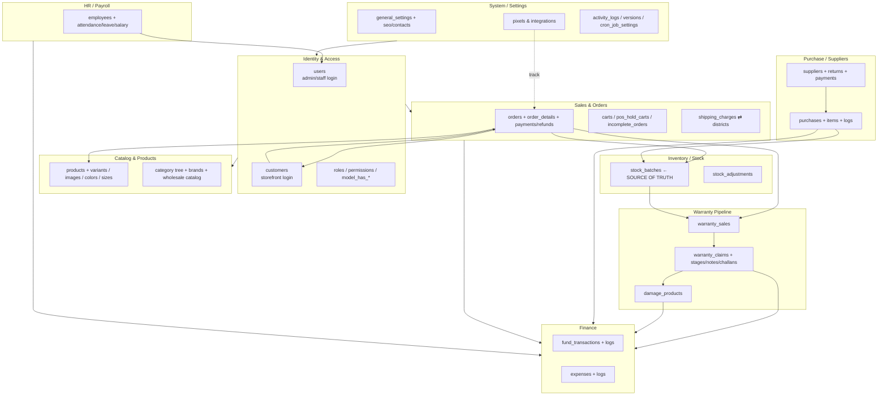

---

## 2. Architecture conventions (read first)

1. **Stock is denormalized.** `products.stock`, `product_variant_prices.stock`, `product_wholesale_prices.stock`, `wholesale_products.stock` are cached counts. **Source of truth = `stock_batches.remaining_qty`.** Mutations must go through `StockManagementService` (`stockIn/stockOut/adjustStock/syncStockFromBatches`) — see `plan.md` for known direct-mutation drift points.
2. **Product pricing is batch-wise.** Since 2026-08-25 a per-batch pricing engine exists: `stock_batches` carries `selling_price/mrp/wholesale_price`, and the per-variant / wholesale-tier / warranty-tier overrides live in `batch_variant_prices`, `batch_wholesale_prices`, `batch_warranty_tiers`. `purchase_item_prices` snapshots prices at purchase time. One batch per product can be `is_active_for_website = 1` (its price is cached onto `products.website_price`).
3. **Legacy vs modern IDs.** `orders.id`, `customers.id`, `order_details.id`, `users.id`, `payments.id` are **INT UNSIGNED**; anything built later that references them uses `unsignedInteger` columns **without** declared FK constraints (logical FKs). Newer tables (products, stock, warranty, finance) use BIGINT `foreignId` with real (or comment-only) constraints.
4. **Enum strategy.** DB stores most state as strings/enums; the *canonical value lists* live in `app/Enums/` (`OrderStatus`, `PaymentStatus`, `WarrantyClaimStatus`, `WarrantySaleStatus`, `WarrantyType`, `WarrantyStageType`, `DamageStatus`, `DamageType`). `OrderStatus` bridges the legacy `order_statuses` rows via `fromLegacyId()`.
5. **RBAC (Spatie).** Admin staff authenticate against `users` (guard `admin`, default). Storefront customers use `customers` (guard `customer`). Both polymorphically appear in `model_has_roles`/`model_has_permissions` with different `model_type` + `guard_name`. Pivots here are simplified (no composite PK, unique on `name` only).
6. **Audit trail.** `log_activity()` writes to `activity_logs`; purchase/expense/fund edits also write to their own `*_logs` snapshot tables (`purchase_logs`, `expense_logs`, `fund_transaction_logs`) with old/new diffs + running fund balances.
7. **Settings = single-row tables.** `general_settings`, `seo_settings`, `facebook_capi_settings`, etc. hold one row; dozens of grouped columns accumulate over time.
8. **Typo column names are intentional** and must be preserved: `reviews.ratting`, `contacts.hotmail`, `sms_gateways.serderid`, `general_settings.secodery_color`, `general_settings.og_baner`, `purchase_logs` legacy `balance_before/after`.

---

## 3. Domain breakdown

### 3.1 Identity, Access & Customers

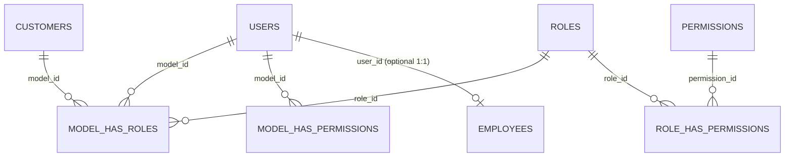

**users** — the single staff/auth-user table (guard `admin` **and** `web`; default guard = `admin`). Doubles as seller profile with wallet + KYC verification.
- `id` int UNSIGNED PK · `name` string(255) · `shop_name` string(255) null · `email` string(255) **unique** · `email_verified_at` ts null · `password` string(255) · `status` tinyint · `image` string(255) default `public/assets/images/user.webp` · `remember_token` string(100) null
- `wallet_balance` decimal(14,2) default 0 · `verification_status` enum(`pending`,`approved`,`rejected`) default `pending` · `voter_id_front`/`voter_id_back`/`self_image` string(255) null · `verification_note` text null · `verified_at` ts null
- ± `created_at`/`updated_at`. No `deleted_at`. FK target for `order_notes.user_id`, warranty `handled_by/sold_by/generated_by`, `activity_logs.user_id` (all nullable, no delete-cascade).

**customers** — registered + manually created storefront customers (guard `customer`).
- `id` int UNSIGNED PK · `name` string(155) · `slug` string(155) · `phone` string(55) · `email` string(55) null · `balance` double(14,2) default 0 · `district` string(255) null (**was int → string**, stores district *name*) · `area` int null (legacy area id) · `address` string(255) null · `verify` int null · `image` string(255) default `public/assets/images/user.webp` · `password` string(255) · `forgot` string(10) null · `verify_token` string(100) null · `remember_token` string(255) null · `status` string(55) (`active`/`inactive`)
- ± timestamps. No declared FKs.

**roles / permissions** — Spatie registries. Both: `id` bigint PK · `name` string(255) **unique** · `guard_name` string(255) · ± timestamps. Note: unique is on `name` **only**, not Spatie's standard `(name, guard_name)` composite.

**model_has_roles / model_has_permissions** — morph pivots. `role_id`/`permission_id` bigint · `model_type` string(255) (`App\Models\User` / `App\Models\Customer`) · `model_id` bigint (indexed). No timestamps.

**role_has_permissions** — `permission_id` bigint · `role_id` bigint (indexed). No timestamps.

**employees** — HR record, **not** an auth principal; optionally linked 1:1 to `users`.
- `id` bigint PK · `user_id` int UNSIGNED null (indexed) · `employee_id` string(255) **unique** (`EMP-xxxxx`) · `name` string(255) · `email` string(255) **unique** · `phone` string(255) null · `designation` string(255) null · `department` string(255) null · `joining_date` date · `basic_salary` decimal(14,2) default 0 · `address` text null · `nid` string(255) null · `bank_name` string(255) null · `bank_account` string(255) null · `status` enum(`active`,`inactive`,`terminated`) default `active` · `notes` text null · `created_by` int UNSIGNED null
- ± timestamps.

**vendors** — plain vendor directory (distinct from `suppliers` used in purchases, and from marketplace `users`). `id` bigint PK · `name` · `email` **unique** · `phone` null · `address` text null · `status` tinyint default 1 · ± timestamps.

---

### 3.2 Catalog, Products & Variants

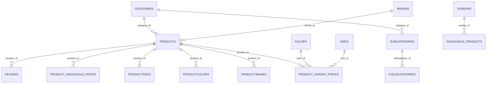

**products** — the central catalog entity. Slug route-key bound; soft-deletable.
- `id` bigint PK · `name` string(255) · `slug` string(255) · `category_id` int · `subcategory_id` bigint null · `childcategory_id` bigint null · `brand_id` int null · `product_code` string(255) **unique** · `barcode` string(255) null · `barcode_type` string(20) default `C128`
- Pricing: `purchase_price` int · `supplier_price` decimal(14,2) default 0 · `costing_method` enum(`lifo`,`fifo`,`average`) default `average` · `old_price` int null · `new_price` int · `website_price` decimal(14,2) null (cached from active website batch) · `website_stock` int default 0 · `advance_amount` decimal(14,2) default 0 · `wholesale_price` decimal(14,2) null · `reseller_price` decimal(10,2) null · `min_wholesale_quantity` int default 1
- Stock: `stock` int (**denormalized** — source = `stock_batches`) · `sold` int default 0 · `low_stock_threshold` int default 10 · `allow_negative_stock` bool default false
- Attributes: `pro_unit` string(50) null · `weight` decimal(10,2) null · `topsale` tinyint null · `flashsale` tinyint default 0 · `feature_product` tinyint null · `campaign_id` tinyint null · `free_delivery` tinyint default 0 · `vendor_id` bigint null (indexed)
- Publish: `status` tinyint (legacy 0/1) · `publish_status` string(20) default `active` (`active`/`draft`) · `product_type` string(20) default `simple` · `is_digital` tinyint default 0 · `digital_file` string(255) null · `download_limit` int null · `download_expire_days` int null · `is_wholesale` tinyint default 0 · `is_sn_required` bool default false (serial per unit) · `approval_status` enum(`pending`,`approved`,`rejected`) default `approved`
- Media/SEO: `meta_*` (`description` text, `title` string, `keywords` string, `image` string(255) null) · `description` text null · `note` text null · `pro_video_type` string(20) null · `pro_video_path` string(300) null · `pro_video` string null · `facebook_posted_at` ts null
- Warranty: `warranty_method` string(20) default `active` (`active`/`inactive`/`hidden`)
- `deleted_at` ts null (**soft deletes**) · ± timestamps.
- ⚠️ `ProductController::store/update` always force `stock = 0` — stock is only ever added via purchase batches / stock adjustments.

**categories / subcategories / childcategories** — 3-level taxonomy.
- `categories`: `id` PK · `name` · `slug` · `parent_id` int default 0 · `image` string(255) default `public/uploads/category/default.png` · `meta_title` string null · `meta_description` text null (renamed from typo `meta_decription`) · `status` tinyint · `front_view` tinyint default 1 · `icon` string null · ± timestamps.
- `subcategories`: `id` PK · `subcategoryName` string(255) · `slug` · `category_id` int · `image` text null · `meta_title` string null · `meta_description` text null · `status` tinyint · ± timestamps.
- `childcategories`: `id` PK · `childcategoryName` string(255) default `text` · `slug` default `text` · `subcategory_id` int UNSIGNED default 0 · `meta_*` · `status` tinyint · ± timestamps.

**brands** — `id` PK · `name` string(255) · `name_bn` string(255) null · `slug` · `image` string(255) default `public/uploads/category/default.png` · `status` tinyint · ± timestamps.

**colors / sizes / flavors** — attribute lookups.
- `colors`: `id` PK · `colorName` string(255) null · `color` string(255) null (hex) · `status` string(255) null · ± timestamps.
- `sizes`: `id` PK · `sizeName` string(255) null · `status` string(255) null · ± timestamps.
- `flavors`: `id` bigint PK · `name` string(255) · `status` tinyint default 1 · ± timestamps.

**product_variant_prices** — SKU-level price/stock per (product × color × size).
- `id` bigint PK · `product_id` bigint · `color_id` bigint null · `size_id` bigint null · `price` decimal(14,2) default 0 · `stock` int default 0 (variant denormalized stock) · `sku` string(100) null · `barcode` string(255) null
- **No timestamps.** FK target of `batch_variant_prices` (cascade).

**product_wholesale_prices** — quantity-tier wholesale pricing (optionally per variant).
- `id` bigint PK · `product_id` bigint · `variant_id` bigint null · `min_quantity` int · `max_quantity` int null · `wholesale_price` decimal(14,2) (⚠️ stored as a **৳ discount off sell price**, not a final price) · `stock` int default 0 · ± timestamps.

**productimages** — gallery images (optionally scoped by color/size). `id` PK · `image` string(255) · `product_id` int (indexed) · `color_id`/`size_id` int UNSIGNED null · ± timestamps.

**productcolors / productsizes** — simple pivots (no unique). `product_id` int · `color_id`/`size_id` int · ± timestamps.

**reviews** — storefront ratings. `id` PK · `name` · `email` string(55) · `ratting` string(4) (typo name kept) · `review` text · `product_id` int · `customer_id` bigint null (indexed) · `status` string(55) · ± timestamps.

**wholesale_products** — vendor-facing wholesale catalog (parallel to `products`). `id` bigint PK · `vendor_id` bigint null · `name` · `slug` **unique** · `category_id` bigint · `subcategory_id`/`childcategory_id`/`brand_id` bigint null · `product_code` string null · `purchase_price`/`wholesale_price`/`retail_price` decimal null · `min_quantity` int default 1 · `unit` string(50) null · `price` decimal(14,2) · `stock` int default 0 · `description` text null · `meta_*` · `feature_image` string(255) null · `feature_product` tinyint default 0 · `status` tinyint default 1 · `approval_status` string(20) default `approved` · `created_by` bigint null · ± timestamps.

**wholesale_product_images** — `id` bigint PK · `wholesale_product_id` bigint (indexed) · `image` string(255) · `sort_order` int default 0 · ± timestamps.

**digital_downloads** — per-order digital product access. `id` bigint PK · `order_id` bigint · `customer_id` bigint null · `product_id` bigint · `token` string(100) **unique** · `file_path` string null · `download_count` int default 0 · `remaining_downloads` int default 9999 · `max_downloads` int null · `expires_at` ts null · ± timestamps.

---

### 3.3 Content, Storefront & Homepage Builder

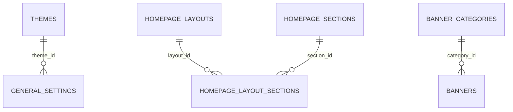

**themes** — storefront visual theme (colors/fonts/layout). `id` bigint PK · `name` string(100) · `slug` string(100) **unique** · `description` text null · `is_default` tinyint default 0 · `is_active` tinyint default 1 · `preview_image` string(255) null · ~20 color columns (`primary_color`, `secondary_color`, `accent_color`, `text_color`, `heading_color`, `body_bg_color`, `header_bg_color`, `header_text_color`, `footer_bg_color`, `footer_text_color`, `copyright_*`, `button_*`, `border_color`, `sale_badge_*`, `sidebar_*`, `topbar_*`, `admin_card_bg`) · `font_family`/`heading_font` string(100) · `body_font_size` string(10) default `14px` · `heading_font_weight` string(10) default `700` · `layout_style` enum(`full-width`,`boxed`,`contained`) default `contained` · `border_radius` string(10) default `8px` · `card_shadow` string(100) · `custom_css` text null · `page_custom_css` text null · ± timestamps.

**homepage_layouts** — saved homepage builder layouts. `id` bigint PK · `name` string(100) · `description` text null · `is_active`/`is_default` tinyint default 0 · `created_by` bigint null · ± timestamps.

**homepage_sections** — registry of available building blocks. `id` bigint PK · `name` · `slug` **unique** · `description` text null · `icon` string(100) null · `preview_image` string(255) null · `is_system`/`is_active` tinyint default 1 · `settings_schema` longText null · `default_columns` string(20) default `col-sm-12` · `default_order` int default 0 · ± timestamps.

**homepage_layout_sections** — pivot: section ordering/visibility inside a layout. `id` bigint PK · `layout_id` bigint · `section_id` bigint · `sort_order` int default 0 · `is_visible` tinyint default 1 · `columns_config` string(50) default `col-sm-12` · `extra_settings` longText null · `breakpoints` longText null · **unique** `(layout_id, section_id)` · ± timestamps.

**banner_categories / banners** — grouped storefront slides. Category: `id` PK · `name` string(255) · `status` tinyint · ± timestamps. Banner: `id` PK · `category_id` int · `link` string(255) · `image` string(255) · `status` tinyint · ± timestamps.

**create_pages** — static CMS pages. `id` PK · `name` · `slug` · `title` · `description` text · `status` tinyint · ± timestamps.

**blogs** — `id` bigint PK · `title` · `slug` **unique** · `short_description` text null · `description` longText null · `image` string null · `views` int default 0 · `status` tinyint default 1 · ± timestamps.

**popups** — marketing popups. `id` bigint PK · `title` string null · `description` text null · `image` string null · `link` string null · `btn_text` string null · `offer_end_text` string null · `status` tinyint default 1 · ± timestamps.

---

### 3.4 Marketing, Campaigns & Coupons

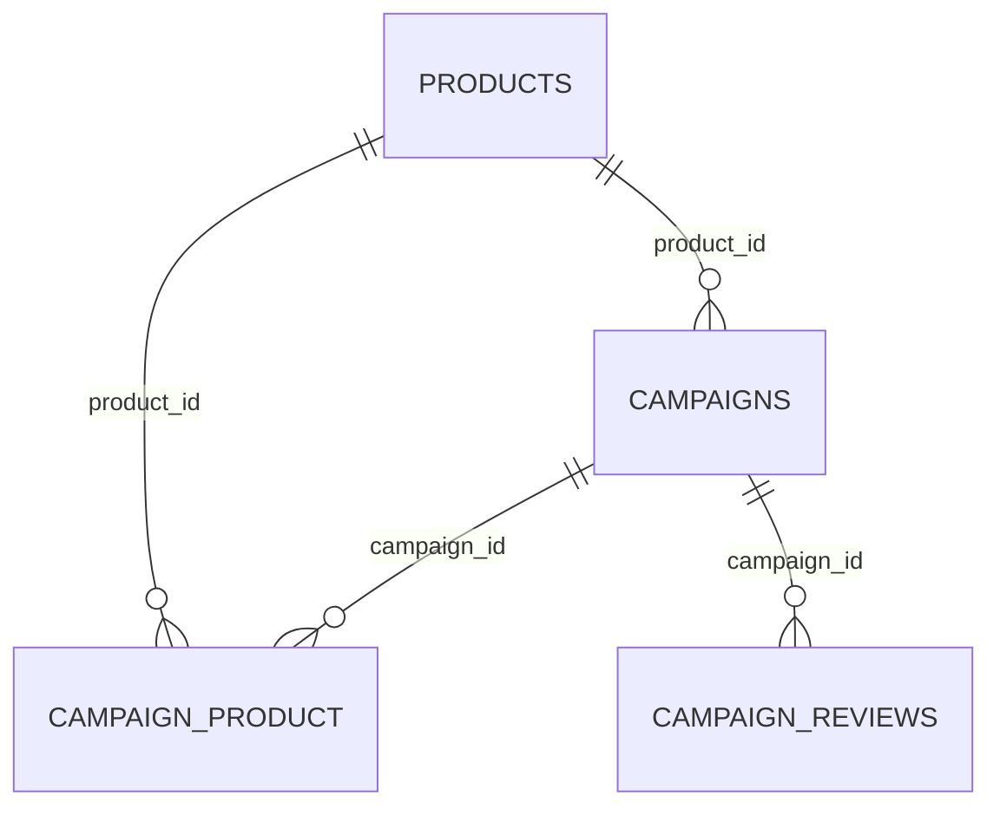

**campaigns** — full landing-page campaign (megasale style) with rich JSON section config. `id` int UNSIGNED PK · `product_id` bigint null (indexed) · `name` · `slug` · `banner`/`banner_title` string null · `deadline` string(55) null (renamed from `date`) · `short_description` text · `review` string(255) · `description` text · `image_one` text · `image_two`/`image_three` text null · `status` string(55) (`0`/`1`) · content cols `top_title_1/2`, `heading_1..4`, `feature_1/2`, `note`, `billing_details` text null, `video` string(300) null · design cols `page_design`/`page_html`/`page_css` longText null · JSON blocks: `sections`, `labels`, `features`, `problem`, `solution`, `benefits`, `trust`, `faq`, `cta` · ± timestamps.

**campaign_product** — pivot. `campaign_id` bigint · `product_id` bigint · **unique** `(campaign_id, product_id)` · ± timestamps.

**campaign_reviews** — gallery images. `id` PK · `image` string(255) · `campaign_id` int · ± timestamps.

**coupons** — checkout discount codes. `id` bigint PK · `code` string(50) **unique** · `type` string(20) default `fixed` (`fixed`/`percent`; renamed from `discount_type`) · `value` decimal(14,2) default 0 · `min_purchase` decimal(14,2) null default 0 · `valid_from` date null · `valid_to` date null · `max_uses` int default 0 · `used_count` int default 0 · `status` tinyint default 1 · ± timestamps.
> Legacy columns dropped: `discount_type`, `discount`, `min_order_amount`, `expiry_date`.

---

### 3.5 Sales, Orders & Fulfillment

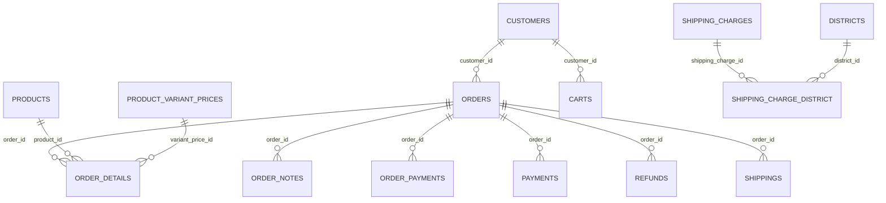

**orders** — one row per order (online/POS/COD). `id` int UNSIGNED PK · `invoice_id` string(55) · `amount` int (legacy gross) · `paid_amount` decimal(15,2) default 0 · `due_amount` decimal(15,2) default 0 · `discount` int · `shipping_charge` int · `customer_id` int (FK → customers) · `ip_address` string(45) null · `order_status` string(55) (see `OrderStatus` enum) · `note`/`order_note` text null · `payment_status` string(20) default `pending` · `order_type` string(20) default `online` (`online`/`pos`/`cod`) · `coupon_code` string(50) null · courier: `courier_type`, `courier_tracking_id` string(255) null, `courier_sent_at` ts null · fraud: `fraud_success_rate`, `pathao_rate`, `redx_rate`, `steadfast_rate` decimal(5,2) null, `is_duplicate_order` tinyint default 0, `duplicate_order_count` int default 0, `duplicate_order_rate` decimal(5,2) null, `last_duplicate_order_date` datetime null · ± timestamps.
> `order_status` was INT (legacy ids 1–14) → converted to VARCHAR via `OrderStatus` enum mapping.

**order_details** — line items. `id` int UNSIGNED PK · `order_id` int · `product_id` int · `product_name` string(255) · `purchase_price` int · `sale_price` int · `qty` int · `batch_ids` json null (stock-batch linkage) · `cogs` decimal(15,2) null · `product_color` bigint null · `warranty_tier_id` bigint null (FK → product_warranty_tiers, nullOnDelete) · `warranty_price` decimal(12,2) default 0 · `product_size` bigint null · `variant_price_id` bigint null · `product_discount` decimal(14,2) default 0 · ± timestamps.

**order_notes** — order timeline. `id` bigint PK · `order_id` int UNSIGNED (FK cascade) · `user_id` int UNSIGNED null (FK set null) · `content` text · `type` string(20) default `info` (`info`/`warning`/`success`/`danger`) · `source` string(30) default `admin` (`admin`/`system`/`courier`/`customer`) · `metadata` json null · ± timestamps; index `(order_id, created_at)`.

**order_statuses** — **deprecated** legacy lookup (kept physically; enum-driven now). `id` int UNSIGNED PK · `name` string(155) · `slug` string(155) · `status` string(55) · ± timestamps. Legacy ids 1–14 ↔ `OrderStatus` cases via `fromLegacyId()`.

**order_payments** — per-installment payment receipts on an order. `id` bigint PK · `order_id` int UNSIGNED (indexed) · `customer_id` int UNSIGNED null · `amount` decimal(15,2) · `payment_method` string(55) default `Cash` · `trx_note` string(255) null · `created_by` int UNSIGNED null · ± timestamps.

**payments** — legacy payment attempts/records (gateway/COD ledger). `id` int UNSIGNED PK · `order_id` int · `customer_id` int · `amount` int · `trx_id` string(55) null · `sender_number` string(55) null · `payment_method` string(55) null · `payment_status` string(55) · ± timestamps.

**payment_gateways** — gateway credentials. `id` bigint PK · `type` string(55) null · `app_key`/`app_secret`/`username`/`password`/`base_url`/`success_url`/`return_url` string null · `prefix` string(25) null · `status` tinyint default 0 · ± timestamps.

**refunds** — refund requests against orders (partial + full). `id` bigint PK · `order_id` int UNSIGNED · `customer_id` int UNSIGNED · `refund_id` string(255) **unique** · `amount` decimal(14,2) · `shipping_charge` decimal(14,2) default 0 · `refund_amount` decimal(14,2) null (partial) · `include_shipping` bool default true · `reason`/`admin_note`/`customer_note` text null · `status` enum(`pending`,`approved`,`rejected`,`processed`) default `pending` · `processed_by` bigint null · `processed_at` ts null · `refund_method` enum(`original_payment`,`bkash`,`nagad`,`bank`,`manual`) default `original_payment` · `refund_account` string(255) null · `refund_account_name` string(100) null · ± timestamps.

**carts** — customer cart lines (denormalized). `id` bigint PK · `customer_id` int UNSIGNED · `product_id` bigint · `product_name` string(255) · `qty` int · `price` decimal(14,2) · `size`/`color` string(255) null · ± timestamps. (Note: POS carts use a separate `Cart` instance `pos_shopping`, persisted in session, not this table.)

**pos_hold_carts** — POS carts held for later restore. `id` bigint PK · `customer_id` bigint null (indexed) · `customer_name`/`customer_phone` string null · `cart_data` json · `subtotal`/`discount`/`shipping_charge`/`grand_total` decimal(15,2) default 0 · `note` text null · `held_by` bigint null (indexed) · `held_at`/`restored_at` ts null · `status` enum(`held`,`restored`,`converted`,`cancelled`) default `held` (indexed) · ± timestamps.

**incomplete_orders** — abandoned checkout leads. `id` bigint PK · `name` string(255) · `phone` string(50) · `address` text null · `items` longText null (serialized cart) · `product_image`/`product_link` string null · `total_amount` decimal(14,2) default 0 · ± timestamps. (⚠ known stock-drift mutation point.)

**districts** — geo records (one row per area). `id` int UNSIGNED PK · `area_id` int · `area_name` string(255) · `district` string(255) · `charge_update_required` bool default 0 · ± timestamps. Columns `shippingfee`/`partialpayment` **dropped** (moved to shipping-charge zones).

**shipping_charges** — delivery zones/amounts (source of truth for fees). `id` int UNSIGNED PK · `name` string(255) · `amount` int · `status` string(255) (stores `'1'`/`'0'`) · ± timestamps.

**shipping_charge_district** — M2M pivot: charge ↔ districts/areas. Composite PK `(shipping_charge_id, district_id)` · `district_id` indexed · ± timestamps.

**shippings** — delivery-address snapshot per order. `id` int UNSIGNED PK · `order_id` int · `customer_id` int · `name` string(155) · `phone` string(55) · `address` string(256) · `area` string(100) (area **name** stored as text) · ± timestamps.

---

### 3.6 Inventory, Stock & Batches

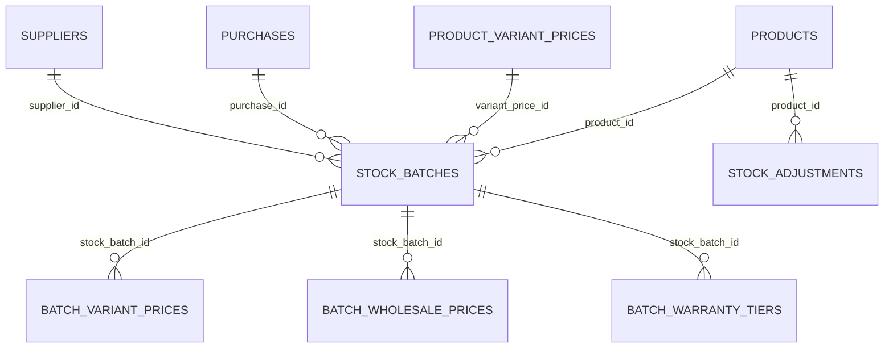

**stock_batches** — ⭐ **SOURCE OF TRUTH for stock.** Each row = one received/issued batch.
- `id` bigint PK · `product_id` bigint (indexed) · `variant_price_id` bigint null · `purchase_id` bigint null (indexed) · `supplier_id` bigint null (indexed) · `batch_no` string(50) null
- Qty: `quantity` int default 0 (positive = in, negative = out) · `remaining_qty` int default 0 (**current availability — canonical**)
- Serial numbers: `sn_stock` json null (serials available) · `sn_sold` json null (serials sold/assigned)
- Costing: `unit_cost` decimal(14,2) default 0
- Pricing (batch-wise engine): `selling_price` decimal(14,2) null · `mrp` decimal(14,2) null (compare-at) · `wholesale_price` decimal(14,2) null
- Dates: `mfg_date`/`exp_date` date null
- Flags: `is_active_for_website` bool default false (one per product) · `pos_enabled` bool default true · `auto_advance` bool default true (auto-activate next FIFO batch) · `is_manual_price` bool default false · `price_updated_at` ts null · `price_updated_by` bigint null
- Classification: `type` enum(`in`,`out`) default `in` · `reference_type` string(50) null (`purchase`,`sale_return`,`purchase_return`,`adjustment`) · `reference_id` bigint null · `reference_no` string(100) null · `custom_field` string(255) null
- ± timestamps. Indexes: `product_id`, `purchase_id`, `supplier_id`. No declared FK constraints.

**stock_adjustments** — audit of manual corrections. `id` bigint PK · `product_id` bigint (indexed) · `variant_price_id` bigint null · `type` enum(`addition`,`reduction`,`correction`) · `quantity` int · `current_stock` int · `new_stock` int · `reason` text null · `reference_type` string(50) null · `reference_id` bigint null · `created_by` bigint null · ± timestamps.

**batch_variant_prices** — per-batch variant override (mirror of `product_variant_prices`). `id` bigint PK · `stock_batch_id` bigint (FK cascade) · `variant_price_id` bigint (FK cascade) · `price` decimal(14,2) default 0 · `old_price` decimal(14,2) null · `stock` unsignedInt default 0 · **unique** `(stock_batch_id, variant_price_id)` · ± timestamps.

**batch_wholesale_prices** — per-batch quantity tiers. `id` bigint PK · `stock_batch_id` bigint (FK cascade) · `variant_price_id` bigint null (FK cascade) · `min_quantity` unsignedInt · `max_quantity` unsignedInt null · `wholesale_price` decimal(14,2) · ± timestamps; index `(stock_batch_id, variant_price_id)`.

**batch_warranty_tiers** — per-batch warranty offering. `id` bigint PK · `stock_batch_id` bigint (FK cascade) · `variant_price_id` bigint null (FK cascade) · `warranty_tier_id` bigint (FK cascade) · `additional_cost` decimal(14,2) default 0 · `is_active` bool default true · **unique** `(stock_batch_id, variant_price_id, warranty_tier_id)` · ± timestamps.

---

### 3.7 Purchases & Suppliers

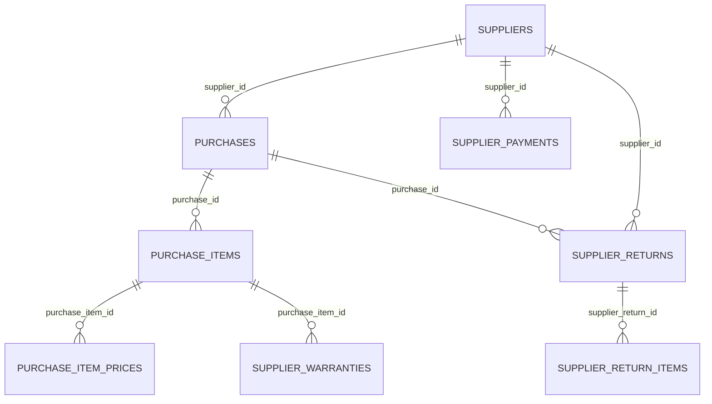

**purchases** — purchase header. `id` bigint PK · `supplier_id` bigint null · `invoice_no` string(50) null · `purchase_date` date null · `amount` decimal(15,2) null default 0 (legacy) · `subtotal` decimal(15,2) default 0 · `discount` decimal(15,2) default 0 · `shipping_cost` decimal(15,2) default 0 · `grand_total` decimal(15,2) default 0 · `total_qty` int default 0 · `paid_amount` decimal(15,2) default 0 · `due_amount` decimal(15,2) default 0 · `costing_method` enum(`lifo`,`fifo`,`average`) null · `status` tinyint default 1 · `note` text null · `draft_data` json null (unpublished draft payload, 2026-09-01) · `created_by` bigint · `updated_by` bigint null · ± timestamps.

**purchase_items** — line items. `id` bigint PK · `purchase_id` bigint (indexed) · `product_id` bigint (indexed) · `variant_price_id` bigint null · `qty` decimal(14,2) · `unit_cost` decimal(14,2) · `line_total` decimal(14,2) · `returned_qty` decimal(14,2) default 0 · `batch_no` string(50) null · `mfg_date`/`exp_date` date null · `custom_field` string(255) null · ± timestamps.

**purchase_item_prices** — pricing snapshot per purchase item (sell price / MRP / wholesale + warranty tiers JSON). `id` bigint PK · `purchase_item_id` bigint (FK cascade) · `variant_price_id` bigint null (indexed) · `selling_price` decimal(14,2) · `mrp` decimal(14,2) null · `wholesale_price` decimal(14,2) null · `wholesale_tiers` json null · `warranty_tiers` json null · ± timestamps.

**purchase_logs** — audit of purchase create/edit/delete (old vs new diffs + fund balance). `id` bigint PK · `purchase_id` bigint null · `action` enum(`create`,`edit`,`delete`) · `old_/new_invoice_no` string(50) null · `old_/new_purchase_date` date null · `old_/new_paid_amount`, `old_/new_grand_total` decimal null · `old_/new_note` string(255) null · `fund_balance_before/after` decimal null · `description` string(500) null · `performed_by` int UNSIGNED null · ± timestamps. (Legacy `balance_before/after` exist only on live DBs, not fresh migrations.)

**suppliers** — supplier master with running balances. `id` bigint PK · `name` · `phone` string(50) null · `email` string null · `address` text null · `company` string(255) null · `contact_person` string(255) null · `tax_id` string(100) null · `payment_terms` string(100) null · `lead_time` int null · `notes` text null · `is_active` bool default true · `opening_balance` decimal(15,2) default 0 · `current_due` decimal(15,2) default 0 · `total_purchase`/`total_paid`/`total_due` decimal(15,2) default 0 (denormalized counters) · `status` tinyint default 1 · ± timestamps.

**supplier_payments** — payments to suppliers. `id` bigint PK · `supplier_id` bigint (indexed) · `purchase_id` bigint null (indexed) · `amount` decimal(15,2) · `payment_date` date null · `method` string(50) null · `note` text null · `fund_transaction_id` bigint null (→ fund_transactions) · `created_by` bigint null · ± timestamps.

**supplier_returns** — returns to supplier. `id` bigint PK · `supplier_id` bigint (indexed) · `purchase_id` bigint null · `return_no` string(50) · `return_date` date · `total_qty` int default 0 · `total_amount` decimal(15,2) default 0 · `reason` text null · `status` enum(`pending`,`completed`,`cancelled`) default `pending` · `created_by` bigint null · ± timestamps.

**supplier_return_items** — line items of a supplier return. `id` bigint PK · `supplier_return_id` bigint (indexed) · `product_id` bigint · `variant_price_id` bigint null · `batch_id` bigint null (→ stock_batches) · `qty` int · `unit_cost` decimal(14,2) · `line_total` decimal(14,2) · `reason` text null · ± timestamps.

---

### 3.8 Warranty Pipeline & Damage

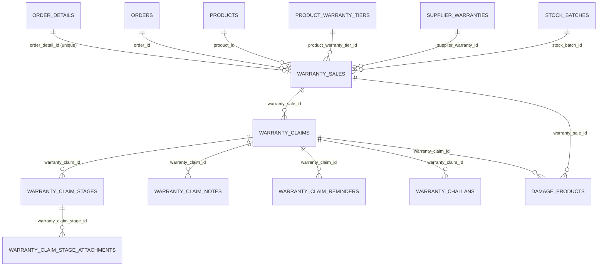

**supplier_warranties** — upstream guarantee on a purchased batch/item. `id` bigint PK · `purchase_item_id` bigint (FK cascade) · `batch_id` bigint null (FK nullOnDelete) · `product_id` bigint (FK cascade) · `supplier_id` bigint (FK cascade) · `warranty_days` int default 0 · `warranty_start_date`/`warranty_end_date` date null · `warranty_type` string default `supplier_warranty` (`supplier_warranty`/`store_warranty`/`extended_warranty`/`none`) · `warranty_terms` text null · `is_transferable` bool default true · `notes` text null · ± timestamps. Indexes: `(product_id, warranty_end_date)`, `supplier_id`.

**warranty_sales** — warranty issued at sale time, one per order line (unique `order_detail_id`).
- `id` bigint PK · `order_id` int UNSIGNED (FK cascade) · `order_detail_id` int UNSIGNED (FK cascade, **unique**) · `product_warranty_tier_id` bigint null (FK nullOnDelete) · `customer_id` int UNSIGNED (FK cascade, indexed) · `product_id` bigint (FK cascade) · `serial_numbers` json null (multi-SN; single `serial_number` varchar was dropped) · `supplier_warranty_id` bigint null (FK nullOnDelete) · `stock_batch_id` bigint null (FK set null) · `purchase_id` bigint null (FK set null) · `sold_by` int UNSIGNED null (→ users)
- Coverage: `warranty_type` string (`none`/`supplier_warranty`/`store_warranty`/`extended_warranty`) · `warranty_days` int default 0 · `warranty_start_date`/`warranty_end_date` date null · `warranty_price` decimal(12,2) default 0 · `status` string default `active` (`active`/`expired`/`claimed`/`void`)
- ± timestamps. Indexes: `customer_id`, `status`, `warranty_end_date`.

**warranty_claims** — the store↔supplier repair/replace/refund pipeline driver (largest warranty table).
- `id` bigint PK · `warranty_sale_id` bigint (FK cascade) · `customer_id` int UNSIGNED (FK cascade, indexed) · `order_id` int UNSIGNED (FK cascade) · `product_id` bigint (FK cascade) · `claim_number` string **unique** · `issue_description` text · `issue_type` string null · `attachments` json null
- Status: `status` string default `submitted` (see `WarrantyClaimStatus`) · `resolution`/`rejection_reason` text null · `servicing_cost` decimal(12,2) default 0 · `store_bears_cost` bool default false · `claimed_at` ts null
- Receipt pipeline: `product_received_at` ts null · `receive_challan_no` string(50) null · `receive_notes` text null
- Supplier pipeline: `sent_to_supplier_at` ts null · `supplier_challan_no` string(50) null · `sent_supplier_id` bigint null (FK nullOnDelete) · `supplier_send_notes` text null · `returned_from_supplier_at` ts null · `supplier_return_challan_no` string(50) null · `replacement_sn` string(100) null · `replacement_order_detail_id` int UNSIGNED null (→ order_details.id, **no FK**) · `return_type` enum(`repaired`,`replaced`,`refunded`) null · `supplier_return_notes` text null
- Delivery: `ready_for_delivery_at` ts null · `delivery_challan_no` string(50) null · `delivered_to_customer_at` ts null · `delivery_notes` text null · `resolved_at` ts null
- Finance links: `supplier_charge` decimal(15,2) null · `supplier_expense_id` bigint null (FK → expenses) · `customer_charge` decimal(15,2) null · `customer_earning_fund_id` bigint null (FK → fund_transactions)
- ± timestamps. Indexes: `customer_id`, `status`, `claim_number`.

**warranty_claim_stages** — lifecycle step rows. `id` bigint PK · `warranty_claim_id` bigint (FK cascade) · `stage` string (see `WarrantyStageType`) · `status` string default `pending` (`pending`/`completed`) · `notes` text null · `handled_by` int UNSIGNED null (→ users) · `started_at`/`completed_at` ts null · ± timestamps.

**warranty_claim_notes** — free-form internal notes. `id` bigint PK · `warranty_claim_id` bigint (FK cascade) · `user_id` int UNSIGNED null (→ users) · `note` text · `attachment` string null · ± timestamps.

**warranty_claim_reminders** — due-date reminders per pipeline step. `id` bigint PK · `warranty_claim_id` bigint (FK cascade) · `step` string (`supplier_delivery`/`customer_delivery`/`follow_up`/`repair_due` …) · `label` string · `remind_at` datetime · `status` string default `pending` (`pending`/`done`) · `note` text null · `created_by` int UNSIGNED null · ± timestamps. Index `(status, remind_at)`.

**warranty_claim_stage_attachments** — per-stage media files. `id` bigint PK · `warranty_claim_stage_id` bigint (index only, no FK) · `file_path` string(500) · `file_name` string(255) null · `file_type` string(20) null · `uploaded_by` int UNSIGNED null · ± timestamps.

**warranty_challans** — physical challan audit rows with JSON snapshot. `id` bigint PK · `warranty_claim_id` bigint (FK cascade) · `challan_type` enum(`receive`,`send_to_supplier`,`receive_return`,`delivery`) · `challan_no` string(50) **unique** · `challan_data` json · `generated_by` int UNSIGNED null (→ users) · ± timestamps.

**damage_products** — damaged/recovered unit ledger. `id` bigint PK · `warranty_claim_id` bigint null (FK nullOnDelete) · `warranty_sale_id` bigint null (FK nullOnDelete) · `product_id` bigint (FK restrict) · `supplier_id` bigint null (FK nullOnDelete) · `original_serial_number`/`replacement_serial_number` string(100) null · `damage_type` string default `partial` (`partial`/`full`) · `status` string default `on_warranty` (`on_warranty`/`supplier_hold`/`in_service`/`resellable`/`unsellable`/`discarded`) · `condition_note`/`accessories` string(255) null · `service_cost` decimal(12,2) default 0 · `damage_cost` decimal(12,2) default 0 · `resell_price` decimal(12,2) null · `expense_id` bigint null (FK → expenses) · `earning_fund_id` bigint null (FK → fund_transactions) · `received_at`/`disposed_at` datetime null · `created_by` int UNSIGNED null · ± timestamps.

**product_warranty_tiers** — warranty tier catalog per product (or variant). `id` bigint PK · `product_id` bigint (FK cascade) · `variant_id` bigint null · `tier_name` string · `warranty_type` string default `none` · `warranty_days` int default 0 · `price` decimal(12,2) default 0 · `additional_cost` decimal(12,2) default 0 · `is_active` bool default true · `sort_order` int default 0 · `badge` string null · `features` json null · `is_default` bool default false · **unique** `(product_id, warranty_type)` · ± timestamps.

---

### 3.9 HR / Payroll

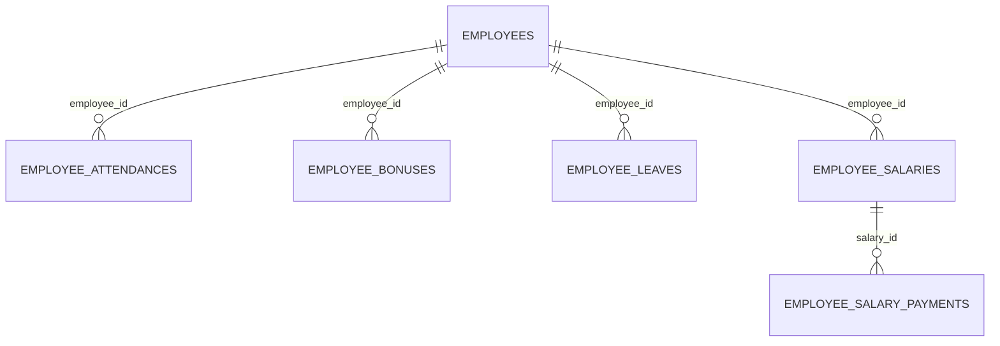

All HR child tables: `id` bigint PK · `employee_id` bigint (FK cascade) · ± timestamps, with `created_by`/`approved_by`/`paid_by` int UNSIGNED actors (→ users).

- **employee_attendances** — `attendance_date` date · `check_in`/`check_out` time null · `status` enum(`present`,`absent`,`late`,`half_day`,`holiday`) default `present` · `notes` text null · `marked_by` int UNSIGNED null · **unique** `(employee_id)` (one row per employee), indexes `attendance_date`, `status`.
- **employee_bonuses** — `bonus_type` string · `amount` decimal(14,2) · `salary_month` string(255) null · `reason` text null · `status` enum(`pending`,`approved`,`paid`) default `pending` · `notes` text null · `approved_by` int UNSIGNED null · `approved_at` ts null. Indexes `employee_id`, `status`, `salary_month`.
- **employee_leaves** — `leave_type` enum(`sick`,`casual`,`annual`,`emergency`,`maternity`,`paternity`,`unpaid`) default `casual` · `start_date`/`end_date` date · `total_days` int · `reason` text null · `status` enum(`pending`,`approved`,`rejected`) default `pending` · `admin_note` text null · `approved_by`/`approved_at`. Indexes `employee_id`, `status`, `start_date`, `end_date`.
- **employee_salaries** — monthly payroll summary. `salary_month` string(255) · `total_days` int · `present_days`/`absent_days`/`leave_days`/`working_days` int default 0 · `basic_salary`/`allowance`/`deduction`/`bonus`/`overtime`/`gross_salary`/`net_salary` decimal(14,2) default 0 · `status` enum(`pending`,`calculated`,`paid`) default `pending` · `notes` text null · `calculated_by` int UNSIGNED null · `calculated_at` ts null · **unique** `(employee_id)`, indexes `salary_month`, `status`.
- **employee_salary_payments** — disbursements. `salary_id` bigint null (FK set null) · `payment_id` string(255) **unique** · `payment_month` string(255) · `amount` decimal(14,2) · `payment_method` enum(`cash`,`bank_transfer`,`bkash`,`nagad`,`rocket`,`check`) default `bank_transfer` · `transaction_id` string(255) null · `bank_name`/`account_number` string null · `payment_date` date · `notes` text null · `status` enum(`pending`,`paid`,`failed`) default `pending` · `paid_by` int UNSIGNED null · `paid_at` ts null. Indexes `salary_id`, `employee_id`, `payment_month`, `status`, `payment_date`.

---

### 3.10 Finance — Fund, Expenses & Audit Logs

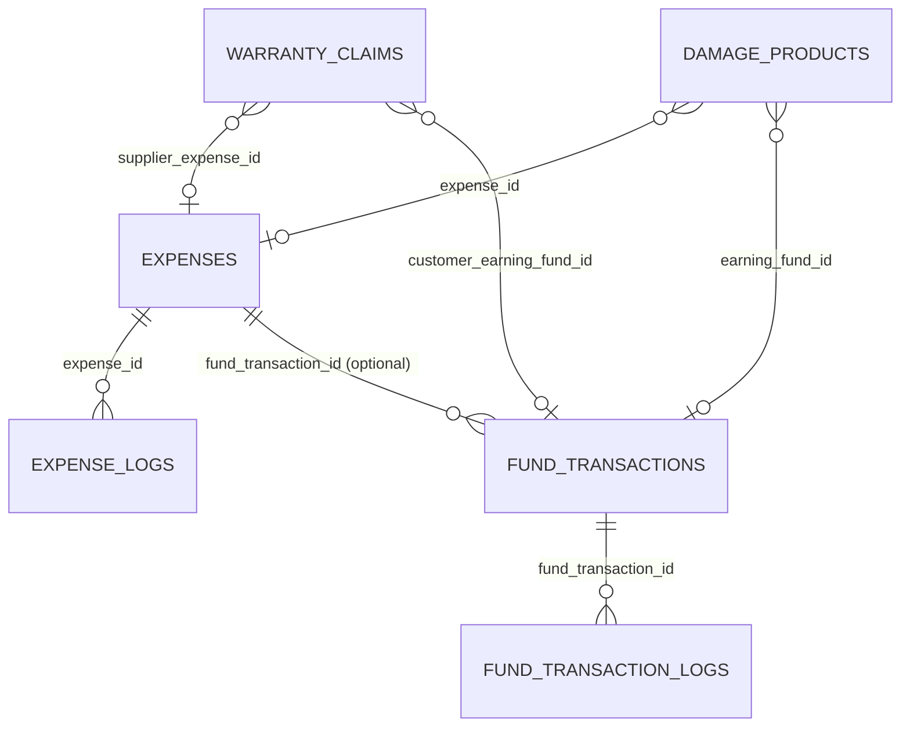

**fund_transactions** — single running fund ledger; each row is a credit (`in`) or debit (`out`) with running balance and polymorphic source.
- `id` bigint PK · `created_by` bigint · `updated_by` bigint null · `amount` decimal(15,2) · `direction` string(10) (`in` = credit/add, `out` = debit/withdraw) · `source` string(50) null (`manual_add`, `withdraw`, `sale`, `refund`, `refund_reversal`, `expense`, `supplier_payment`, `employee_salary`, `employee_bonus`, `warranty`, `warranty_resell`) · `source_id` bigint null (polymorphic link) · `note` text null · `balance_before`/`balance_after` decimal(15,2) default 0 · `status` tinyint default 1 · ± timestamps.

**fund_transaction_logs** — audit of fund edit/delete. `id` bigint PK · `fund_transaction_id` bigint null · `action` enum(`edit`,`delete`) · `old_/new_direction` enum(`in`,`out`) null · `old_/new_amount` decimal null · `balance_before`/`balance_after` decimal · `old_/new_note` string(255) null · `description` text null · `performed_by` bigint · ± timestamps.

**expenses** — expense ledger records. `id` bigint PK · `title` string(255) null · `category` string(100) null · `amount` decimal(15,2) · `note` text null · `fund_transaction_id` bigint null (→ fund_transactions) · `created_by` bigint · `updated_by` bigint null · `status` tinyint default 1 · `expense_date` date null · ± timestamps.

**expense_logs** — audit of expense edit/delete with fund balances. `id` bigint PK · `expense_id` bigint null · `action` enum(`edit`,`delete`) · `old_/new_title` string(255) null · `old_/new_amount` decimal null · `old_/new_expense_date` date null · `old_/new_category` string(100) null · `old_/new_note` string(255) null · `balance_before`/`balance_after` decimal null (legacy) · `fund_balance_before`/`fund_balance_after` decimal null · `description` string(500) null · `performed_by` int UNSIGNED null · ± timestamps.

---

### 3.11 Settings, Communication & Support

**general_settings** — single-row site settings (dozens of grouped columns).
- Core: `id` int UNSIGNED PK · `name` string(55) · `default_language` string(10) default `en` · `admin_language` string(10) default `en` · `white_logo`/`dark_logo`/`favicon` string(255) · `copyright` string(155) null · `status` tinyint · `theme_id` bigint null (indexed) · `active_layout_id` bigint null (indexed)
- Storefront behavior: `show_all_products` tinyint default 1 · `show_category_wise_products` tinyint default 1 · `flash_sale_end_date`/`hot_deal_end_date` datetime null · `og_baner` string null (typo kept) · `top_headline` varchar(500) null · `vendor_enabled` tinyint default 0 · `reseller_enabled` tinyint default 0 · `order_limit_time` int default 48 · `order_limit_qty` int default 2 · `order_policy` text null · `checkout_note` text null
- Colors/design: `primary_color` varchar(7) default `#0d6efd` · `secodery_color` varchar(7) default `#198754` (typo kept) · `footer_color`/`copyright_color` · `product_card_style` varchar(50) default `default` (`default`/`premium`/`overlay`/`ribbon`/`glass`/`classic`) · responsive card columns `pc_home_desktop/laptop/tablet/phone` + `pc_other_*` unsignedTinyInt · `pc_title_lines` unsignedTinyInt default 2 · `pc_image_height` unsignedInt default 200
- Header/footer builder: `header_style`/`footer_style` varchar(50) default `classic` · `header_all_category_button` tinyint default 1 · `header_all_category_type` varchar(50) default `mega` · `header_top_bar`/`header_sticky` tinyint default 1 · `footer_columns` int default 4 · `header_components`/`footer_components` json null
- Duplicate-order fraud: `duplicate_order_api_key`/`duplicate_order_api_url` string null · `duplicate_order_method` string(10) default `POST` · `duplicate_order_phone_key` string(50) default `phone` · `fraud_check_enabled` tinyint default 1
- Update/license: `update_api_url` string null · `update_script_name` string(100) null · `app_version` string(50) null · `license_key` string(100) null (empty → falls back to hardcoded `config/updater.php`)
- Misc: `default_costing_method` enum(`lifo`,`fifo`,`average`) default `average` · `footer_about_text` text null · `google_play_link`/`app_store_link` string null · `facebook_page_username` string null
- ± timestamps.

**seo_settings** — `id` bigint PK · `meta_title` string null · `meta_tags` string null · `meta_description` text null · `search_console_verification` string null · ± timestamps.

**contacts** — site contact info. `id` PK · `hotline`/`hotmail` string null · `phone`/`email` string(50) · `address` string(255) · `maplink` string(255) null · `whatsapp` string(50) null · `status` tinyint · ± timestamps.

**contact_messages** — contact form inbox. `id` bigint PK · `full_name` string(255) · `mobile` string(50) null · `email` string(255) null · `subject` string(255) null · `details` text null · `status` tinyint default 0 (0 = unread) · ± timestamps.

**newsletter_subscribers** — `id` bigint PK · `email` string(255) **unique** · `status` tinyint default 1 · ± timestamps.

**social_media** — footer links. `id` PK · `title` · `icon` · `status` tinyint · ± timestamps.

**complaints** — customer complaint/support pipeline. `id` bigint PK · `customer_id` bigint null (indexed) · `name` string(255) · `phone` string(50) null · `order_id` string(255) null (string, not FK) · `subject` text null · `description` text null · `image` string(255) null · `status` string(30) default `pending` (`pending`/`processing`/`resolved`; changed from tinyint) · ± timestamps.

---

### 3.12 Integrations — Couriers, SMS, Payment & Tracking Pixels

| Table | Purpose & key columns |
|---|---|
| **courierapis** | Courier credentials, one row per integration. `type` string(55) null (`pathao`/`steadfast`/`redx`) · `api_key`/`secret_key`/`client_id`/`client_secret`/`username`/`password`/`url`/`token`/`webhook_url` · `status` tinyint default 1 · ± ts |
| **sms_gateways** | SMS provider + per-event toggles. `url` string(99) null · `method` string(10) default `POST` · `phone_key`/`message_key` string(50) · `api_key` string(155) null · `serderid` string(155) null (typo kept) · `status` string(25) null · event toggles `forget_pass`/`order_confirm`/`order_cancel`/`order` tinyint default 0 · ± ts |
| **ecom_pixels** | Generic embedded pixel scripts. `code` string(255) · `status` tinyint · ± ts |
| **facebook_capi_settings** | FB Conversions API. `pixel_id` string null · `access_token` text null · `test_event_code` string null · `status` tinyint default 1 · ± ts |
| **facebook_page_settings** | FB page auto-posting. `page_id`/`page_access_token`/`page_name` · `auto_post_new_products` tinyint default 0 · `post_template` text null · ± ts |
| **google_tag_managers** | GTM containers. `code` string(255) · `status` tinyint · ± ts |
| **google_analytics_settings** | GA4. `measurement_id` string(50) null · `api_secret` string(255) null · `status` tinyint default 1 · ± ts |
| **tiktok_pixels** | TikTok pixels. `code` string(255) · `status` tinyint default 1 · ± ts |
| **ads_analytics_settings** | Per-platform ad-account credentials. `platform` string(255) · `is_active` tinyint default 0 · `access_token` text null · `ad_account_id`/`app_id`/`app_secret`/`refresh_token`/`client_id`/`client_secret` string null · `extra_config` longText null · ± ts |

---

### 3.13 System & Audit

**activity_logs** — security/audit trail written by `log_activity()`. `id` bigint PK · `user_id` int UNSIGNED null (indexed) · `user_name` string(191) null · `module` string(50) (indexed) · `action` string(50) (`create`/`update`/`delete`/`price_change`/`status`…) · `description` string(500) null · `model_type` string(191) null · `model_id` bigint null · `data` json null (old/new) · `ip` string(45) null · ± timestamps. Composite indexes `(module, created_at)`, `(user_id, created_at)`.

**versions** — self-update release registry (backing "updates"; paired with the WP `softmit-license-manager` server). `id` bigint PK · `version` string(20) **unique** (semver) · `release_date` date · `changelog` text null · `file_size` bigint null · `file_path` string(255) null · `is_active` tinyint default 1 · `requires_migration` tinyint default 0 · ± timestamps.

**cron_job_settings** — persisted schedule config for auto-discovered jobs. `id` bigint PK · `job_key` string(80) **unique** · `job_title` string(150) · `job_description` text null · `is_enabled` tinyint default 1 · `frequency_minutes` smallInt default 10 · `order_limit` smallInt default 50 · `last_run_at` ts null · `last_run_status` string(20) null · `last_run_result` text null · `last_updated_count`/`last_failed_count` int default 0 · ± timestamps.

**ip_blocks** — anti-fraud blocked IPs. `id` PK · `ip_no` string(255) · `reason` text · ± timestamps.

---

## 4. Enum value reference

### `OrderStatus` (`orders.order_status`) — 14 states
`pending` → `confirmed` → `picking` → `packing` → `packed` → `shipped` → `out_for_delivery` → `delivered` → `completed`, plus `return_requested`, `return_approved`, `returned`, `cancelled`, `closed`. Legacy ints 1–14 map 1:1 in that order via `OrderStatus::fromLegacyId()`.

### `PaymentStatus` (`orders.payment_status`, `payments.payment_status`)
`pending`, `paid`, `partial`, `partially_refunded`, `refunded`, `failed`, `cancelled` (legacy `completed`/`success`/`approved` treated as paid).

### Warranty enums
- `WarrantyType`: `none`, `supplier_warranty`, `store_warranty`, `extended_warranty`
- `WarrantySaleStatus`: `active`, `expired`, `claimed`, `void`
- `WarrantyClaimStatus`: `submitted`, `under_review`, `approved`, `awaiting_product`, `product_received`, `in_service`, `sent_to_supplier`, `awaiting_supplier_return`, `supplier_returned`, `serviced`, `ready_for_delivery`, `delivered`, `resolved`, `rejected`, `cancelled`
- `WarrantyStageType`: `submitted`, `document_verification`, `product_inspection`, `sent_to_supplier`, `supplier_return`, `repair`, `replacement`, `quality_check`, `ready_for_return`, `returned_to_customer`, `closed`
- `DamageStatus`: `on_warranty`, `supplier_hold`, `in_service`, `resellable`, `unsellable`, `discarded`
- `DamageType`: `partial`, `full`

### Other string/enum fields
- `orders.order_type`: `online`, `pos`, `cod`
- `pos_hold_carts.status`: `held`, `restored`, `converted`, `cancelled`
- `refunds.status`: `pending`, `approved`, `rejected`, `processed`; `refunds.refund_method`: `original_payment`, `bkash`, `nagad`, `bank`, `manual`
- `fund_transactions.direction`: `in` / `out`; `source`: `manual_add`, `withdraw`, `sale`, `refund`, `refund_reversal`, `expense`, `supplier_payment`, `employee_salary`, `employee_bonus`, `warranty`, `warranty_resell`
- `supplier_returns.status`: `pending`, `completed`, `cancelled`
- `stock_batches.type`: `in`, `out`; `stock_adjustments.type`: `addition`, `reduction`, `correction`
- `costing_method` (products, purchases, general_settings, stock): `lifo`, `fifo`, `average`
- `complaints.status`: `pending`, `processing`, `resolved`
- `order_notes.type`: `info`, `warning`, `success`, `danger`; `order_notes.source`: `admin`, `system`, `courier`, `customer`
- `purchase_logs.action`: `create`, `edit`, `delete`
- HR: employee `active|inactive|terminated`; attendance `present|absent|late|half_day|holiday`; leave `sick|casual|annual|emergency|maternity|paternity|unpaid` + `pending|approved|rejected`; salary & bonus `pending|calculated|paid`; salary payment method `cash|bank_transfer|bkash|nagad|rocket|check`, status `pending|paid|failed`

---

## 5. Key cross-domain flows

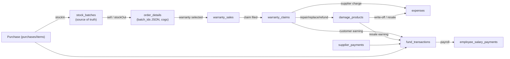

1. **Purchase → Stock:** publishing a purchase creates `purchases` + `purchase_items`, optional `supplier_warranties`, then `StockManagementService::stockIn()` writes `stock_batches` (+ optional serials to `sn_stock`) and refreshes `products.stock`/variant stock.
2. **Sale → Stock:** POS/web orders run `stockOut()` against preferred batches; `stock_batches.remaining_qty` drops, `products.stock` syncs, `sn_stock` moves to `sn_sold` when serials tracked. `order_details.batch_ids` records which batches were drawn.
3. **Warranty pipeline:** `order_details → warranty_sales` (1:1 per line) → `warranty_claims` → stage/note/reminder/challan children. Resolutions either flow back to the customer (`return_type`) or become `damage_products`; supplier-side charges → `expenses`, customer compensations → `fund_transactions`.
4. **Finance ledger:** nearly every money event (sale payment, refund, expense, supplier payment, salary/bonus, warranty resell) posts a `fund_transactions` row (`direction` in/out) with a running `balance_after`, optionally sourcing a snapshot into the matching `*_logs` table.

---

## 6. Gotchas for schema work

- **Never edit `config/updater.php`** — the license server is hardcoded + base64; the app refuses to boot if altered (`LicenseService::assertConfigIntegrity()`).
- **No docker-compose.yml** → Sail unusable; MySQL is often unreachable in sandboxed environments. Validate schema-free code via tinker/Blade `compileString`.
- **Migration files are snapshot-style & guarded** (`Schema::hasTable()` / `Schema::hasColumn()`), so many "fix" migrations are runtime no-ops on a fresh DB — don't delete them; they exist for live-DB upgrades.
- **`products.deleted_at`** is the only soft-delete column. `Product::delete()` = soft; products with transaction history must be soft-deleted, never hard-deleted.
- **Preserve typo column names** (`reviews.ratting`, `contacts.hotmail`, `sms_gateways.serderid`, `general_settings.secodery_color`/`og_baner`).
- **Real DB enums are rare**; PHP `app/Enums/*` are canonical. When adding a new status value, update the PHP enum + any DB enum columns together.
- **PK type split:** when referencing `orders`/`customers`/`users`/`order_details` from new tables use `unsignedInteger`; when referencing products/stock/suppliers/warranty use `foreignId` (bigint).
- **Wholesale `*_wholesale_prices.wholesale_price` is a per-unit ৳ DISCOUNT** subtracted from sell price at tier qty — not a final price.
- **Purchase pricing:** `purchases.grand_total` is read-only in edit; pricing edits happen per-batch (`purchase_item_prices` + `batch_*` tables).
- Most of the app's ~105 tables are intentionally **FK-constraint-light** (logical FKs only). Don't assume `constrained()` FKs exist — check the specific migration.

---

## 7. Migration index (by domain)

| Group | Key migrations |
|---|---|
| Catalog/products | `...055_create_products_table`, `...051/052`, `...076/080`, `2026_06_30_154600`, `2026_07_29_171845`, `2026_08_25_000006`, `2026_08_30_000001` |
| Sales/orders | `...044/045/046/048/059`, `2026_07_02_000001/000003`, `2026_08_02_000202`, `2026_07_22_000000`, `2026_08_11_000001..000004` (shipping/charges) |
| Stock | `2026_07_06_125944` (stock_batches), `125951` (adjustments), `2026_07_06_130001`, `2026_08_25_000001` (batch pricing flags) |
| Purchase/supplier | `...058`, `...070`, `2026_07_01_120000_078/079`, `2026_07_06_125951/125952` (returns), `2026_07_05_163600`, `2026_09_01_000001` (draft), `2026_08_25_000005` (item prices), `2026_09_02_000001/000002` (purchase_logs) |
| Warranty/damage | `2026_07_20_000001..000007`, `2026_07_28_000001..000004`, `2026_08_02_000101..000105`, `2026_08_10_000001`, `2026_08_23_000001/000002` |
| Finance | `...028/029/032/033`, `2026_08_03_000003/000004` |
| HR | `...022..027` |
| RBAC/users | `...041/042/049/061/062/073`, `...074` (vendors) |
| Settings/integrations | `...001`, `...016`, `...021`, `...030/031/035`, `...034`, `2026_07_11_000000`, `2026_08_11_000005/000006`, `2026_08_11_164239`, `2026_08_12_000001` |
| Content | `...002/003/036/037/038`, `2026_06_28_000000/160000`, `2026_08_13_120000` |
| System | `2026_08_03_000002` (activity_logs), `...018` (cron_job_settings), `...075` (versions), `...040` (ip_blocks), `2026_09_03_000003` (invoice unique), `2026_09_03_000004` (HR uniques), `2026_09_03_000005` (missing indexes), `2026_09_03_000006` (RBAC uniques) |

---

## 8. Phase 6–7 updates (2026-09-03): Schema hardening & ops monitoring

### 8.1 HR uniqueness constraints (Phase 6.1)
- `employee_attendances`: replaced single-employee unique on `employee_id` with composite unique on `(employee_id, attendance_date)` — allows multiple attendance records per employee across different dates.
- `employee_salaries`: replaced single-employee unique on `employee_id` with composite unique on `(employee_id, salary_month)` — allows multiple salary records per employee across months.
- Migration: `2026_09_03_000004_fix_hr_unique_constraints.php`

### 8.2 Missing indexes (Phase 6.2)
Added performance indexes on high-cardinality FK columns + unique constraint on `invoice_id`:
- `orders`: index on `customer_id`, index on `order_status`, **unique** on `invoice_id`
- `order_details`: index on `order_id`, index on `product_id`
- `payments`: index on `order_id`
- `refunds`: index on `order_id`
- `shippings`: index on `order_id`
- `carts`: index on `customer_id`
- Migration: `2026_09_03_000005_add_missing_indexes.php`

### 8.3 RBAC uniqueness & composite PKs (Phase 6.3)
- `roles` & `permissions`: replaced unique on `name` alone with composite unique on `(name, guard_name)` — allows same name across different guard contexts (`admin` vs `customer`).
- `model_has_roles`: added composite primary key on `(role_id, model_id, model_type)` — replaces any old primary key and ensures no duplicate assignments.
- `model_has_permissions`: added composite primary key on `(permission_id, model_id, model_type)` — replaces any old primary key.
- Migration: `2026_09_03_000006_fix_rbac_uniques.php`

### 8.4 Operational tasks (Phase 7)
- **Nightly reconcile:** `stock:sync-from-batches --dry-run` scheduled at 02:00 daily (via `app/Console/Kernel.php`) to detect stock drift between `products.stock` and `stock_batches.remaining_qty`. On success logs to `stock` channel; on failure alerts via `warning` log.
- **Log retention:** monthly archival command `logs:archive-activity --days=90` scheduled 1st of each month at 04:00 to prune activity logs older than 90 days and prevent unbounded table growth.
- **Monitoring hooks:** guarded via `onSuccess()`/`onFailure()` callbacks on scheduler; can extend to Slack/email alerts if desired.

---

## 9. Conventions & best practices

**Stock safety:**
- All stock mutations go through `StockManagementService` (`stockIn/stockOut/adjustStock/syncStockFromBatches`). Direct writes to `products.stock` are a bug.
- `StockBatch` is the single source of truth; `products.stock` + variant stock are cache fields always kept in sync.

**Schema work:**
- Always guard with `Schema::hasTable()`, `Schema::hasColumn()`, custom `indexExists()` checks to support fresh installs + live upgrades.
- Use `DB::transaction()` to wrap multi-step schema changes.
- Avoid `Doctrine\DBAL` methods (e.g., `getDoctrineSchemaManager()`) — not available in all environments. Use `INFORMATION_SCHEMA` queries or Laravel schema helpers.

**Enums & status:**
- DB stores statuses as strings/enums; PHP `app/Enums/*` are canonical value lists.
- `OrderStatus` uses legacy int-to-enum bridging via `fromLegacyId()` for backward compatibility.

**Foreign keys:**
- Legacy core tables (orders, customers, users, payments) use INT UNSIGNED without FK constraints.
- Newer tables (products, stock, warranty, finance) use BIGINT `foreignId` with optional real/comment constraints.
- Avoid adding real FK constraints to legacy INT tables without thorough testing on a live-DB backup.

**Audit trail:**
- `log_activity(module, action, description, $model, $data)` writes to `activity_logs`; available everywhere via the helper.
- Purchase/expense/fund edits also snapshot old/new diffs + fund balance into `*_logs` tables.
- Keep `log_activity()` calls **after** DB transactions commit to avoid logging rolled-back events.

**Demo mode:**
- `DEMO_MODE=true` in `.env` makes admin read-only. Test major changes on a staging clone or local environment.

