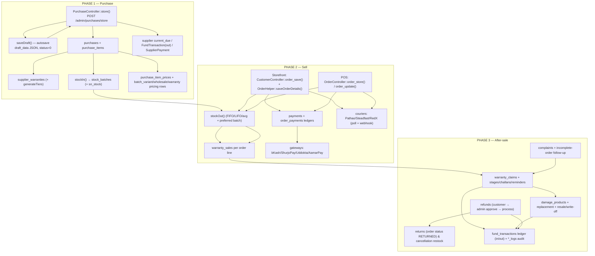

# Product Lifecycle Deep Analysis — Purchase → Sell → After-Sale Support

> **Repo:** `lara` (Ecommerce Pro, Laravel 12)
> **Scope:** end-to-end trace of money, stock, warranty and support data as a product moves from supplier purchase → stock-in → sale (web + POS) → after-sale (warranty claims, refunds/returns, complaints).
> **Method:** read-only trace of controllers/services/models with file:line citations. Critical claims verified directly against source.
> **Last reviewed:** 2026-09-02

---

## 1. Lifecycle overview



---

## 2. Phase 1 — Purchase → Stock-In

### 2.1 Publish flow — `PurchaseController::store()` (`app/Http/Controllers/Admin/PurchaseController.php:164-382`)

Order of operations:

1. **Validate** (:164-205) — `supplier_id`, `purchase_date`, `invoice_no`, `items[]` (`product_id`, `qty`, `unit_cost`) + optional per-item batch pricing (`selling_price`, `mrp`, `activate_website`, `variant_prices`, `wholesale_tiers`, `warranty_tiers`) and `serial_numbers[]`.
2. **Warranty → SN enforcement** (:207-226) — if `warranty_days > 0`, every unit must carry a serial; else back with `$snErrors`.
3. **Totals** (:228-243) — `grand_total = Σ(qty×unit_cost) − discount + shipping_cost`; `paid = min(grand, paid_amount)`; `due = grand − paid`.
4. **`Purchase` row** (:235-248).
5. **Per item** (:252-315):
   - `PurchaseItem` (:262) — qty, unit_cost, line_total, custom_field.
   - `SupplierWarranty` (:269-295) — only if `warranty_days > 0`; type `supplier_warranty`, end = start + days.
   - `WarrantyService::generateTiers()` (`app/Services/WarrantyService.php:27-80`) — `firstOrCreate` product_warranty_tiers: "No Warranty" (90% of base price), "Standard Warranty" (supplier days), extended only if pre-existing.
   - `products.supplier_price = unit_cost` (:292-296).
   - **`StockManagementService::stockIn()`** (:298) with `reference_type='purchase'`, `reference_id=$purchase->id`, `serial_numbers` (:307).
   - `persistBatchPricing()` (:313, `:880-907`) — **only when `config('pricing.batch_wise')`**: `batch_variant_prices`, `batch_wholesale_prices`, `batch_warranty_tiers` (+ on-the-fly `product_warranty_tiers`), then the `purchase_item_prices` snapshot; `setActiveWebsiteBatch()` if `activate_website`.
6. **Supplier ledger** (:317-348) — `supplier->current_due += due`; if `paid > 0`: `FundTransaction(direction='out', source='supplier_payment')` → `SupplierPayment` → back-link `fund->source_id`.
7. **`PurchaseLog action='create'`** (:351-370) with fund balance before/after.
8. **Draft publish** (:372-382) — deletes the `status=0` draft row, redirects to clean index.

### 2.2 Draft autosave — `saveDraft()` (:388-440)

- Whole form serialized to one `payload` string; stored in `purchases.draft_data` (JSON, `status=0`), all money/qty columns zeroed. `serial_numbers` excluded client-side (`resources/views/backEnd/purchases/index.blade.php:603-604`). No stock/accounting rows created.

### 2.3 `stockIn()` internals (`app/Services/StockManagementService.php:44-105`)

- Creates `stock_batches` row: `quantity=remaining_qty`, `unit_cost`, `selling_price`, `mrp`, `wholesale_price`, flags (`is_active_for_website`, `pos_enabled=true`, `auto_advance`), mfg/exp.
- Writes `sn_stock` JSON when serials supplied (:82-91).
- `$product->increment('stock', $qty)` (:95) + variant stock increment (:102-104).
- Average costing → `recalculateAverageCost()` (:474-496) rewrites **`products.purchase_price`** as weighted moving average.

### 2.4 Pricing / cache engine — `PricingService` (`app/Services/PricingService.php`)

- `refreshProductCache()` (:363-388) → `products.website_price` (active batch selling_price, fallback raw `new_price`), `website_stock` (Σ sellable batches), and shadows `new_price` when > 0.
- `setActiveWebsiteBatch()` (:80) — one `is_active_for_website=1` batch per product.
- Triggered after purchase publish, batch price saves, adjustments, supplier returns, and by `stock:sync-from-batches` / `pricing:backfill`.

### 2.5 Supplier payments & returns

- **`payDue()`** (`PurchaseController:461-510`): FundTransaction `out/supplier_payment` → SupplierPayment → `purchase.paid/due` recompute → `supplier.current_due −= amount`. ⚠️ `suppliers.total_paid` is **never updated by any code** (dead denormalized column).
- **Supplier returns (2 mechanisms):**
  - `StockController::storeSupplierReturn` (`StockController.php:373-454`) — **goods coming back to store**: creates SupplierReturn + items, increments `products.stock` AND `stock_batches.remaining_qty` directly (no `stockIn`), then `refreshProductCache` + `syncStockFromBatches`.
  - `PurchaseController::returnItem` (`:516-566`) — **goods going back to supplier**: bumps `purchase_items.returned_qty`, then **manual FIFO decrement of `stock_batches.remaining_qty` + `products.stock`** (:536-554) — bypasses `stockOut`, writes no `type='out'` trace row, and `reference_type='purchase_return'` is never emitted by any code path.

### Phase-1 touch map

| Table | Write | Trigger |
|---|---|---|
| `purchases` (+`draft_data`) | create / update | store / saveDraft |
| `purchase_items` | create | store |
| `supplier_warranties` | create | store (warranty_days>0) |
| `product_warranty_tiers` | firstOrCreate | generateTiers / saveWarrantyPricing |
| `stock_batches` | create (in) + sn_stock | stockIn |
| `batch_variant/wholesale/warranty` | create | persistBatchPricing |
| `purchase_item_prices` | create | persistBatchPricing |
| `products` | stock↑, supplier_price, purchase_price (avg), website_* | stockIn / PricingService |
| `product_variant_prices` | stock↑ | stockIn |
| `suppliers` | current_due ↑/↓ | store / payDue / destroy |
| `supplier_payments` | create | store (paid) / payDue |
| `fund_transactions` | out (supplier_payment) | store / payDue |
| `purchase_logs` | create/edit/delete | store / saveBatchesPricing / destroy |

---

## 3. Phase 2 — Sell

### 3.1 Storefront checkout — `CustomerController::order_save()` (`app/Http/Controllers/Frontend/CustomerController.php:424-870`)

> Route: `POST /order-save` → `customer.ordersave` (`routes/web.php:416`). **No DB transaction wrapper.**

1. Validate name/phone/address/area (:426-431); campaign single-product override rebuilds cart (:434-478); digital+COD blocked (:485-490).
2. **Shipping fee re-resolved server-side** (:500-556): district-linked charge via `shipping_charge_district` pivot → legacy area=charge-id → customer-picked `shipping_charge_id`.
3. **Order created** (:585-628): `invoice_id = rand(11111,99999)` ⚠️ (no unique guarantee), `amount = grandTotal`, `order_status = 'pending'`, `order_type = cod|online`, `payment_status = 'pending'`, `discount`, `coupon_code` from session.
4. `shippings` snapshot (:632-648) — `area` = `"area, district"` text.
5. `payments` row (:651-669) — online gateways get `amount = 0` (callback fills it), COD gets payable amount.
6. **`OrderHelper::saveOrderDetails()`** (`app/Helpers/OrderHelper.php:13-94`): `order_details` per item (+ `warranty_tier_id`/`warranty_price` if tier active) and **`WarrantySale::updateOrCreate` per order line** (:46-88). Supplier warranty matched from `supplier_warranties` (earliest `warranty_end_date`), not from the batch.
7. **StockOut** (:676-711):
   - batch-wise ON: `PricingService::websiteAllocation()` splits qty across sellable batches (FIFO by `mfg_date, created_at, id`), then per portion `stockOut(..., preferredBatchId)`; then `advanceActiveBatchIfDepleted` + `refreshProductCache`.
   - else single `stockOut($product, $qty, ['type'=>'sale','id'=>$order->id])`.
   - ⚠️ `catch (\Throwable)` fallback directly decrements `products.stock` (:704-711) — drift path.
   - ⚠️ Stock consumed **at order placement** even for `pending` web orders.
8. Gateway redirect (:765-800) → bKash/ShurjoPay/Uddokta/AamarPay; COD → digital downloads + success page.
9. `IncompleteOrder::where('phone')->delete()` cleanup (:760).

**Not done on storefront:** no `fund_transactions` sale row, no `order_notes`, no coupon `used_count++`, no duplicate-order check (admin-only), no SN handling (`is_sn_required` ignored; `sn_stock→sn_sold` movement does not exist anywhere — verified: `sn_sold` appears only in model casts).

### 3.2 POS sale — `OrderController::order_store()` (`app/Http/Controllers/Admin/OrderController.php:1920-2195`)

- Cart instance `pos_shopping`; customer find-or-create by phone (:1946-1963).
- `order_type = pos|cod`; paid order → `order_status='completed'`, else `'pending'` (:1972-1995).
- `order_payments` ledger row if paid>0 (:2036-2045) + `payments` current-state row (:2047-2052).
- Detail loop (:2055-2140): warranty tier, **SN uniqueness check against active/claimed `warranty_sales.serial_numbers`** (:2100-2112), and a **`WarrantySale` for every line** (even `warranty_type='none'`), carrying `serial_numbers`, `stock_batch_id`, `purchase_id`, `sold_by`.
- **`handleStockChange($order, 0, status)`** (:2165) — paid POS consumes stock immediately; COD POS (pending) consumes nothing until first active status.
- Fund: `in/sale` for `$paid` (:2168-2177) — ⚠️ `balance_before/after` not populated.
- `order_update` (:2804-3072): recomputes paid/due, appends OrderPayment, guarded FundTransaction, `reAdjustStockForBatchChange` on batch swap (:3067-3081).

### 3.3 Stock engine — `handleStockChange` / `stockOut`

- `OrderController::handleStockChange` (:62-145): active statuses (`OrderStatus::consumesStock()` — confirmed→completed) → `stockOut` with `preferredBatchId = warranty_sale.stock_batch_id`; writes `order_details.cogs` + `batch_ids` JSON; **CANCELLED from active → `stockIn` with `reference_type='sale_return'`** (:116-129); fallback direct decrement (:111-117).
- `stockOut` (`StockManagementService.php:143-275`): preferred batch first → FIFO/LIFO by `created_at` or average → **auto-selection prioritizes batches with soonest-expiring supplier warranty** (`getAutoSelectionBatches` :389-416) → writes `type='out'` trace batch (`quantity=-qty`, `remaining_qty=0`) → decrements `products.stock`.
- ⚠️ `RETURNED` order status moves **no stock** (only CANCELLED restores).

### 3.4 Payments & couriers

- **Two ledgers:** `payments` = one current-state row per order (gateways write `trx_id`, `paid`); `order_payments` = append-only receipts (POS initial, order_update, `receivePayment`); `Order::recalculatePaymentTotals()` (`Order.php:105-112`) recomputes paid/due/status from receipts.
- **Gateways:** bKash → `order_status='pending'`, `payment_status='paid'`; ShurjoPay → `confirmed`/`paid`; aamarPay → `pending`/`paid`; UddoktaPay → paid only. None touch stock or fund.
- **Fund `in/sale` entry points are inconsistent:** guarded by `exists()` in `updateSingleStatus`/`markDelivered`/`completeOrder`/`order_update`, **unguarded** in `order_process` (:1125-1132) and **RedX webhook** (:82-87) → possible duplicate sale credits.
- **Courier poll `courier:check-status`** (`app/Console/Commands/CheckCourierOrderStatus.php`): ⚠️ queries **legacy int `order_status = 5`** (:43-48) — post-enum-migration this selects nothing; writes raw ints back (:88-90); no stock/fund/note side effects.
- **RedX webhook** (`app/Http/Controllers/Admin/RedXWebhookController.php`): writes int status, credits fund on `6`, and its private `handleStockChange` (:133-166) **mutates `products.stock` directly** (drift source) using legacy ints `[1,2,3,5,6,8]`, bypassing batches and the `OrderWarrantyObserver`.
- `OrderWarrantyObserver` (`app/Observers/OrderWarrantyObserver.php`): DELIVERED → `activateOnDelivery` (warranty start/end set); RETURNED/CANCELLED → `voidWarranty`.

### Phase-2 touch map

| Table | Write | Trigger |
|---|---|---|
| `orders` | create / status / paid / due | order_save, order_store/update, callbacks, poll, webhook |
| `order_details` (+`batch_ids`,`cogs`) | create / update | OrderHelper / handleStockChange |
| `warranty_sales` (+`serial_numbers`) | updateOrCreate | OrderHelper, POS store/update |
| `payments` | current-state row | checkout, POS, callbacks, updatePaymentStatus |
| `order_payments` | append receipts | POS, receivePayment, order_update |
| `stock_batches` | in/out rows, remaining_qty | stockIn/stockOut |
| `products` / `product_variant_prices` | stock ↓/↑ | stockOut/stockIn (+ drift fallbacks) |
| `shippings` | create | checkout, POS |
| `digital_downloads` | firstOrCreate | COD + gateway success |
| `fund_transactions` | in (sale) | POS/status completions/webhook (inconsistent guards) |
| `incomplete_orders` | delete on success | order_save |
| `order_notes` | system notes | transitions, POS creation, payments |

---

## 4. Phase 3 — After-Sale Support

### 4.1 Warranty claims — `WarrantyService::fileClaim()` (`app/Services/WarrantyService.php:143-235`)

Single funnel (customer API/web/admin-on-behalf). Guards: warranty `ACTIVE`, order `completed|delivered`, no open claim, `max_claims_per_sale = 3`. In one `DB::transaction`: warranty sale → `claimed`; claim → `submitted` (claim_number `WCL-YYYYMMDD-XXXXX`); stages `submitted` (completed) + `document_verification` (pending).

**Status machine** — `WarrantyClaimStatus::canTransitionTo()` (`app/Enums/WarrantyClaimStatus.php:70-91`):
```
submitted → under_review | cancelled
under_review → approved | rejected
approved → awaiting_product | in_service | cancelled
awaiting_product → product_received | cancelled
product_received → sent_to_supplier | in_service | cancelled
sent_to_supplier → awaiting_supplier_return
awaiting_supplier_return → supplier_returned
supplier_returned → serviced | in_service
in_service → serviced
serviced → ready_for_delivery → delivered → resolved
```

**Pipeline actions + challans** (`WarrantyController` + `WarrantyChallanService`):

| Action | Controller | challan_type | Key writes |
|---|---|---|---|
| receiveProduct | :538-580 | `receive` | status→product_received, `receive_challan_no` |
| sendToSupplier | :581-609 | `send_to_supplier` | status→sent_to_supplier, `sent_supplier_id`, `supplier_challan_no` |
| supplierReturn | :610-674 | `receive_return` | status→supplier_returned, `return_type`, `replacement_sn`, `supplier_charge`, **expense+fund `out`** (:636-655), SN rewritten on warranty sale |
| deliverToCustomer | :694-751 | `delivery` | status→delivered→resolved, `customer_charge`, **fund `in` source=`warranty`** (:718-729) |
| readyForDelivery | :676-692 | — | direct status write |

- `warranty_challans.challan_data` = full printable JSON snapshot.
- `warranty_claim_reminders` created on supplierReturn/deliver forms (`supplier_delivery` / `customer_delivery` steps).
- `warranty_claim_stage_attachments` uploaded to `public/uploads/media/warranty`.

### 4.2 Damage & replacement — `WarrantyController::giveReplacement()` (:904-1006)

1. `stockOut(type='warranty_replacement')` consumes 1 unit (:925-928), raw `decrement` fallback (:933).
2. `damage_products` row: original SN, replacement SN, `damage_type`, status `on_warranty` (:946-958).
3. Optional supplier handoff → `supplier_hold` + challan (:962-979).
4. Warranty sale SN swapped to replacement (:977-979); claim → `ready_for_delivery` (:985-987).
5. ⚠️ **No order/order_detail is created** — `replacement_order_detail_id` is never assigned anywhere (dangling column).

**Damage lifecycle** — `updateDamageStatus()` (:1008-1180): `on_warranty → supplier_hold → in_service → resellable | unsellable | discarded`.
- → `resellable`: `stockIn(reference_type='warranty_repair')` puts the repaired unit back into stock (:1035-1040); if resell price > 0 → fund `in` source=`warranty_resell` (:1044-1051).
- → `unsellable`: `damage_cost` → Expense `warranty_loss` + fund `out` (:1066-1094).
- Service cost → Expense `warranty_repair` + fund `out` on any change (:1111-1140). ⚠️ `expense_id` column is shared between repair expense and write-off expense.

### 4.3 Refunds — `Frontend/RefundController` + `Admin/RefundController`

- **Customer request** (`Frontend/RefundController.php:66-124`): guards order not cancelled, no open refund, amount ≤ order amount; creates `refunds` row `pending`.
- **Approve** (`Admin/RefundController.php:58-117`): partial support (`refund_amount`, `include_shipping`); fund balance guard; **money leaves fund at APPROVE** (`out/refund`, source_id = refund id) — process only adds metadata.
- **Reject** (:129-172): if previously approved → compensating `in/refund_reversal`.
- **Process** (:182-224) → `status=processed`; ⚠️ **stock restore** (:227-235): only if `order_status == 'cancelled'`, then direct `product->stock += qty` — **batch-blind, no `sale_return` row**, and can double-restore when `OrderController::handleStockChange` already restored on cancellation. **DRIFT RISK.**
- No `order_notes` are written for refund events; order `payment_status` is not updated.

### 4.4 Returns (order-level)

- `Order::requestReturn/approveReturn/markReturned` (`Order.php:346-365`) → enum transitions with system order_notes.
- ⚠️ `RETURNED` restores **no stock**; only `CANCELLED` triggers `stockIn(reference_type='sale_return')` in `handleStockChange` (:116-129).

### 4.5 Complaints & incomplete orders

- Complaints: public store (`Frontend/ComplaintController.php:9`) → admin `updateStatus` (`Admin/AdminComplaintController.php:27`) with `pending|processing|resolved`. No notes table, no order link (order_id is a string).
- Incomplete orders: captured at checkout failure (`FrontendController.php:618`, `items` JSON cast); admin `accept()` (`IncompleteOrderController.php:76-216`) creates customer+order+details then **directly decrements `products.stock`** (:196-199) — batch-blind drift point (web orders defer deduction to active status; this deducts at `pending`).

### 4.6 Scheduled jobs

- `warranty:expire` (hourly) — flips active sales past `warranty_end_date` → `expired`.
- `warranty:update-tiers` (daily 03:00) — syncs supplier-warranty tier `warranty_days`/name from earliest valid `supplier_warranties`; deactivates when none.
- `courier:check-status` (scheduled) — ⚠️ broken against enum statuses (legacy int filter).

---

## 5. Risk register (verified findings)

| # | Severity | Finding | Location |
|---|---|---|---|
| 1 | 🔴 HIGH | `PurchaseController::store()` has **no transaction** — partial writes on mid-loop failure (stock batched but purchase header orphaned, etc.) | `PurchaseController.php:164-382` |
| 2 | 🔴 HIGH | Storefront checkout has **no transaction** and no order_notes/fund entries; prices are cart-trusted | `CustomerController.php:424-870` |
| 3 | 🔴 HIGH | Stock drift sources — direct `products.stock` writes bypassing batches: refund process, incomplete-order accept, RedX webhook, storefront `catch` fallback, mobile API | `RefundController.php:234`, `IncompleteOrderController.php:197-199`, `RedXWebhookController.php:145/159`, `CustomerController.php:704-711`, `Api/Mobile/OrderController.php` |
| 4 | 🔴 HIGH | Double stock restore possible: refund `process()` restores on cancelled orders *and* `handleStockChange` already restored via `sale_return` | `RefundController.php:227-235` vs `OrderController.php:116-129` |
| 5 | 🟠 MED | `courier:check-status` + RedX webhook still use **legacy integer statuses** (5/6/11) against enum string column — poll likely matches nothing; webhook writes ints back | `CheckCourierOrderStatus.php:43-48,88-90`, `RedXWebhookController.php:137` |
| 6 | 🟠 MED | `sn_sold` never written — serial tracking is one-way (`sn_stock` only); POS serials live solely on `warranty_sales.serial_numbers` | `StockBatch.php` casts vs no writers |
| 7 | 🟠 MED | Coupon `max_uses`/`used_count` never enforced or incremented (storefront + POS) | `ShoppingController.php:173-216`, `OrderController.php:2639-2690` |
| 8 | 🟠 MED | Duplicate `in/sale` fund credits possible — `order_process` (:1125) and RedX webhook (:82) don't check `exists()` like other paths | `OrderController.php:1125-1132`, `RedXWebhookController.php:80-88` |
| 9 | 🟠 MED | `invoice_id = rand(11111,99999)` — no uniqueness; collision risk + no unique index on DB | `CustomerController.php:585` |
| 10 | 🟠 MED | `purchase_items.returned_qty` updated only by `returnItem` (manual FIFO decrement, no out-batch trace); `reference_type='purchase_return'` never emitted | `PurchaseController.php:532-554` |
| 11 | 🟠 MED | `suppliers.total_paid` dead column — never written by any code | `Supplier.php` fillable |
| 12 | 🟡 LOW | `replacement_order_detail_id` dangling — instant replacement creates no order detail | `WarrantyController.php:904-1006` |
| 13 | 🟡 LOW | `damage_products.expense_id` shared between repair and write-off expenses | `WarrantyController.php:1111-1140` |
| 14 | 🟡 LOW | Warranty sale created with `warranty_type='none'` for every POS line (noise rows) | `OrderController.php:2115-2140` |
| 15 | 🟡 LOW | Fund `balance_before/after` columns exist but are not populated on most writes | POS store :2168-2177 |

---

## 6. What works well

- **Stock ledger integrity** (when the service is used): in/out batch rows with `reference_type`/`reference_no` give a full audit trail; `sale_return` restock and `warranty_replacement`/`warranty_repair` references keep causality.
- **Warranty pipeline** is well-modeled: state machine enforced in enum, stages/challans/reminders/attachments, finance links to expenses/fund.
- **Batch auto-selection** selling soonest-expiring warranty first is a smart real-world optimization.
- **Dual payment ledgers** (`payments` current state + `order_payments` append-only) is the right pattern; `recalculatePaymentTotals()` keeps them consistent.
- **Audit culture**: `purchase_logs`, `fund_transaction_logs`, `expense_logs`, `activity_logs`, `order_notes`.

## 7. Recommended fixes (priority order)

1. Wrap `PurchaseController::store()` and storefront `order_save()` in `DB::transaction` with try/catch rollback.
2. Route all stock mutations through `StockManagementService` — replace the 5 direct-write drift points; add `purchase_return` and `sale_return` handling for `RETURNED`.
3. Migrate courier poll + RedX webhook to enum statuses via `Order::transitionTo()` (so observers, notes, stock, and fund all fire consistently) and add fund `exists()` guards.
4. Implement SN movement `sn_stock → sn_sold` on sale and restore on cancel.
5. Enforce coupon `max_uses/used_count`; unique index on `orders.invoice_id` (and generate it safely).
6. Reconcile refund-vs-cancellation stock restore (single ownership: refund never touches stock; return/cancel path owns restock).
