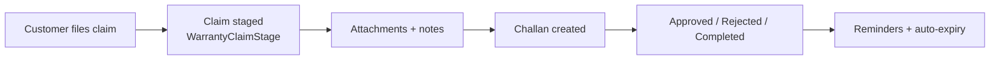
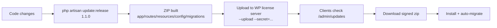

# Ecommerce Pro — Services & Features Guide

> **Platform:** Laravel 12 e-commerce system (codename **lara** / "Ecommerce Pro").
> **Purpose of this doc:** an in-depth **service + feature list** with **simple details**
> for customers/sales and **working processes** for developers/QA.

---

## 1. What is Ecommerce Pro?

Ecommerce Pro is a full e-commerce solution that ships with **three storefronts in one**:

- 🛍️ **Online Storefront** — customers browse, buy, and pay online.
- 🧾 **POS (Point of Sale)** — admin/staff sells from the counter, from any stock batch.
- 📱 **Mobile App API (Flutter)** — a ready-to-connect mobile app backend.

It also includes a complete **Admin Panel** for products, orders, stock, purchases,
warranty, employees, expenses, marketing, and reports — plus a **warranty pipeline**
and a **license/update server** integration so the software itself stays licensed and
up-to-date.

---

## 2. Tech Stack (simple)

| Layer | Technology |
|---|---|
| Backend | PHP 8.2, Laravel 12 |
| Database | MySQL |
| Frontend (storefront/admin) | Blade + Bootstrap 5, static assets in `public/backEnd` & `public/frontEnd` |
| Frontend (customer panel) | Tailwind (separate layout) |
| Mobile API | Laravel REST API + Sanctum auth (for Flutter app) |
| Payments | bKash, Shurjopay, UddoktaPay, AamarPay |
| Couriers | Pathao, Steadfast, RedX |
| Marketing pixels | Facebook CAPI, Google Analytics 4, GTM, TikTok |
| License/Update server | WordPress plugin `softmit-license-manager` (paired project) |

---

## 3. Feature Inventory

Each feature has: **what it is** (simple) → **how it works** (process). Detailed workflows
for the big ones are in [§5 Working Processes](#5-working-processes).

### 3.1 Storefront (customer-facing)

| Feature | Simple detail | How it works |
|---|---|---|
| Product catalog | Browse by category/subcategory/child-category, brand, color, size | Dynamic filters; products use slug-based URLs for clean links |
| Product detail page | Images, price, variants (color/size), stock, warranty selector | Price comes from the **active website batch** (batch-wise pricing engine) |
| Cart & checkout | Add to cart, choose warranty per item, place order | Session cart; warranty validated at checkout (`CartWarrantyService`) |
| Order tracking | Track order status by invoice | Public `orders/track/{invoiceId}` mobile API + storefront |
| Blog, pages, banners | Content marketing | Admin-managed CMS |
| Popups & campaigns | Promotional popups, hot-deals, campaign sections | `Popup`, `Campaign`, `HomepageLayout` admin modules |
| Reviews | Customer reviews on products | `Review` model, admin moderation |
| Newsletter | Subscribe for updates | `NewsletterSubscriber`, admin export/manage |
| Complaints | Customer files a complaint | Storefront form → `Complaint` → admin pipeline |

### 3.2 Admin Panel (dashboard)

| Feature | Simple detail |
|---|---|
| Dashboard | Sales, order, stock, revenue widgets |
| Product management | Full CRUD, media, SEO, digital downloads, soft/hard delete with history |
| Category / brand / size / color / district management | Catalog taxonomies |
| Order management | Create, edit, invoice, status workflow, duplicate-order flag |
| Purchase management | Purchases + per-batch pricing panel (Batch → Variant → Wholesale → Warranty) |
| Stock management | Batches, adjustments, barcode printing, stock sync |
| Supplier management | Suppliers + supplier warranty records |
| Customer management | Customers, addresses, order history |
| Coupon & shipping charges | Promo codes, shipping rules per district |
| Warranty pipeline | Warranty sales, claims, stages, challans, reminders |
| POS | Counter sales from all batches |
| Employees | Attendance, leave, salary, bonus, salary payments |
| Expenses & funds | Expense logging, fund transactions |
| Reports | Sales, stock, purchase, supplier, profit reports |
| Media manager | Uploads, folders, file manager (`public/uploads`) |
| Marketing | Banners, blogs, popups, social media, SEO, sitemap |
| Pixels & analytics | Facebook CAPI, GA4, GTM, TikTok pixel settings |
| Settings | General, payment gateways, SMS, email, courier, fraud, order restrictions |
| Roles & permissions | Spatie permission-based access control |
| Activity logs | Every action audited via `log_activity()` |
| Backup / cache tools | DB backup, one-click cache clear |
| Demo mode | Read-only admin when `DEMO_MODE=true` |
| License & updates | License key management + one-click update install |

### 3.3 Stock & Batch Management (core)

- **Batches** (`stock_batches`) hold `quantity`, `remaining_qty`, `unit_cost`, batch no, mfg/exp dates, and per-batch sell price.
- **Source of truth** for stock is `stock_batches.remaining_qty`. `products.stock` is a denormalized copy kept in sync by `StockManagementService`.
- **Costing methods:** FIFO / LIFO / Average — resolved per purchase → per product → global default.
- **Adjustments:** stock-in / stock-out / adjustment ledger via `StockAdjustment`.
- **Barcode printing** for batch labels.

### 3.4 Batch-Wise Pricing Engine (advanced, behind `BATCH_WISE_PRICING`)

- One **active website batch** per product (default = oldest FIFO batch with stock); the website shows & prices from it only.
- When it sells out and `auto_advance` is on, the system **auto-advances to the next FIFO batch**.
- **POS sells from ALL batches** — seller picks the batch per line.
- Website orders **consume stock FIFO across batches** (e.g. batch₁=3, batch₂=10, order of 8 → 3+5).
- Pricing set once per batch at purchase time; old product-page price editing retired.
- Fully reversible — everything is behind the feature flag.

### 3.5 Warranty Pipeline (flagship)

- **At checkout**, each product can carry a warranty tier: **No Warranty / Supplier Warranty / Extended Store Warranty**.
- Tiers are generated from supplier warranty records (`WarrantyService::generateTiers`), non-destructive (never overwrites admin prices).
- **Warranty sale** is created when the order is placed.
- **Claims pipeline:** customer files a claim → stages (`WarrantyStageType`) → attachments → notes → challans → reminders → auto-expiry (`warranty:expire`) & tier updates (`warranty:update-tiers`).
- Customer panel + mobile API: "My Warranties", "My Claims".
- Dynamic margin-based pricing via `WarrantyPriceCalculator`.

### 3.6 Orders & Payments

- Order statuses are **enum-driven** (`OrderStatus`); legacy integer statuses bridged via `OrderStatus::fromLegacyId()`.
- Gateways: **bKash, Shurjopay, UddoktaPay, AamarPay** (checkout + admin).
- **Duplicate-order detection** (local, no 3rd-party API): same phone on 2+ active orders ⇒ flagged.
- Incomplete-order recovery + courier integration.

### 3.7 Couriers (Pathao / Steadfast / RedX)

- Courier credentials stored per type in `Courierapi`.
- `RedXService` handles RedX API (sandbox-aware, token cleaned).
- `courier:check-status` polls order delivery status.
- RedX webhook updates order status.

### 3.8 Marketing & Analytics

- **Facebook CAPI** (`FacebookCapiService`) — server-side conversion events.
- **GA4, Google Tag Manager, TikTok pixel** — tag managers & pixel settings.
- **Facebook Page post** integration (`FacebookPagePostService`).
- Blog, SEO, sitemap, popups, homepage layout builder.

### 3.9 Wholesale / B2B

- `WholesaleProduct` + `ProductWholesalePrice` — quantity-tier wholesale pricing.
- Batch-anchored `BatchWholesalePrice` in the new pricing engine.

### 3.10 HR & Finance (admin)

- Employees, attendance, leave, salary, bonus, salary payments.
- Expenses + expense logs; fund transactions + fund logs.

### 3.11 Security & Anti-Fraud

- Spatie roles/permissions, IP blocking, fraud settings, order restriction settings.
- `DuplicateOrderService` flags repeat-phone orders.
- License enforcement (`AppSessionHandler`) redirects admins to the license page when invalid.
- Demo-mode read-only admin.

### 3.12 Mobile API (Flutter app)

- Auth (register/login/profile/password/logout), products, cart, orders, order tracking — all under `v1/mobile`.
- **Warranty API** for customers (`v1/customer/*`) and admins (`v1/admin/warranty/*`).
- Public storefront API (`v1/*`): slider, categories, homepage products, contact info.

### 3.13 Licensing & Updates (self-updating software)

- `LicenseService` verifies the install against the WP license server (`softmit.xyz`).
- `update:release` builds a version zip, optionally uploads it to the license server, bumps `app_version`.
- Clients check for updates, download signed zips, install, and **auto-run migrations**.
- License key is admin-managed (DB); server URL is baked into code (integrity-checked at boot).

---

## 4. Service Layer Deep-Dive

> These are the engine rooms. Each entry: **role** + **key methods** + **how it works**.

### 4.1 `StockManagementService`
**Role:** Single source of truth for stock movement. Never touch stock directly — use this service.

| Method | Purpose |
|---|---|
| `stockIn(product, data)` | Creates a `StockBatch` (qty, cost, batch no, mfg/exp, sell price) + ledger |
| `stockOut(...)` | Decrements batch `remaining_qty` FIFO across batches |
| `adjustStock(...)` | Positive/negative adjustment with `StockAdjustment` record |
| `syncStockFromBatches(productId?)` | Recomputes `products.stock` = `SUM(stock_batches.remaining_qty)` |
| `resolveMethod(product?, purchase?)` | Chooses FIFO/LIFO/average: purchase → product → global |

**How it works:** every stock movement writes to `stock_batches` (the ledger), and
`products.stock` is periodically reconciled from it so the storefront/POS/reports all agree.

### 4.2 `PricingService`
**Role:** The single source of truth for sellable prices (batch-wise mode).
- `isBatchWise()` — feature flag check.
- `activeWebsiteBatch(product)` — returns the one batch the website prices from; auto-advances if depleted.
- `setActiveWebsiteBatch(product, batchId)` — admin override.
- Legacy mode (flag off) falls back to `products.new_price` / variant price — fully reversible.

### 4.3 `WarrantyService` + `WarrantyChallanService` + `WarrantyPriceCalculator` + `CartWarrantyService` + `WarrantyDisplayService`
- **`WarrantyService`** — `generateTiers()` (non-destructive defaults from supplier warranty), `createWarrantySale()` (on order placement), claim lifecycle helpers.
- **`WarrantyPriceCalculator`** — tier pricing: No Warranty ≈ 88% of base, Extended ≈ 112% of base, or margin-based via `config('warranty.margins')`.
- **`CartWarrantyService`** — re-validates cart warranty tiers at checkout; auto-updates to latest admin price.
- **`WarrantyChallanService`** — creates warranty challans (physical repair/handover documents).
- **`WarrantyDisplayService`** — shapes warranty data for views/API.

### 4.4 `LicenseService`
**Role:** License verification + integrity guard for the whole app.
- `verify()` — POSTs `{domain, license_key}` to `{api_url}/api/verify-license`; 10-min cache.
- `config()` — baked-in `api_url`/`script_name` + DB-managed `license_key` + DB-driven `current_version`.
- `assertConfigIntegrity()` — throws at boot if the softmit.xyz URL was removed (DB-free).
- Skips verification for `localhost`/`127.0.0.1` and the master domain `softmit.xyz`.

### 4.5 `RedXService`
**Role:** RedX courier integration (POS/order delivery).
- Reads active RedX config from `Courierapi`; auto-prefixes `https://`; strips `Bearer`.
- `isConfigured()`, `getConfigStatus()`, booking & status methods (sandbox-aware).

### 4.6 `FacebookCapiService` / `FacebookPagePostService`
- **CAPI:** sends server-side conversion events (purchase, add-to-cart, etc.) to Facebook.
- **Page post:** auto-posts to Facebook page (from admin).

### 4.7 `DuplicateOrderService`
**Role:** Local duplicate-order detection (replaces a paid 3rd-party API).
- `normalize(phone)` → trailing 11 digits (Bangladesh format, strips `880`).
- `ordersFor(phone)` → active (non-cancelled/closed) orders for a phone via `RIGHT(REPLACE(...),11)`.
- ≥2 orders from the same phone ⇒ duplicate; response shape matches the old API so views work unchanged.

### 4.8 `Ads/` service folder
- Ads & analytics helpers (used by `AdsAnalyticsController` / `AdsAnalyticsSetting`).

---

## 5. Working Processes (step-by-step)

### 5.1 Stock-in via Purchase (the correct way to add stock)

1. Admin creates a **purchase** (supplier, items, cost, batch no, mfg/exp).
2. Each item calls `StockManagementService::stockIn()` → a `StockBatch` row is created with `remaining_qty = quantity`.
3. Costing method (FIFO/LIFO/avg) is resolved and recorded.
4. `products.stock` is synced from `SUM(remaining_qty)` so storefront, POS, and reports show the same number.

### 5.2 Website Order Flow

1. Customer browses; product shows the **active website batch** price + stock.
2. Customer adds to cart, optionally picks a **warranty tier** per item.
3. At checkout, `CartWarrantyService` re-validates the tiers (rejects removed/inactive ones, auto-prices).
4. Order is placed → status set (enum) → payment via bKash/Shurjopay/UddoktaPay/AamarPay (or COD).
5. Stock is consumed **FIFO across batches** (`StockManagementService::stockOut`).
6. A `WarrantySale` is created per item if a warranty tier was chosen.
7. `DuplicateOrderService` flags the order if the same phone already has active orders.
8. Courier integration (Pathao/Steadfast/RedX) picks up for delivery; webhook/`courier:check-status` updates status.

### 5.3 POS Sale

1. Staff opens POS, picks a product and **a specific batch** per line (POS sells from all batches).
2. Price comes from the chosen batch (batch-wise engine) — cost/profit tracked per batch.
3. On checkout, `stockOut` decrements that batch; payment recorded.

### 5.4 Warranty Claim Pipeline

1. Customer files a claim from storefront/panel/mobile API (`warrantySale.claim`).
2. Admin moves the claim through stages (`WarrantyStageType`) with attachments & notes.
3. A `WarrantyChallan` is created for physical handover.
4. Resolution marked; reminders sent via `WarrantyClaimReminder`.
5. `warranty:expire` auto-expires due warranties; `warranty:update-tiers` refreshes tiers.

### 5.5 Keeping Stock in Sync (drift fix)

1. Run `php artisan stock:sync-from-batches` (optionally `--product={id}`, `--dry-run`).
2. It recomputes `products.stock = SUM(stock_batches.remaining_qty)` for every product (or one).
3. Products with **no batches are left untouched** (never zeroed).
4. Prevention: always mutate stock through `StockManagementService`, never direct DB writes.

### 5.6 Release & Update Pipeline (self-update)

1. Developer runs `php artisan update:release {version} --changelog="..."`.
2. Command builds `update-{version}.zip` (core dirs + `manifest.json`), bumps `general_settings.app_version`.
3. Optional `--upload --secret=...` posts it to the WP license server (`softmit/v1/updates/upload`).
4. Clients click **Update** in admin → download (HMAC-signed URL) → install → **migrations auto-run**.

### 5.7 License Verification

1. App boots → `LicenseService::assertConfigIntegrity()` ensures the softmit.xyz config is intact.
2. Admin visits License page → `verify()` POSTs domain + key → 10-min cached result.
3. Valid → all good. Invalid → `AppSessionHandler` redirects admin to the license page with an error.
4. Key is managed in DB (admin-editable); localhost/master skip validation.

---

## 6. API Surface (summary)

| Area | Prefix | Auth | Purpose |
|---|---|---|---|
| Storefront public | `v1/*` | none | slider, categories, products, homepage, contact info |
| Mobile (Flutter) | `v1/mobile/*` | Sanctum | auth, products, cart, orders, tracking |
| Warranty customer | `v1/customer/*` | Sanctum | my warranties, claims |
| Warranty admin | `v1/admin/warranty/*` | Sanctum + role | stats, claims management |
| Update server | `updates/*` | license | check/info/download, `file/{version}` |
| License verify (client) | `api/verify-license` (WP) | license key | validity check |

---

## 7. Commands & Tools (cheat sheet)

| Command | What it does |
|---|---|
| `php artisan test` | Run Unit + Feature tests |
| `php artisan stock:sync-from-batches [--product=] [--dry-run]` | Reconcile `products.stock` from batches |
| `php artisan warranty:expire` | Auto-expire due warranties |
| `php artisan warranty:update-tiers` | Refresh warranty tiers |
| `php artisan courier:check-status [--limit=50] [--force]` | Poll courier delivery status |
| `php artisan update:release {version} [--upload] [--secret=]` | Build/upload update zip |
| `php artisan migrate:fresh:default` | Fresh migrate + default seeder only |
| `npm run dev` / `npm run build` | Vite build (sass/js only) |
| `php artisan view:cache` / `view:clear` | Validate Blade views without DB |

---

## 8. Key Concepts (things to never break)

1. **Stock source of truth = `stock_batches.remaining_qty`.** `products.stock` is a copy — always mutate via `StockManagementService` or re-sync afterward.
2. **Pricing source of truth = `PricingService`** (batch-wise when enabled).
3. **License server config is baked in** — `config/updater.php` must never be edited (`assertConfigIntegrity` guards it).
4. **Order status is enum-driven** — use `OrderStatus` enum, not raw integers.
5. **`DEMO_MODE=true`** makes the admin read-only.
6. **Audit everything** with `log_activity($module, $action, $description, $model, $data)`.
7. **Defensive DB checks** (`Schema::hasColumn()`) because live DBs may lag behind migrations.
