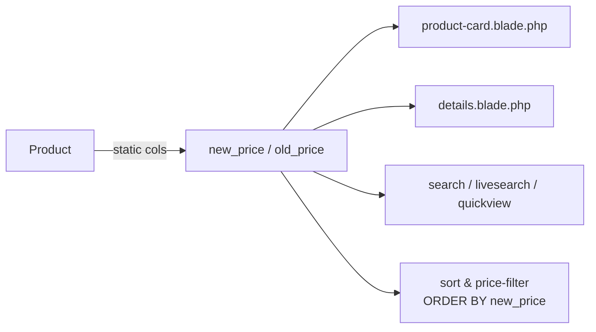
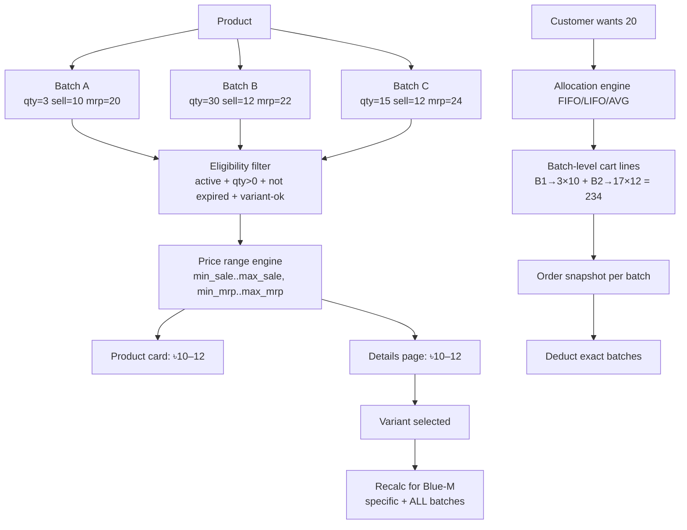

# Storefront Batch Pricing — Proper Implementation Design

> **Applies to:** `lara` storefront (frontEnd)
> **Companion doc:** [`STOREFRONT-BATCH-PRICING-FIX.md`](./STOREFRONT-BATCH-PRICING-FIX.md) — the concrete "make it work" fix/update plan.
> **Related:** [`UPGRADE-batch-wise-pricing.md`](./UPGRADE-batch-wise-pricing.md), [`CUTOVER-CHECKLIST.md`](./CUTOVER-CHECKLIST.md), [`plan.md`](./plan.md)
> **Source spec:** "E-Commerce Batch, Variant, Pricing & Cart Allocation Specification" (Pasted text #1) — referenced below as **[Spec §N]**.

---

## 1. TL;DR — why the storefront price is wrong

The storefront **does not price from batches**. Every catalog path reads the **static** `products.new_price` / `products.old_price` columns:



Meanwhile the real inventory lives in `stock_batches` (`remaining_qty`, `selling_price`, `mrp`), which the storefront only reflects *indirectly* and *unreliably*:

- `BATCH_WISE_PRICING` (config `pricing.batch_wise`) is **default OFF**, so `PricingService` is not consulted at all in the common case.
- Even when ON, the engine exposes **one "active website batch"** (a single price), never the **range** the spec requires ([Spec §4, §22]).
- `PricingService::refreshProductCache()` copies the **active batch** `selling_price` into `products.new_price`, but nothing syncs `old_price`/MRP, and nothing produces `min–max`.

**Result (the bug you are seeing):** product cards / detail pages show a stale, single, admin-typed price (frequently `0` or outdated) while the same product has sellable batches at different prices. A product that appears at `৳10` may actually be selling `৳10–৳12` from three live batches.

The rest of this document is the **target design** — the "proper way to implement" it so the storefront is batch-accurate end-to-end.

---

## 2. Core principle (the rule everything else follows)

> **[Spec §41] The customer buys a product + variant; the system fulfils that quantity from eligible inventory batches.**

Everything downstream (display, cart, order, deduction) must therefore treat these as **separate concepts**:

| Concept | Where it lives today | Gap |
|---|---|---|
| **Product** (catalog) | `products` | price/stock columns on it are **denormalized** |
| **Batch** | `stock_batches` | ✅ source of truth for qty + price |
| **Variant combination** | `product_variant_prices` (color×size) | only 2 fixed dimensions ([Spec §14] wants N dimensions) |
| **Batch → variant mapping** | `stock_batches.variant_price_id` (single, nullable) | no `is_all_variants` flag ([Spec §16/§36]) |
| **Wholesale rule** | `batch_wholesale_prices` | per-batch tiers exist ✅ |
| **Warranty rule** | `batch_warranty_tiers` | per-batch overrides exist ✅ |
| **Cart line** | hardevine cart item (single price) | cannot represent a split allocation ([Spec §27]) |
| **Order line** | `order_details` (single `sale_price` + `batch_ids[]`) | snapshot is per-order-line, not per-batch ([Spec §28]) |

**Design invariant:** *display/price input comes from batches only.* Static `new_price`/`old_price`/`stock` become **cache/output** columns, never the source of truth (consistent with `plan.md` for `products.stock`).

---

## 3. Target data flow



Eligibility rules are **exactly** [Spec §25]:

```
eligible(batch, variant?) =
    batch.pos_enabled            (active)
    AND remaining_qty > 0        (has stock — [Spec §33])
    AND (exp_date IS NULL OR exp_date >= today)
    AND applicable(batch, variant)
```

---

## 4. Batch → variant applicability (Specific vs ALL)

This is the piece most missing from the current model ([Spec §16–21, §26]).

### 4.1 Schema delta (needed)

Today a `stock_batches` row has **one** optional `variant_price_id`; you cannot say "this batch serves every combination". Add an explicit flag:

```text
stock_batches
  ├── variant_price_id  (nullable)  → batch tied to ONE specific combination
  └── is_all_variants   (bool, default false)  → batch serves ANY combination  [Spec §16 Option B]
```

Rules ([Spec §36]):
- `is_all_variants = true` ⇒ batch is eligible for **every** combination.
- `variant_price_id` set ⇒ batch is eligible **only** for that combination.
- Both `false` + `null` ⇒ legacy/unspecified → treat as "product-level" (only when the product has no variants).

Current batch-child tables already use the same convention you need to keep:
`variant_price_id = NULL` ⇒ **all variants**; a value ⇒ **that variant only** (`batch_wholesale_prices`, `batch_warranty_tiers`, `batch_variant_prices`). A batch-level `is_all_variants` flag just makes the **stock bucket** expressible.

> ⚠️ Important: `remaining_qty` is a **single column per batch**. An "ALL" batch holds *one shared pool* for all combinations — it is **not** a per-combination stock matrix. Allocation simply subtracts from that one pool ([Spec §19/§37]).

### 4.2 Eligibility resolution (in priority order)

For a chosen combination `Blue-M`:

```
1. batches where variant_price_id = Blue-M-id        (specific, highest priority — [Spec §20])
2. batches where is_all_variants = true              (fallback inventory — [Spec §21])
```

If neither exists ⇒ `stock=0`, `price=N/A`, Add-to-Cart disabled ([Spec §18/§39, Test 5]).

---

## 5. Price-range engine (cards & pre-variant detail)

One public method that is stock-aware ([Spec §33 — critical rule]):

```php
// Returns
// { min_sale, max_sale, min_mrp, max_mrp, count, single_sale, single_mrp }
$range = $pricing->priceRange($product, ?int $variantId = null);
```

Implementation rules:
1. Load **eligible** batches only (filter of §3).
2. If a variant is passed → only applicable (specific ∪ ALL) batches.
3. Sale price per batch = batch `selling_price`; if the batch has a `batch_variant_prices` row for the chosen variant → that price wins.
4. MRP per batch = batch `mrp` (or `batch_variant_prices.old_price`).
5. Compute min/max over those batches.
6. **If min == max** → render a single price; else render `min - max` ([Spec §4]).
7. **If zero eligible batches** → out-of-stock, no price ([Spec §33/Test 4]).

Display ([Spec §22, §34]):

```html
<del>৳20 - 24</del>      <!-- MRP range -->
<strong>৳10 - 12</strong> <!-- Sale range -->
```

> The single "active website batch" concept ([Spec-adjacent; current engine]) can remain as an **admin override / promo tool**, but the **default** public computation must be the range over all sellable batches — not a pinned batch. (Product Owner decision — see §12.)

---

## 6. Allocation engine (FIFO / LIFO / AVG)

### 6.1 Two different kinds of "allocation" — do not conflate them

| Kind | Meaning | Used for |
|---|---|---|
| **Physical allocation** | which batch's stock fulfils which qty | stock deduction, batch-level pricing |
| **Pricing rule (AVG)** | what unit price to charge | invoicing when AVG is configured |

The spec is explicit ([Spec §8]) that **FIFO/LIFO = physical** and **AVG = a pricing/allocation rule**, and AVG must be **weighted by eligible batch quantity**, not `(min+max)/2`.

### 6.2 FIFO / LIFO ([Spec §6, §7])

Both sort eligible batches by a sequence and consume greedily:

```
allocate(product, variant, qty, method):
    batches = eligible batches (variant-applicable, ordered)
    order = FIFO ? (mfg_date, created_at, id ASC)      // oldest first
          : LIFO ? (mfg_date, created_at, id DESC)     // newest first
    for batch in order:
        take = min(remaining need, batch.remaining_qty)
        push {batch, qty: take, unit_price: batchPrice(batch, variant)}
        need -= take
        break when need == 0
    if need > 0 → insufficient stock (reject/limit by policy)  [Spec §6]
```

Existing FIFO code to generalize: `PricingService::websiteAllocation()` (FIFO only). It must become `allocate($product, $variantId, $qty, $method)` returning the same `[{batch, qty}]` shape.

### 6.3 AVG ([Spec §8])

Recommended business rule = **quantity-weighted average of applicable batch prices**:

```
price_per_unit = Σ(batch.remaining_qty × batch.price) / Σ(batch.remaining_qty)
```

Applied **only** when the product's `allocation_method = AVG`. All batch-eligible qty is then priced at that single weighted rate, but stock is still deducted from the physical batches FIFO/LIFO (configurable).

### 6.4 Where allocation lives (config)

`allocation_method` is **per product** (default `FIFO`) — add column `products.allocation_method` (enum `FIFO|LIFO|AVG`). Keep the global default in `config/pricing.php`. This matches [Spec §2] exactly.

---

## 7. Wholesale + Warranty per batch

Already largely supported by `batch_wholesale_prices` / `batch_warranty_tiers` — keep and extend:

- Wholesale tiers are **per batch** ([Spec §9, §10]); `variant_price_id = NULL` = global-for-that-batch. Tier = **discount amount** subtracted (current convention — keep it consistent end-to-end: card shows `− ৳X`, checkouts subtract it).
- Warranty overrides are **per batch** ([Spec §11]); adjustment can be **+ / − / 0** ([Spec §12]).

Final unit price ([Spec §12]) — the order of operations must be explicit and, if required, configurable:

```
final_unit = batchPrice(+variant) + warrantyAdjustment − wholesaleDiscount
```

Keep one shared calculator (not per-controller logic — see §10 below).

---

## 8. Cart line model ([Spec §27])

The cart must preserve **batch granularity**. One customer request may become N internal lines:

```
Product A / Blue-M
  ├─ Batch 1 (specific) → 3 × ৳12  = 36
  └─ Batch 4 (ALL)      → 17 × ৳14 = 238
  Total 20 pcs = ৳274
```

Every cart line carries **at minimum** (as cart `options` today, but extended):

```
product_id, variant_price_id (combination), batch_id, batch_name,
qty, base_unit_price, wholesale_discount, warranty_tier_id,
warranty_adjustment, final_unit_price, subtotal, mrp
```

> Frontend may visually merge them into one product row; backend keeps the split. (This is the biggest cart rework — see FIX doc Phase 4.)

---

## 9. Order snapshot + deduction ([Spec §28–30])

- On checkout, **snapshot** each batch allocation into the order — never re-derive from current batch prices later.
- Suggested: an `order_items`-style per-batch table, or expand `order_details.batch_ids` JSON to a rich array:

```jsonc
[
  { "batch_id": 1, "batch_no": "B1", "qty": 3,  "unit_price": 12,
    "mrp": 22, "wholesale_discount": 0, "warranty_adjustment": 0 },
  { "batch_id": 4, "batch_no": "B4", "qty": 17, "unit_price": 14, ... }
]
```

- Deduct from the **exact allocated batches** ([Spec §29]) inside one DB transaction with row locks:

```
check stock  →  lock batch rows (lockForUpdate)  →  allocate  →
write order  →  deduct/reserve  →  commit                     [Spec §30]
```

(`CustomerController::order_save` already wraps order creation in a transaction and FIFO-deducts via `websiteAllocation()` — but today the **price snapshot is not per-batch**; that is the gap.)

---

## 10. Shared calculation pipeline ([Spec §31])

Every entry point (details page, cart add, cart qty change, checkout recalc, POS) must call **one pipeline**, not re-implement price math. A single service method:

```php
// PriceResolver
priceFor(product, variant?, qty?, method?, includeWarranty?, includeWholesale?)
    → { eligible_batches, allocation: [{batch, qty, unit, mrp, wholesale, warranty}],
        totals: {subtotal, wholesale_discount, warranty_added}, price_range }
```

Callers today that duplicate this: `FrontendController::cartStore`, `ShoppingController`, `CustomerController::order_save`, `Admin\OrderController` (POS), campaign pricing. All converge on the resolver.

---

## 11. Storefront data contract ([Spec §32, §39])

Product cards + detail need a light JSON/dto so the front-end can update without a reload when variant changes:

```jsonc
{
  "product_id": 100,
  "allocation_method": "FIFO",
  "has_variants": true,
  "price": { "min_sale": 10, "max_sale": 14, "min_mrp": 20, "max_mrp": 24 },
  "variant_combinations": [
    { "combination_id": 7, "label": "Blue-M", "stock": 30, "sale": 14, "mrp": 20 }
  ]
}
```

See [Spec §32] (example response), and §39 (front-end must re-render stock/price/MRP/wholesale/warranty/Add-To-Cart on variant change without full page reload).

---

## 12. Open decisions (Product Owner sign-off)

| # | Decision | Options | Default recommendation |
|---|---|---|---|
| D1 | Public price display basis | (a) **range over all sellable batches** (spec) vs (b) keep single active-batch price | **(a)** — matches spec; keep (b) only as an optional admin override |
| D2 | AVG rule | weighted avg vs (min+max)/2 vs avg of batch prices | **weighted avg** ([Spec §8]) |
| D3 | Multi-batch cart display | split lines w/ per-batch price (spec) vs merge visually | **split internally, merge visually** ([Spec §27]) |
| D4 | Oversell policy | reject vs limit to stock | **reject with clear message** ([Spec §6]) |
| D5 | Calc order of warranty vs wholesale | fixed (wholesale after warranty) vs configurable | configurable flag in `config/pricing.php` |
| D6 | Variant engine | keep color×size only vs generic N-attribute engine | generic engine **only if** products actually need >2 dims ([Spec §14]); otherwise color×size + `is_all_variants` is sufficient |
| D7 | `BATCH_WISE_PRICING` flag | keep global toggle vs remove legacy path | keep toggle through cutover, then lock ON |

---

## 13. Acceptance tests to encode (from [Spec §40])

| Test | Scenario | Expected |
|---|---|---|
| T1 | b1=3@10, b2=30@12, buy 20, FIFO | 3@10 + 17@12 = **234** |
| T2 | b1=3, b2=30, b3=15, buy 40, FIFO | 3 / 30 / 7 |
| T3 | sales 10,12,12 · mrps 20,22,24 | sale **10–12**, mrp **20–24** |
| T4 | b1=0@10, b2=30@12 | show **12**, not `10–12` ([Spec §33]) |
| T5 | Blue-M, no specific + no ALL | stock 0, price N/A, add-to-cart disabled |
| T6 | Blue-M no specific, ALL=30@14 mrp20 | stock 30, sale 14, mrp 20 |
| T7 | Blue-M specific 3@12 + ALL 30@14, buy 20, FIFO | 3×12 + 17×14 = **274** |

> Add these as PHPUnit feature tests in `tests/Feature` (see FIX doc Phase 8).
