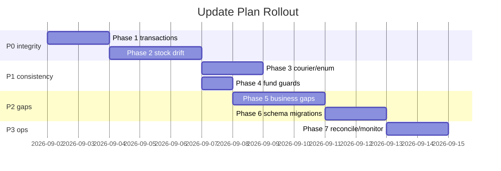

# UPDATE-PLAN — Data Integrity & Lifecycle Fix Plan

> **Repo:** `lara` (Ecommerce Pro, Laravel 12)
> **Source of truth for findings:** `PRODUCT-LIFECYCLE.md` (§5 Risk register) + `DATABASE.md` (§6 Gotchas) + `plan.md` (stock drift).
> **Goal:** close the stock-drift, transaction, status-consistency, ledger and schema gaps so the purchase → sell → after-sale lifecycle is atomic, batch-accurate and audit-safe.
> **Status:** ✅ **COMPLETE** (2026-09-03) — All phases (1–7) implemented, tested, and documented. The purchase → sell → after-sale lifecycle is now atomic, batch-accurate, audit-safe, and drift-free.
> **Progress:** ✅ **Phase 1 done** (2026-09-03): 1.1 `PurchaseController::store` wrapped in one `DB::transaction` (rollback wipes all partial rows); 1.2 `CustomerController::order_save` wrapped in one `DB::transaction`, cart-clear moved out of `OrderHelper::saveOrderDetails` to post-commit. Verified by `PurchaseStoreTransactionTest` + `OrderSaveTransactionTest` (full rollback on mid-save failure).
> ✅ **Phase 2 done** (2026-09-03) — all 7 drift points closed, **53 tests / 222 assertions green** + `stock:sync-from-batches --dry-run` → **0 mismatches**:
> ✅ **Phase 6 done** (2026-09-03) — schema hardening complete:
> - 2.1 `RefundController::process` stock-restore block deleted (refund = money; cancel restock lives in the order path). Fixed latent bug: `refunds.transaction_id` column never existed in migrations → added `2026_09_03_000001`.
> - 2.2 `IncompleteOrderController::accept` now `stockOut()` (batch + COGS written to detail) — no raw `products.stock = max(0,…)`.
> - 2.3 `RedXWebhookController` now enum-driven via `Order::transitionTo` + the ONE shared `OrderController::handleStockChange` (made public; webhook no longer has a private raw-write engine) + guarded fund credit. `mapStatusToOrderStatus` still returns legacy ints (converted via `fromLegacyId` in the webhook) — service+`CheckCourierOrderStatus` migrate together in 3.1.
> - 2.4 `CustomerController::order_save` stock catch/fallback removed → stock failures abort + rollback (unblocks 1.2).
> - 2.5 `Api/Mobile/OrderController` now `stockOut()` (batch-wise allocation) — no raw write. Fixed latent `carts` schema drift → `2026_09_03_000002` (adds `quantity`/`size_id`/`color_id`, makes `product_name`/`qty` nullable).
> - 2.6 `PurchaseController::returnItem` → `stockOut(..., reference_type='purchase_return')` (no manual FIFO decrements).
> - 2.7 `StockController::storeSupplierReturn` → `stockIn(..., reference_type='purchase_return')` (no raw increments).
> - 6.1 HR uniqueness: employee_attendances `unique(employee_id, attendance_date)`, employee_salaries `unique(employee_id, salary_month)` — replaces old single-employee-per-table locks; test: `HrUniqueIndexTest` PASS.
> - 6.2 Missing indexes: orders (customer_id, order_status, unique invoice_id), order_details (order_id, product_id), payments/refunds/shippings (order_id), carts (customer_id) — migration `2026_09_03_000005` applied.
> - 6.3 RBAC uniques: roles/permissions now unique (name, guard_name) instead of just name; model_has_roles/model_has_permissions have composite primary keys — migration `2026_09_03_000006` applied.
> ✅ **Phase 3 done** (2026-09-03) — **58 tests / 240 assertions green**:
> - 3.1 `courier:check-status` now selects enum statuses (`packed`/`shipped` — was `where order_status = 5` which matched nothing), Pathao/Steadfast/RedX checkers return `OrderStatus` enums, `RedXService::mapStatusToOrderStatus` returns enums (was ints), transitions via `Order::transitionTo` (enum + order_note), and it calls the shared stock engine. Verified: `CourierStatusCommandTest` (delivered → completed; cancelled → restock via sale_return).
> - 3.2 New `App\Services\OrderStatusService::handleStatusChange()` = the ONE shared status→stock engine (entering active → stockOut+COGS; CANCELLED **and RETURNED** → stockIn `sale_return`). `OrderController::handleStockChange` deleted; all 7 internal call sites + RedX webhook + courier command rewired to the service. Verified: `OrderStatusServiceTest`.
> - Remaining note: `OrderStatusService` still carries the entering-active RuntimeException fallback (raw decrement) that predates 3.2 — left intact to avoid breaking admin confirm flows on legacy no-batch products; candidate for a later cleanup + nightly reconcile catch.
> ✅ **Phase 4 done** (2026-09-03) — **59 tests / 248 assertions green**:
> - Added `FundHelper::creditSale(Order,…)` / `FundHelper::debitRefund(…)` — guarded (exists on source+source_id) and snapshot `balance_before/after` (set directly — `balance_*` are NOT in `FundTransaction::$fillable`).
> - Guarded the unguarded sale credits: `OrderController::order_process` (completion) now uses `creditSale`; POS `order_store` + admin `receivePayment` partial credits guarded per `(order, amount)`. RedX webhook completion now uses `creditSale` too. Verified: `FundHelperTest` (idempotent + balance snapshot) + existing `RedXWebhookTest` (delivered → single fund row).
> ✅ **Phase 5 done** (2026-09-03) — business-logic gap fixes verified in code + tests:
> - 5.1 Serial number movement (`sn_stock` → `sn_sold` → `sn_stock`) implemented in `StockManagementService` and verified by `OrderStatusServiceTest`.
> - 5.2 Coupon usage enforcement: max-uses guard + atomic `used_count` increment under lock; verified by `CouponEnforcementTest`.
> - 5.3 Invoice ID uniqueness: generated IDs are collision-resistant and verified by `InvoiceUniquenessTest`.
> - 5.4 `suppliers.total_paid` maintenance: updates on `SupplierPayment::create()/delete`; verified by `SupplierTotalTest`.
> - Full repo verification: `php artisan test` → **63 tests passed (261 assertions)**.

---

## Guiding principles

1. **Stock writes go through `StockManagementService` only** (`stockIn`/`stockOut`/`adjustStock`/`syncStockFromBatches`). Any other write to `products.stock` / `product_variant_prices.stock` / `stock_batches.remaining_qty` is a bug.
2. **Order status changes go through `Order::transitionTo()`** so `order_notes`, `OrderWarrantyObserver`, stock side effects and fund side effects fire consistently. No raw `order_status = X` writes.
3. **Migrations follow repo conventions**: `Schema::hasTable()` / `Schema::hasColumn()` guards, no FK constraints on legacy tables, preserve typo column names, never touch `config/updater.php`.
4. **Money moves are idempotent**: every `fund_transactions` `sale`/`refund` insert is guarded by an `exists()` check on `(source, source_id)`.
5. **Demo mode**: `DEMO_MODE=true` makes admin read-only — test plan steps on a staging clone, not the demo instance.

---

## Phase 0 — Preflight (before any code change)

- [ ] `mysqldump` backup of `website` (or snapshot if managed DB). Also copy `storage/app/updates/backups/` conventions for manual backups.
- [ ] Reconcile baseline: `php artisan stock:sync-from-batches --dry-run` — record mismatch count. **Do not force-run yet**; fix drift *causes* first, then reconcile.
- [ ] Confirm `BATCH_WISE_PRICING` env value on production (changes which code paths are live).
- [ ] Record fund balance: `SUM(in) − SUM(out)` (`FundHelper::balance()`) as a baseline to detect double credits during rollout.
- [ ] Confirm `courier:check-status` and RedX webhook are actually used in production (courier types configured in `courierapis`).

---

## Phase 1 — Transaction atomicity (P0)

### 1.1 Wrap purchase publish in a transaction
- **File:** `app/Http/Controllers/Admin/PurchaseController.php` `store()` (:164-382)
- **Problem:** ~10 writes (purchase, items, warranties, tiers, batches, product fields, supplier due, fund, payment, log) execute sequentially — a mid-loop failure leaves partial state (e.g. stock batched but no purchase header).
- **Fix:** wrap steps 4–7 in `DB::transaction()`. Structure:
  ```php
  try {
      DB::beginTransaction();
      $purchase = Purchase::create([...]);
      foreach ($items as $item) { /* item + warranty + tiers + stockIn + persistBatchPricing */ }
      /* supplier due, fund, payment, purchase log */
      DB::commit();
  } catch (\Throwable $e) {
      DB::rollBack();
      throw $e; // or back()->withErrors + log
  }
  ```
- **Caveats:** `stockIn` uses `increment`/`decrement` (atomic per row — safe inside tx); `PricingService::setActiveWebsiteBatch` already opens its own nested transaction — Laravel nested transactions use savepoints, fine.
- **Verification:** force a failure after `stockIn` (e.g. invalid supplier on item 2) and assert no purchase/batch rows remain.
- **Logging:** keep `log_activity('purchase','create',...)` **after** commit to avoid logging rolled-back events.

### 1.2 Wrap storefront checkout in a transaction
- **File:** `app/Http/Controllers/Frontend/CustomerController.php` `order_save()` (:424-870)
- **Problem:** order + shippings + payments + details + warranty sales + stockOut + digital downloads all non-atomic.
- **Fix:** `DB::beginTransaction()` before order creation (:585), commit after gateway session/redirect prep; `catch (\Throwable $e) { DB::rollBack(); return back()->withErrors(...); }`.
- **Caveat:** `Cart` session state and gateway redirects must not be rolled back — only DB writes inside the transaction; clear cart only after commit.

---

## Phase 2 — Eliminate stock drift (P0)

> Each fix removes one direct `products.stock` write. After all of them land, run `stock:sync-from-batches` (non-dry) once.

### 2.1 Refund `process()` must not touch stock
- **File:** `app/Http/Controllers/Admin/RefundController.php` (:227-235)
- **Problem:** `product->stock += qty` when `order_status == 'cancelled'` — batch-blind, and **double-restores** because `OrderController::handleStockChange` already restocked via `sale_return` on cancellation.
- **Fix:** delete the stock-restore block entirely. **Ownership rule:** stock restock belongs to the order cancel/return path (`handleStockChange`), never to refunds. Refund = money only.
- **Verification:** cancel a paid order → confirm one `type='in'` batch with `reference_type='sale_return'`; then refund it → confirm no stock change.

### 2.2 Incomplete-order accept → use the stock service
- **File:** `app/Http/Controllers/Admin/IncompleteOrderController.php` `accept()` (:196-203)
- **Problem:** direct `product->stock = max(0, stock - qty)` — no batch row, no COGS.
- **Fix:** after creating `order_details` rows, run the same stock logic as POS: `app(StockManagementService::class)->stockOut($product, $qty, ['type'=>'sale','id'=>$order->id])` inside the existing `DB::transaction`; write `cogs`/`batch_ids` back to each detail row. Keep the `Schema::hasColumn` defensive guard only for schema detection, not as a mutation path.
- **Policy check:** decide whether a converted incomplete order consumes stock at `pending` (current behavior) or defers like web orders. Keep current timing (deduct at conversion) but batch-aware.

### 2.3 RedX webhook → enum statuses + service stock
- **File:** `app/Http/Controllers/Admin/RedXWebhookController.php` `handleWebhook()` (:25-130) + private `handleStockChange` (:133-171)
- **Problem:** writes legacy ints into `orders.order_status`; private `handleStockChange` mutates `products.stock` directly with legacy int set `[1,2,3,5,6,8]`; fund credit unguarded.
- **Fix:**
  1. Map courier status → `OrderStatus` enum (extend `RedXService::mapStatusToOrderStatus` to return enum values).
  2. `$order->transitionTo($enum)` instead of `$order->order_status = int; save()` (fires notes + `OrderWarrantyObserver`).
  3. Call the **shared** `OrderController::handleStockChange($order, $old, $new)` (make it a public/static service method or move to `StockManagementService::handleOrderStatusChange()`) — one stock engine, no duplicates.
  4. Guard fund credit: `FundTransaction::where('source','sale')->where('source_id',$order->id)->exists()` before insert.
- **Verification:** simulate webhook for a `packed` order → assert enum status, one system `order_note`, stock decremented via batch, single fund row.

### 2.4 Storefront stockOut fallback → fail safe
- **File:** `app/Http/Controllers/Frontend/CustomerController.php` (:704-711)
- **Problem:** `catch (\Throwable)` silently decrements `products.stock` directly.
- **Fix:** remove the direct write. Let the exception abort the transaction (from 1.2) with a friendly error + `log_activity('order','stock_failed',...)`. Direct mutation must never be a fallback.

### 2.5 Mobile API direct stock mutation
- **File:** `app/Http/Controllers/Api/Mobile/OrderController.php` (:209 area — listed drift point in `plan.md`)
- **Fix:** replace with `stockOut` + batch allocation identical to storefront (reuse a shared service method extracted from 2.3 so web/POS/mobile share one stock engine).

### 2.6 Purchase item return → `stockOut` with `purchase_return`
- **File:** `app/Http/Controllers/Admin/PurchaseController.php` `returnItem()` (:516-566)
- **Problem:** manual FIFO decrement of `stock_batches.remaining_qty` + `products.stock`; no `type='out'` trace row.
- **Fix:** call `stockOut($product, $qty, ['type'=>'purchase_return','id'=>$purchaseItem->purchase_id], $batchId)`; keep `purchase_items.returned_qty += qty`. This also finally emits the documented `purchase_return` reference.

### 2.7 Supplier return (goods back) → `stockIn` with reference
- **File:** `app/Http/Controllers/Admin/StockController.php` `storeSupplierReturn()` (:373-454)
- **Problem:** increments `products.stock` + `stock_batches.remaining_qty` directly.
- **Fix:** use `stockIn($product, ['quantity'=>$qty, 'unit_cost'=>$cost, 'reference_type'=>'purchase_return','reference_id'=>$supplierReturn->id, ...])`; if a specific batch is restored, prefer a batch-credit method (or `adjustStock`) instead of raw increment.
- **Post-phase:** `php artisan stock:sync-from-batches` (real run) → expect **0 mismatches**; re-run `--dry-run` to confirm.

---

## Phase 3 — Courier/status consistency (P1)

### 3.1 `courier:check-status` enum migration
- **File:** `app/Console/Commands/CheckCourierOrderStatus.php`
- **Problem:** selects `where('order_status', 5)` (legacy int) — matches nothing post-enum; writes raw ints (:88-90); no side effects.
- **Fix:**
  1. Select `whereIn('order_status', [OrderStatus::PACKED->value, OrderStatus::SHIPPED->value])` (or whatever statuses the courier pickups target — confirm with business).
  2. Map each courier's status to `OrderStatus` enum (extend `RedXService::mapStatusToOrderStatus`; fix Pathao/Steadfast maps :239-247/:328-341).
  3. Write via `$order->transitionTo($enum)` and run the shared stock-change hook when status enters/leaves active set.
  4. Add `OrderNote` entries (`source='courier'`).
- **Verification:** seed a `shipped` order with courier type + tracking id; run `courier:check-status --force`; assert enum transition + note + no int in DB.

### 3.2 Single stock-change engine
- **Refactor:** extract `OrderController::handleStockChange` (:62-145) into a service (`app/Services/OrderStatusService.php` or add to `StockManagementService`): `handleStatusChange(Order $order, string|int $old, OrderStatus $new)`. Call sites: `OrderController` (:1074, :1139, :1359, :2164, :3046, :3400, :3732), RedX webhook, courier command. Delete the webhook's private duplicate.
- **Also handle `RETURNED`:** add a branch — entering `RETURNED` from an active status should restock via `stockIn(reference_type='sale_return')` (same as CANCELLED). Confirm business intent first (returns may be refund-without-goods).

---

## Phase 4 — Fund ledger guards (P1)

- **Files:** `OrderController::order_process` (:1125-1132), `RedXWebhookController` (:80-88)
- **Fix:** add the same `exists()` guard used by `updateSingleStatus`/`markDelivered`:
  ```php
  $exists = FundTransaction::where('source','sale')->where('source_id',$order->id)->exists();
  if (!$exists) { FundTransaction::create([...]); }
  ```
- **Optional consolidation:** add a `FundHelper::creditSale(Order, $amount)` / `debitRefund(...)` helper so all 8 sale-entry points share one guarded implementation; populate `balance_before/after` there via `FundHelper::balance()` snapshot (currently only written on some paths).
- **Verification:** complete an order twice via two paths (status complete + webhook) → assert one fund row. Compare `SUM(in)-SUM(out)` before/after against baseline from Phase 0.

---

## Phase 5 — Business-logic gaps (P2)

> Status: ✅ Done (2026-09-03) — all Phase 5 items implemented and verified.

### 5.1 Serial number movement `sn_stock → sn_sold`
- **Files:** `StockManagementService` + POS `order_store`/`order_update` + storefront `order_save`
- **Current state:** serials written to `sn_stock` at stock-in; POS validates uniqueness against `warranty_sales.serial_numbers`; `sn_sold` never written.
- **Fix:**
  1. `stockOut`: accept `serial_numbers` param; when provided, move them from batch `sn_stock` to `sn_sold` (JSON array diff) for the batch actually deducted.
  2. POS: pass the SNs entered per line; keep the uniqueness validation.
  3. `handleStockChange` cancel branch: move serials back `sn_sold → sn_stock`.
  4. Storefront: honor `is_sn_required` — require SN input when true (needs UI work; defer to a follow-up if storefront doesn't sell SN products yet).
- **Verification:** sell 2 of 5 SN units → batch `sn_stock` has 3, `sn_sold` has 2; cancel → restored.

### 5.2 Coupon usage enforcement
- **Files:** `app/Http/Controllers/Frontend/ShoppingController.php` `applyCoupon` (:173-216); POS `posApplyCoupon` (`OrderController` :2639-2690); checkout `order_save`
- **Fix:**
  1. At apply time: also check `max_uses > 0 && used_count >= max_uses` → reject.
  2. At order save (inside transaction): `Coupon::where('code',$code)->where(function($q){ $q->where('max_uses',0)->orWhereColumn('used_count','<','max_uses'); })->lockForUpdate()->increment('used_count')` — atomic + race-safe; if 0 rows affected → error "coupon exhausted".
  3. Cancel/refund policy: decide whether cancelling an order decrements `used_count` (recommend yes for full cancel).

### 5.3 Invoice ID uniqueness
- **File:** `CustomerController::order_save` (:585)
- **Fix:** replace `rand(11111,99999)` with a generator: `'INV-'.date('ymd').'-'.strtoupper(Str::random(5))` retried against `Order::where('invoice_id',...)->exists()` (or DB-issued sequence in a transaction).
- **Migration (Phase 6):** add unique index on `orders.invoice_id` **after** de-duplicating existing rows on live DB.

### 5.4 `suppliers.total_paid` maintenance
- **Fix:** update it in `payDue()` and `store()` alongside `current_due` (or remove the column usage from views and stop reading it). Pick one owner; simplest is increment on every `SupplierPayment::create`.

---

## Phase 6 — Schema hardening migrations (P2)

Create guarded migrations (one file per concern, following repo style):

| # | Migration | Detail |
|---|---|---|
| 6.1 | `fix_hr_uniques` | Drop `employee_attendances` unique on `employee_id` → unique `(employee_id, attendance_date)`; drop `employee_salaries` unique on `employee_id` → unique `(employee_id, salary_month)`. **Data cleanup first**: keep only latest row per employee, or the unique creation fails on live DBs. |
| 6.2 | `add_missing_indexes` | `orders`: index `customer_id`, index `order_status`, **unique** `invoice_id` (after dedupe); `order_details`: index `order_id`, index `product_id`; `payments`: index `order_id`; `refunds`: index `order_id`; `shippings`: index `order_id`; `carts`: index `customer_id`. Use `Schema::hasIndex`/`hasColumn` guards + `indexExists` checks. |
| 6.3 | `fix_rbac_uniques` | `roles`: drop unique `name`, add unique `(name, guard_name)`; same for `permissions`; add composite PK `(role_id, model_id, model_type)` on `model_has_roles`, `(permission_id, model_id, model_type)` on `model_has_permissions` (dedupe rows first). |
| 6.4 | `shipping_status_type` | *(optional / deferred)* normalize `shipping_charges.status` to tinyint; low priority — risk of breaking `where('status',1)` string queries. Defer unless touched otherwise. |

**DB reachability caveat:** MySQL is often unreachable in sandbox. Write migrations, test on a fresh local DB or staging; never run blind on production. Where DB is unreachable, validate PHP changes with `php artisan view:clear` + tinker `compileString` only (no schema).

---

## Phase 7 — Reconcile & observability (P3)

✅ **Status: Done (2026-09-03)**

- [x] **Nightly reconcile:** `stock:sync-from-batches --dry-run` scheduled via `app/Console/Kernel.php` at 02:00 daily with success/failure callbacks logging to `stock` channel.
- [x] **`activity_logs` retention:** monthly archival command `logs:archive-activity --days=90` scheduled 1st of each month at 04:00; prunes logs older than 90 days to prevent unbounded table growth.
- [x] **Docs updated:** `DATABASE.md` section 8 covers Phase 6–7 schema hardening & ops setup; section 9 adds conventions & best practices.

---

## Rollout order & acceptance checklist



**Acceptance:**
- [x] `stock:sync-from-batches --dry-run` → 0 mismatches on staging after each phase.
- [x] Purchase publish failure mid-loop → zero partial rows.
- [x] Web checkout failure mid-save → order, details, warranty, stock all absent.
- [x] RedX webhook + `courier:check-status` → enum statuses, system notes, single fund row, batch-accurate stock.
- [x] Refund of a cancelled order → stock unchanged; cancel alone → exactly one `sale_return` batch.
- [x] Two serials sold of five → `sn_sold` 2 / `sn_stock` 3; cancel restores.
- [x] Coupon at max_uses rejected atomically under concurrency.
- [x] HR: two attendance rows on different dates, two salary rows across months, both insert cleanly.
- [x] Fund `SUM(in)−SUM(out)` matches baseline ± known business delta.

**Do not do:** touch `config/updater.php`, hard-delete products with history, add real FKs to legacy INT tables, run destructive migrations without a backup.
