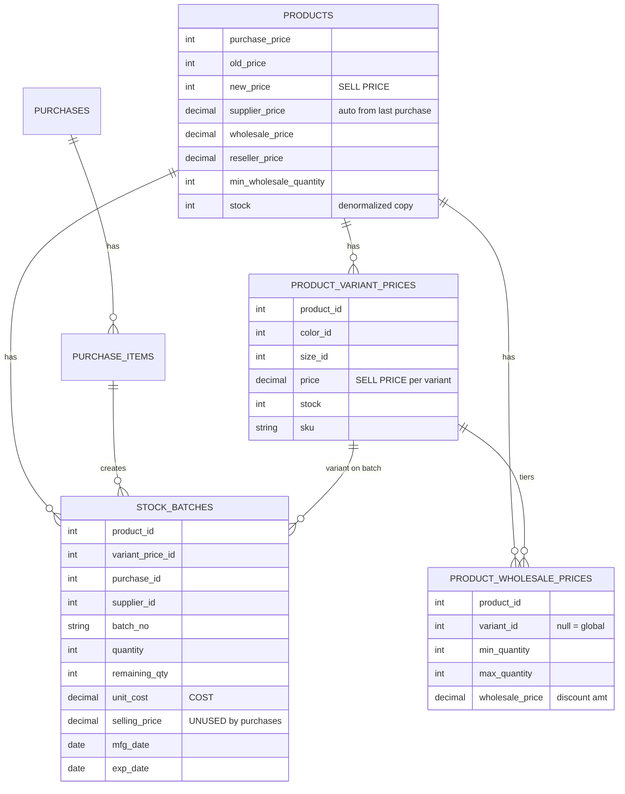
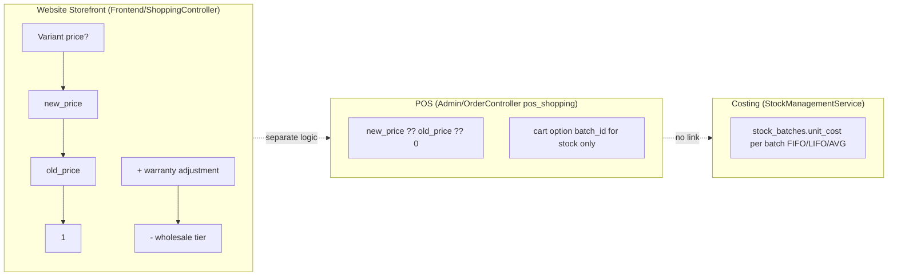
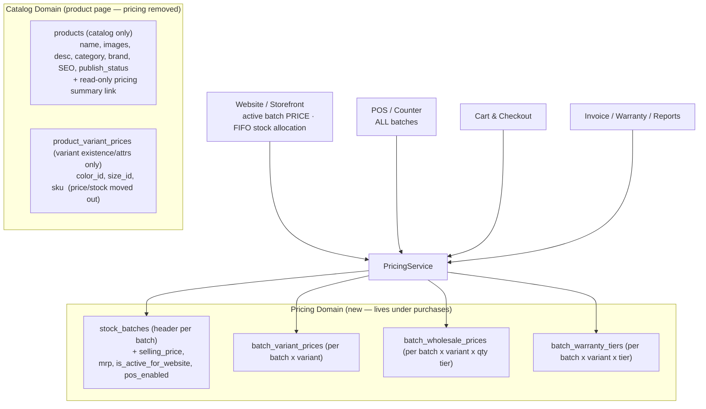
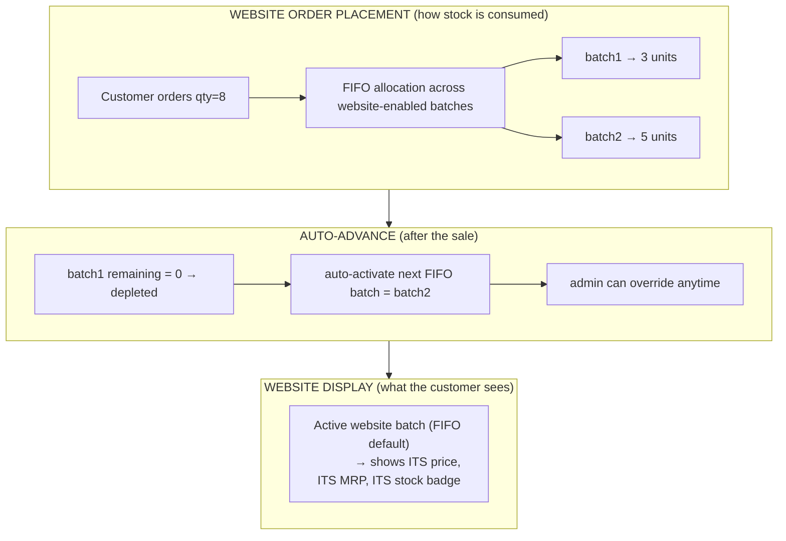
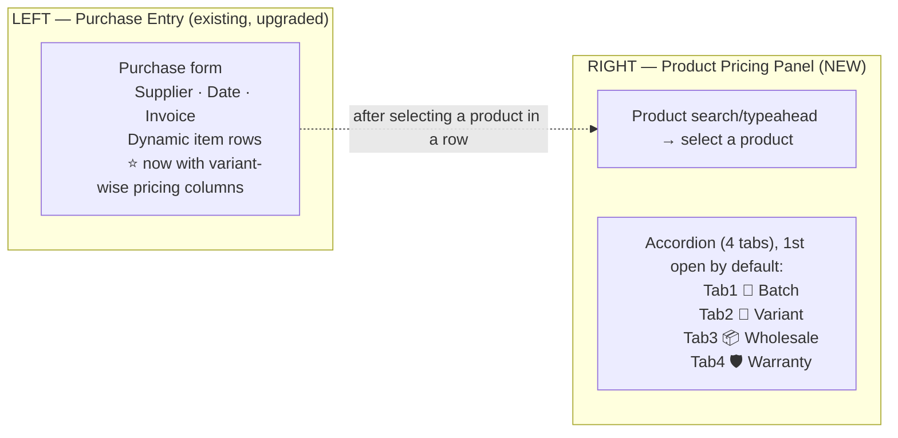

# 🔥 Batch-Wise Pricing Engine — System-Wide Upgrade Plan

> **Scope:** Move **all pricing** out of the Product page (`/admin/products/{id}/edit`) into the **Purchase / Batch Management** page (`/admin/purchases/manage`), and make pricing **batch-wise** — with a per-product **right-hand accordion panel** (Batch → Variant → Wholesale → Warranty), one **"active batch"** controlling the website channel, and POS selling from **all batches**.
>
> **Status:** Design / Planning · **Target:** Phase-wise, reversible rollout
> **Audience:** Developers, Product Owner, QA
> **Version:** 1.0 (2026-08-25)
>
> **✅ Implementation status:** All phases implemented and verified — `PricingServiceTest` passes 8/8, Phase 7 (adjustments/returns pricing + stock semantics) complete, tests pass on the dedicated `ecommerce3_test` DB. Everything is behind `BATCH_WISE_PRICING` (default OFF). Remaining: only the operational cutover — execute `CUTOVER-CHECKLIST.md` in a low-traffic window.

---

## Table of Contents

1. [Executive Summary](#1-executive-summary)
2. [Problem Statement — Why This Upgrade](#2-problem-statement)
3. [Current State (As-Is)](#3-current-state-as-is)
4. [Goals & Non-Goals](#4-goals--non-goals)
5. [Target Architecture (To-Be)](#5-target-architecture-to-be)
6. [New Data Model & Migrations](#6-new-data-model--migrations)
7. [The Pricing Resolution Service (Single Source of Truth)](#7-the-pricing-resolution-service)
8. [UI/UX Design — Purchases/Manage Right Panel](#8-uiux-design--purchasesmanage-right-panel)
9. [System-Wide Impact Map](#9-system-wide-impact-map)
10. [Phase-Wise Implementation Plan](#10-phase-wise-implementation-plan)
11. [Data Migration & Backfill Strategy](#11-data-migration--backfill-strategy)
12. [Testing Strategy](#12-testing-strategy)
13. [Rollout, Feature Flags & Rollback](#13-rollout-feature-flags--rollback)
14. [Risks & Mitigations](#14-risks--mitigations)
15. [Open Questions / Decisions Needed](#15-open-questions--decisions-needed)

---

## 1. Executive Summary

Today, a product's sellable price is scattered across **four different places**:

| Source | Holds | Managed in |
|---|---|---|
| `products` table | `new_price`, `old_price`, `purchase_price`, `supplier_price`, `wholesale_price`, `reseller_price` | Product edit page |
| `product_variant_prices` | per Color/Size price + stock | Product edit page |
| `product_wholesale_prices` | qty-tier discounts (per variant) | Product edit page |
| `stock_batches` | per-batch **cost** (`unit_cost`) + empty `selling_price` | Purchase page (cost only) |

This creates **price drift**: website uses `new_price`, POS uses `new_price`, batch costing uses `unit_cost`, and the batch's own `selling_price` is almost never set from purchases. There is **no concept of "which stock is currently on sale for the website."**

This upgrade introduces a **single, batch-anchored pricing model**:

- **Pricing is set once, per batch, at purchase time** (and adjustable from a dedicated pricing panel). **Every price type varies per batch**: purchase cost (`unit_cost`), sell (`selling_price`), MRP / "new sell" (`mrp`), variant sell (`batch_variant_prices`), wholesale tiers (`batch_wholesale_prices`), warranty (`batch_warranty_tiers`).
- Every product gets a **right-hand accordion panel** with 4 tabs: **① Batch** (default open) → **② Variant** → **③ Wholesale** → **④ Warranty**.
- **The website shows & prices from ONE batch only** — the `is_active_for_website` batch, default = **oldest (FIFO) batch with stock**. When it sells out, the system **auto-advances to the next FIFO batch** (admin can override at any time). No sellable batch → **Out of Stock**.
- **Website orders consume stock FIFO across batches** (e.g. batch₁=3, batch₂=10, order=8 → **3 from batch₁ + 5 from batch₂**) even though the displayed price is the active batch's price.
- **POS sells from ALL batches** (seller picks a batch per line; price comes from that batch).
- The old `new_price`/`old_price`/variant-price/wholesale-price editing on the Product page is **retired** (kept read-only for display until data migration completes).

---

## 2. Problem Statement — Why This Upgrade

1. **Pricing lives in the wrong place.** Prices are attached to the *product*, but stock and cost are attached to *batches*. A single SKU can have batches with different costs, margins, and even different supplier prices — the current model can only express **one** global price.
2. **Price drift & bugs.** `new_price` is the de-facto sell price, but:
   - POS and Website resolve price in **separate code paths** (`OrderController` vs `ShoppingController`/`FrontendController`) with different fallbacks → inconsistent pricing.
   - `stock_batches.selling_price` is a dormant column that purchases never populate.
   - `supplier_price` is auto-overwritten by the **last** purchase cost, even for average-cost products.
3. **No channel control.** You cannot say *"this batch is what the website sells"* — website stock is a flat `products.stock`, with no notion of an active batch.
4. **Purchases can't set sell prices.** During a purchase you enter `unit_cost` but have to jump to the product page to set the sell price, per variant, per wholesale tier, per warranty tier — a slow, error-prone round trip.
5. **Variant pricing is duplicated & inflexible.** `product_variant_prices.price` is a single number; wholesale tiers are a separate table with its own `stock` column that drifts.
6. **The Product page is overloaded.** It mixes catalog data (name, images, description, SEO) with commercial data (prices, tiers) — the upgrade separates concerns: **catalog** on Product page, **commerce** on Purchase/Pricing page.

---

## 3. Current State (As-Is)

### 3.1 Schema (relevant tables)



### 3.2 Current price resolution (fragmented)



### 3.3 Known files & flows (inventory for change)

| Area | Files / Locations | Role in pricing |
|---|---|---|
| Product edit page | `resources/views/backEnd/product/edit.blade.php` | variant price card, wholesale tiers, old/new price, supplier_price, batch stock table (read-only) |
| Product controller | `app/Http/Controllers/Admin/ProductController.php` (`store`, `update`, `price_edit`, `price_update`) | saves variant prices, wholesale tiers, new/old price |
| Purchase page | `app/Http/Controllers/Admin/PurchaseController.php` + `resources/views/backEnd/purchases/index.blade.php` (dynamic rows), `edit.blade.php` | `unit_cost`, batch_no, mfg/exp, warranty; creates `StockBatch` via `StockManagementService::stockIn` |
| Stock service | `app/Services/StockManagementService.php` | `stockIn`/`stockOut`/`adjustStock`/`syncStockFromBatches`/COGS |
| Website cart | `app/Http/Controllers/Frontend/ShoppingController.php`, `FrontendController.php` (`cartStore`) | variant→new_price→old_price; warranty; wholesale discount |
| POS cart | `app/Http/Controllers/Admin/OrderController.php` (`pos` cart, `scanBarcode`, `posAddToCart`, order save) | `new_price ?? old_price`; batch_id in cart options |
| Checkout/order | `app/Http/Controllers/Frontend/CustomerController.php` (`order_save`), `Api/Mobile/*` | prices baked into order details at checkout |
| Invoice | `resources/views/backEnd/order/invoice.blade.php` | reads `sale_price`, `product_discount`, `warranty_price` from order details |
| Warranty | `app/Services/WarrantyService.php`, `WarrantyPriceCalculator.php` | uses `product->selling_price` / `purchase_price * 1.25` as base |
| Wholesale catalog | `app/Http/Controllers/Admin/WholesaleProductController.php`, `resources/views/backEnd/product/wholesale.blade.php` | separate wholesale product flow |
| Reports | `Admin/ReportController.php`, `ReportsController.php` | reads `new_price`, `purchase_price`, `stock` |

> ⚠️ **Gotcha:** `products.stock` is a **denormalized copy** — source of truth is `stock_batches.remaining_qty`. Any new "website stock = active batch stock" logic must keep these in sync (see `SyncProductStockFromBatches` command + `StockManagementService::syncStockFromBatches`).

---

## 4. Goals & Non-Goals

### 4.1 Goals ✅

1. **Single pricing model anchored to batches** — every sellable price (base, MRP, variant, wholesale, warranty) is defined per batch.
2. **Move pricing management to `/admin/purchases/manage`** — a dedicated right-panel accordion per product (Batch → Variant → Wholesale → Warranty).
3. **One visible website batch (FIFO default) with auto-advance** — at most **one** `is_active_for_website` batch per product at a time. It defaults to the **oldest (first-in) batch with stock**; when it sells out, the system **auto-activates the next FIFO batch**, and an admin can manually override at any time. No sellable batch ⇒ website shows **Out of Stock** (even if POS stock exists).
4. **POS multi-batch selling** — seller selects batch (or "auto") per line; price + stock derive from that batch.
5. **Dynamic variant-wise pricing on each purchase batch row** — when a variant product is purchased, the row expands to set price per variant (and wholesale/warranty), not a single price.
6. **FIFO multi-batch order allocation on the website** — an order may consume stock from several batches in FIFO order (b₁=3 + b₂=5 for an order of 8) while the displayed price stays the active batch's price.
7. **One `PricingService`** as the single resolution point used by website, POS, cart, checkout, invoice, warranty, and reports — eliminating price drift.
8. **Fully reversible** with feature flags + data backfill, phase-by-phase.

### 4.2 Non-Goals ❌

- Not re-platforming the shopping cart library (`hardevine/shoppingcart` stays).
- Not migrating the separate `WholesaleProduct` marketplace flow (only in-house product pricing moves; wholesale marketplace can later be pointed at the same service).
- Not redesigning the order/payment pipeline itself — only the **price feeding** it.
- Not changing the licensing/updater system (`config/updater.php`) or `DEMO_MODE`.

---

## 5. Target Architecture (To-Be)

### 5.1 High-level concept



**The golden rule:** *No controller reads `new_price` / `variant->price` directly anymore. Everything asks `PricingService`.*

### 5.2 Channel rules

| Channel | Which batch | Price source | Stock source | If no active batch |
|---|---|---|---|---|
| **Website** (catalog, detail, cart, checkout) | **Display/sell price =** `is_active_for_website = 1` batch (FIFO default, auto-advances when depleted, admin-overridable). **Stock consumption =** FIFO across **all website-enabled batches** | Active batch's variant/wholesale/warranty prices (displayed + charged) | Sum of `remaining_qty` across website-enabled batches, consumed FIFO (b₁=3 + b₂=5 for order of 8) | **Out of Stock** when no website-enabled batch has stock (hide from sale; show out-of-stock badge) |
| **POS** | **Any** batch (pick per line; `auto` = FIFO/LIFO per product costing method) | The chosen batch's prices | Chosen batch `remaining_qty` | POS still sells (batches exist) |
| **Admin order edit / re-save** | The batch originally stored on the line | Stored batch prices snapshot | Batch stock | n/a |

### 5.3 Price resolution precedence (within one batch)

For a given `(product, batch, variant)`:

```
1. Variant-specific price    (batch_variant_prices where variant_price_id = X)
2. Batch base price          (stock_batches.selling_price)
3. Product default price     (products.new_price)  ← legacy fallback during migration only
4. old_price → 1             (legacy fallback)
```

Wholesale discount (per batch):

```
1. batch_wholesale_prices where variant_id = X and min<=qty<=max   (highest min first)
2. batch_wholesale_prices where variant_id IS NULL and min<=qty<=max
3. no tier → no discount
```

Warranty surcharge (per batch):

```
1. batch_warranty_tiers where variant_id = X and is_active
2. batch_warranty_tiers where variant_id IS NULL and is_active
3. product_warranty_tiers (legacy fallback during migration)
```

---

## 5.4 Auto-advance of the website batch & FIFO order allocation

The website has **one visible/active batch**, but stock can be consumed from **several** batches in FIFO order. These two mechanics are distinct and must not be conflated:



### Worked example (from the requirement)

> *"one batch have 3 product, 2nd batch 10 product — if admin not update, then auto 1st to 3 and 2nd to 5 — if website customer orders 8 product."*

| Step | Batch₁ | Batch₂ | Notes |
|---|---|---|---|
| Before order | 3 remaining (active, FIFO first) | 10 remaining | Displayed price = batch₁'s price |
| Customer orders **8** | consumes **3** → 0 | consumes **5** → 5 | Stock allocated FIFO (3 + 5 = 8); **single order, split across batches** |
| After sale | **0 (depleted)** | 5 remaining | COGS = 3×cost₁ + 5×cost₂ (existing `StockManagementService` FIFO) |
| Auto-advance | — | **becomes active** | Next FIFO batch with stock; website now displays batch₂ price |

### Rules

1. **`is_active_for_website`** is always exactly **one** batch per product (partial-unique index / service-enforced). It answers *"what price & MRP do we show?"*
2. **FIFO default selection:** `oldest` (earliest `purchase_date`/`created_at`) website-enabled batch that still has `remaining_qty > 0`.
3. **Auto-advance trigger:** after any `stockOut` (sale, return) leaves the active batch with `remaining_qty = 0`, call `PricingService::advanceActiveBatchIfDepleted()` → activates the next FIFO batch with stock. Also run lazily inside `activeWebsiteBatch()` as a safety net.
4. **Admin override:** `setActiveWebsiteBatch(product, batchId)` sets the active batch explicitly and stops auto-advance from moving it while it still has stock.
5. **Order allocation:** `PricingService::websiteAllocation(product, qty)` returns `[[batch₁, 3], [batch₂, 5]]` (FIFO), passed to `StockManagementService::stockOut` as the preferred batch sequence so stock + COGS are correct per batch.
6. **Website sellable stock** = `Σ remaining_qty` of **website-enabled** batches (NOT just the active batch). Out of stock only when that sum = 0.
7. **Sellable price** = active batch's price (single price per product line at order time). See **Open Question 9** — whether multi-batch portions should be itemized at different prices.

---

## 6. New Data Model & Migrations

### 6.1 New columns on `stock_batches`

```php
Schema::table('stock_batches', function (Blueprint $table) {
    // Commercial pricing for the batch
    $table->decimal('mrp', 14, 2)->nullable()->after('selling_price');      // strike-through price
    $table->decimal('wholesale_price', 14, 2)->nullable()->after('mrp');    // quick single wholesale price (optional shortcut)
    $table->boolean('is_active_for_website')->default(false)->after('exp_date');
    $table->boolean('pos_enabled')->default(true)->after('is_active_for_website');
    $table->boolean('is_manual_price')->default(false)->after('pos_enabled'); // price set manually vs inherited
    $table->timestamp('price_updated_at')->nullable()->after('is_manual_price');
    $table->unsignedBigInteger('price_updated_by')->nullable()->after('price_updated_at');
});
```

- **`is_active_for_website`** — one per product. **DECIDED:** no DB-level partial unique index (this MySQL doesn't support filtered indexes; a plain `UNIQUE(product_id)` would break — migration `000001` avoids it). The one-active-batch invariant is **enforced in the app layer**: `PricingService::setActiveWebsiteBatch()` (transaction: clears all, sets one) + `advanceActiveBatchIfDepleted()`.
- `pos_enabled` — allow hiding a batch from POS (e.g. damaged/on-hold batches) without affecting website.

### 6.2 New table `batch_variant_prices`

```php
Schema::create('batch_variant_prices', function (Blueprint $table) {
    $table->id();
    $table->unsignedBigInteger('stock_batch_id');
    $table->unsignedBigInteger('variant_price_id');
    $table->decimal('price', 14, 2)->default(0);       // sell price for this variant in this batch
    $table->decimal('old_price', 14, 2)->nullable();   // MRP / compare-at for this variant
    $table->unsignedInteger('stock')->default(0);      // variant stock within this batch
    $table->timestamps();

    $table->foreign('stock_batch_id')->references('id')->on('stock_batches')->cascadeOnDelete();
    $table->foreign('variant_price_id')->references('id')->on('product_variant_prices')->cascadeOnDelete();
    $table->unique(['stock_batch_id', 'variant_price_id']);
});
```

> Note: `product_variant_prices.price/stock` become **legacy mirrors** — the service stops reading them for pricing; they keep `color_id/size_id/sku` (variant identity). Variant identity (which color/size combos exist) is still defined on the Product page.

### 6.3 New table `batch_wholesale_prices`

```php
Schema::create('batch_wholesale_prices', function (Blueprint $table) {
    $table->id();
    $table->unsignedBigInteger('stock_batch_id');
    $table->unsignedBigInteger('variant_price_id')->nullable(); // null = all variants
    $table->unsignedInteger('min_quantity');
    $table->unsignedInteger('max_quantity')->nullable();
    $table->decimal('wholesale_price', 14, 2);                  // discounted per-unit price (or discount amount — decide, see §15)
    $table->timestamps();

    $table->foreign('stock_batch_id')->references('id')->on('stock_batches')->cascadeOnDelete();
    $table->foreign('variant_price_id')->references('id')->on('product_variant_prices')->cascadeOnDelete();
});
```

### 6.4 New table `batch_warranty_tiers`

```php
Schema::create('batch_warranty_tiers', function (Blueprint $table) {
    $table->id();
    $table->unsignedBigInteger('stock_batch_id');
    $table->unsignedBigInteger('variant_price_id')->nullable(); // null = all variants
    $table->unsignedBigInteger('warranty_tier_id');             // FK → product_warranty_tiers (kept as catalog)
    $table->decimal('additional_cost', 14, 2)->default(0);      // price override for this batch (falls back to tier's own cost)
    $table->boolean('is_active')->default(true);
    $table->timestamps();

    $table->foreign('stock_batch_id')->references('id')->on('stock_batches')->cascadeOnDelete();
    $table->foreign('warranty_tier_id')->references('id')->on('product_warranty_tiers')->cascadeOnDelete();
    $table->unique(['stock_batch_id', 'variant_price_id', 'warranty_tier_id'], 'batch_warranty_unique');
});
```

### 6.5 New table `purchase_item_prices` (optional but recommended)

Capture the sell-price decisions **at purchase time** so invoices/history stay truthful even if prices change later:

```php
Schema::create('purchase_item_prices', function (Blueprint $table) {
    $table->id();
    $table->unsignedBigInteger('purchase_item_id');
    $table->unsignedBigInteger('variant_price_id')->nullable();
    $table->decimal('selling_price', 14, 2);
    $table->decimal('mrp', 14, 2)->nullable();
    $table->decimal('wholesale_price', 14, 2)->nullable();
    $table->json('wholesale_tiers')->nullable();   // snapshot
    $table->json('warranty_tiers')->nullable();    // snapshot
    $table->timestamps();
    $table->foreign('purchase_item_id')->references('id')->on('purchase_items')->cascadeOnDelete();
});
```

### 6.6 Migration ordering

```text
2026_XX_add_pricing_to_stock_batches
2026_XX_create_batch_variant_prices
2026_XX_create_batch_wholesale_prices
2026_XX_create_batch_warranty_tiers
2026_XX_create_purchase_item_prices
2026_XX_make_legacy_price_columns_nullable   (products.new_price/old_price nullable AFTER backfill)
```

---

## 7. The Pricing Resolution Service

Create **`app/Services/PricingService.php`** — the **only** place that resolves a sellable price. Controllers, cart, POS, checkout, invoice, warranty, and reports **all** call it.

### 7.1 Public API (draft)

```php
class PricingService
{
    /**
     * Active website batch for a product (single source for the storefront PRICE).
     * FIFO default = oldest website-enabled batch with stock; auto-advances when the
     * current active batch is depleted; admin can override via setActiveWebsiteBatch().
     * @return StockBatch|null
     */
    public function activeWebsiteBatch(Product $product): ?StockBatch;

    /**
     * FIFO allocation of an order quantity across website-enabled batches.
     * e.g. batches b1=3, b2=10, qty=8 → [[b1,3],[b2,5]].
     * Used by website order placement to consume stock + COGS correctly per batch.
     * @return array<int, array{batch: StockBatch, qty: int}>
     */
    public function websiteAllocation(Product $product, int $qty): array;

    /**
     * Force the website batch (admin override). Clears the flag on all other
     * batches for the product; keeps products.stock / website_stock in sync.
     */
    public function setActiveWebsiteBatch(Product $product, int $batchId): void;

    /**
     * After any stock-out, if the active website batch is depleted, advance to the
     * next FIFO batch with stock. Idempotent; called automatically by the sale flow
     * and lazily from activeWebsiteBatch() as a safety net.
     * @return StockBatch|null  the newly active batch (or null if unchanged/none)
     */
    public function advanceActiveBatchIfDepleted(Product $product): ?StockBatch;

    /**
     * Sell price for a given channel/batch/variant.
     * @param string $channel 'website'|'pos'|'admin'
     */
    public function price(
        Product $product,
        ?int $batchId = null,
        ?int $variantId = null,
        string $channel = 'website'
    ): float;

    /** Compare-at (MRP) price — nullable */
    public function mrp(Product $product, ?int $batchId = null, ?int $variantId = null): ?float;

    /** Wholesale per-unit price for qty (or discount amount — see §15) */
    public function wholesale(Product $product, int $qty, ?int $batchId = null, ?int $variantId = null): ?float;

    /** Warranty surcharge for a tier on this batch/variant */
    public function warrantyAdjustment(Product $product, int $tierId, ?int $batchId = null, ?int $variantId = null): float;

    /** Sellable stock for a channel */
    public function sellableStock(Product $product, string $channel, ?int $batchId = null, ?int $variantId = null): int;

    /** True if the product is sellable on the website (has active batch w/ stock) */
    public function isWebsiteSellable(Product $product): bool;

    /** All POS-selectable batches for a product (pos_enabled = true) */
    public function posBatches(Product $product): Collection;
}
```

### 7.2 Resolution rules (pseudo)

```text
price(product, batchId, variantId, channel):
    batch  = batchId ? StockBatch::find(batchId)
           : (channel == 'website' ? activeWebsiteBatch(product) : null)
    if channel == 'website' and batch is null:
        return 0            # → caller shows OUT OF STOCK
    if channel == 'website' and not batch.is_active_for_website:
        return 0
    if variantId:
        bvp = batch_variant_prices where batch & variant
        if bvp and bvp.price > 0: return bvp.price
    if batch and batch.selling_price > 0: return batch.selling_price
    return product.new_price ?? product.old_price ?? 0    # legacy fallback (flag-gated)
```

### 7.3 Consistency guard: `is_active_for_website`

The service exposes `setActiveWebsiteBatch(Product $product, int $batchId)`:

```php
DB::transaction(function () use ($product, $batchId) {
    StockBatch::where('product_id', $product->id)
              ->where('id', '!=', $batchId)
              ->update(['is_active_for_website' => false]);
    StockBatch::where('id', $batchId)->update(['is_active_for_website' => true]);
    // keep denormalized products.stock in sync with the ACTIVE batch
    app(StockManagementService::class)->syncStockFromBatches($product->id);
});
```

**Auto-advance (FIFO):**

```php
public function advanceActiveBatchIfDepleted(Product $product): ?StockBatch
{
    $active = $this->activeWebsiteBatch($product);
    if ($active && $active->remaining_qty > 0) {
        return null; // still has stock — nothing to do
    }

    // next = oldest website-enabled batch with remaining_qty > 0
    $next = StockBatch::where('product_id', $product->id)
        ->where('pos_enabled', true)
        ->where('remaining_qty', '>', 0)
        ->orderBy('purchase_date')      // FIFO: first-in first-out
        ->orderBy('created_at')
        ->first();

    if ($next) {
        $this->setActiveWebsiteBatch($product, $next->id);
    }
    return $next;
}
```

**FIFO order allocation (website):**

```php
public function websiteAllocation(Product $product, int $qty): array
{
    $alloc = [];
    $need  = $qty;
    // website-enabled batches, oldest first (FIFO)
    $batches = StockBatch::where('product_id', $product->id)
        ->where('pos_enabled', true)
        ->where('remaining_qty', '>', 0)
        ->orderBy('purchase_date')->orderBy('created_at')->get();

    foreach ($batches as $batch) {
        if ($need <= 0) break;
        $take = min($need, $batch->remaining_qty);
        $alloc[] = ['batch' => $batch, 'qty' => $take];
        $need -= $take;
    }
    return $alloc; // b1=3, b2=10, qty=8 → [[b1,3],[b2,5]]
}
```

> The allocation list is passed to `StockManagementService::stockOut` (which already supports FIFO/LIFO/average per product costing method) so each portion deducts from the correct batch and COGS stays accurate. After the sale, the caller runs `advanceActiveBatchIfDepleted()`.

---

## 8. UI/UX Design — Purchases/Manage Right Panel

### 8.1 Page layout: `/admin/purchases/manage`



**Key UX rule (from the request):**
> *"1st accordion opened default, 2nd for variant tab, 3rd wholesale sell tab, 4th warranty tab."*

So the **Batch tab opens by default** whenever a product is selected; the other three are collapsed until clicked.

### 8.2 Right panel — accordion content

**① Tab 1 — Batch (default open)**
- List of all batches for the selected product (from all purchases + stock adjustments):
  - `Batch No` | `Purchase/Ref` | `Supplier` | `Qty In` | `Remaining` | `Unit Cost` | **`Selling Price`** | **`MRP`** | Expiry | Status
- Per batch row controls:
  - **Selling Price** (editable inline, saves to `stock_batches.selling_price`)
  - **MRP / Compare-at** (editable inline)
  - **🟢 Set as Website Active Batch** (radio/star — only one allowed; saving auto-clears others)
  - **POS Enabled** toggle
  - **Sync to product default** (optional: copy batch price → `products.new_price` for legacy consumers)
- **FIFO indicator:** a badge shows the **auto-advance order** — e.g. *"Next in FIFO line after batch₂ sells out"* — so staff can see what price the website will show next.
- **Auto-advance toggle (per product):** *"Auto-activate next FIFO batch when the active batch sells out"* (default **ON**). Turning it OFF means the website goes **Out of Stock** once the active batch is depleted until an admin manually activates another batch.
- Top banner: *"No active batch → website shows Out of Stock"*.
- Button: **➕ New Batch** (creates a stock adjustment batch, not a purchase).

**② Tab 2 — Variant**
- Only shown for variable products (`product_variant_prices` count > 0).
- Grid: rows = variants (Color × Size), columns = `SKU` | **`Price`** | **`MRP`** | `Stock (batch)`.
- Editing saves to `batch_variant_prices` for the **active batch** (batch selector at top of tab if multiple batches).
- Quick actions: *"Copy batch base price to all variants"*, *"Fill from active batch"*.

**③ Tab 3 — Wholesale**
- Tier table: `Variant` (dropdown: All / specific) | `Min Qty` | `Max Qty` | **`Wholesale Price`** | delete.
- Add-tier button; stores into `batch_wholesale_prices` for the selected batch.

**④ Tab 4 — Warranty**
- Tiers per batch/variant: `Tier Name` (from `product_warranty_tiers` catalog) | **`Additional Cost (override)`** | `Active` toggle.
- Saves to `batch_warranty_tiers`; empty override falls back to the tier's own `additional_cost`.

### 8.3 Purchase item row upgrade (LEFT panel)

Each dynamic row (`items[*]`) gains a **pricing expansion**:

```
[ Product ▼ ] [ Variant ▼ ] [ Qty ] [ Unit Cost ] [ Selling Price ] [ MRP ]
[ Batch No ] [ Mfg ] [ Exp ] [ Warranty Days ] [ Custom Field ]
  ▼ "Set Variant Pricing" (only if product has variants) — expands:
     Variant A: [Price] [MRP] [Stock]   |   Variant B: [Price] [MRP] [Stock] ...
  ▼ "Set Wholesale" (optional) — expands tier mini-grid
  ▼ "Set Warranty" (optional) — expands tier mini-grid
```

- On **store**, `PurchaseController` writes:
  1. `PurchaseItem`
  2. `StockBatch` via `StockManagementService::stockIn(..., 'selling_price' => …, 'mrp' => …)`
  3. `batch_variant_prices` rows (per variant entered)
  4. `batch_wholesale_prices` rows
  5. `batch_warranty_tiers` rows
  6. `purchase_item_prices` snapshot
  7. If `"Set as website active batch"` checked → `PricingService::setActiveWebsiteBatch()`
- The whole thing is one **DB transaction**.

### 8.4 Purchase edit page (`purchases/{id}/edit`)

Currently read-only for items. Upgrade to allow:
- Adjusting per-line **selling price / MRP** (updates `stock_batches` + `batch_variant_prices` + snapshot).
- Re-opening batch → adjust variant/wholesale/warranty pricing (not qty/cost — that stays with returns/adjustments).
- Activation toggle for the batch.

---

## 9. System-Wide Impact Map

> This is the big one — the user's request notes *"it change to effect hole system"*. Every subsystem that touches price is listed with the required change.

### 9.1 Catalog / Product page

| File | Change |
|---|---|
| `resources/views/backEnd/product/edit.blade.php` | Remove variant-price editing, wholesale tier editing, old/new price fields, `supplier_price` input. Replace with a **read-only Pricing Summary card** (active batch, sell price, MRP, variant table, wholesale tiers, warranty tiers) + **button → `/admin/purchases/manage?product={id}`**. Keep batch-stock table (now also shows `selling_price` per batch). |
| `resources/views/backEnd/product/create.blade.php` | Same removal for create; add note "Set pricing after first purchase". |
| `app/Http/Controllers/Admin/ProductController.php` | `store`/`update`: drop `variant_price[..][price]`, `wholesale_discount[..]`, `new_price`, `old_price` writes (keep variant **identity**: color_id/size_id/sku). Keep `price_edit`/`price_update` routes as **legacy read** (flag-gated). |

### 9.2 Purchase & costing

| File | Change |
|---|---|
| `app/Http/Controllers/Admin/PurchaseController.php` | `store`: persist pricing payload (8.3). `index`: load `stockBatches` + pricing for right panel; expose `pricingJson` for JS. `edit`/`update`: pricing adjustment endpoints. New: `pricePanel(Product $product)` partial + `savePricing` endpoint. |
| `resources/views/backEnd/purchases/index.blade.php` | Add right-panel accordion + dynamic pricing columns in item rows (8.3). |
| `resources/views/backEnd/purchases/edit.blade.php` | Pricing editing per line/batch. |
| `app/Services/StockManagementService.php` | `stockIn` accepts `selling_price`, `mrp`, and returns the batch so pricing rows can attach. `syncStockFromBatches` now sums **per channel**: `products.stock` = website-active batch remaining (see §15 decision) or all-batch total (POS stock). |
| `app/Http/Controllers/Admin/StockController.php` | Adjustments may set sell price; batch adjustments sync pricing rows. |

### 9.3 Website storefront (cart & checkout)

| File | Change |
|---|---|
| `app/Http/Controllers/Frontend/FrontendController.php` | `productDetails`, `cartStore`: use `PricingService::price(product, channel='website')` + `isWebsiteSellable()`. If no active batch → out-of-stock (add-to-cart blocked, button disabled). |
| `app/Http/Controllers/Frontend/ShoppingController.php` | `addTocartGet`/`cart_store`: price from active batch; wholesale from active batch tiers; warranty from active batch tiers; put `batch_id` + `batch_price_snapshot` in cart options. |
| `app/Http/Controllers/Frontend/CustomerController.php` (`order_save`) | Bakes resolved price into `order_details.sale_price`; store `stock_batch_id` from cart options (already supported by schema). |
| `resources/views/frontEnd/**` product cards & detail | Show price from passed `$product` price fields (they must be pre-resolved in controller to active-batch price); **Out of Stock** badge when `isWebsiteSellable() == false` — even if POS has stock. |
| Catalog filters/sort | `new_price` filters (`min_price`/`max_price`, sort by price) must use active-batch price. Provide a DB-computed price (e.g. cached `website_price` on products updated on batch activation) to keep queries fast. |

### 9.4 POS

| File | Change |
|---|---|
| `app/Http/Controllers/Admin/OrderController.php` | `posAddToCart`/`scanBarcode`: price via `PricingService::price(..., channel='pos', batchId=selected)`. Add **batch selector** in POS cart row (dropdown of `posBatches()`); `auto` = service default. Store `batch_id` (already in options). |
| POS views (`backEnd/order/*`) | Show batch column + batch picker; batch stock shown per row. |
| `posHoldCart` | Preserve batch selection when holding/restoring carts. |

### 9.5 Admin order edit / re-save

| File | Change |
|---|---|
| `app/Http/Controllers/Admin/OrderController.php` | `orderDetailsUpdate` / cart re-save paths already handle `batch_id`; ensure price recalc uses `PricingService` for the stored batch. |

### 9.6 Invoice & warranty

| File | Change |
|---|---|
| `resources/views/backEnd/order/invoice.blade.php` | Already reads `sale_price`, `product_discount`, `warranty_price` from order details — stays valid because checkout now bakes **batch-resolved** prices. Show batch no on POS receipt if set. |
| `app/Services/WarrantyPriceCalculator.php` | Base price should come from `PricingService` (active batch price) instead of `product->selling_price`/`purchase_price * 1.25`. |

### 9.7 Reports & analytics

| File | Change |
|---|---|
| `Admin/ReportController.php`, `ReportsController.php` | Replace `new_price` reads with resolved price (or a cached `products.website_price`). COGS reports already use batch `unit_cost` — unaffected. |

### 9.8 APIs (Mobile)

| File | Change |
|---|---|
| `Api/Mobile/ProductController.php`, `Api/Mobile/CartController.php`, `Api/Mobile/OrderController.php` | Route through `PricingService` (website channel). Keep response shape identical. |

---

## 10. Phase-Wise Implementation Plan

Each phase is **independently shippable** behind a feature flag (`config('pricing.batch_wise')` / `.env` `BATCH_WISE_PRICING=true`). No phase breaks the running system.

### Phase 0 — Audit & Foundation (1–2 days)
- [x] Add **feature flag** + `config/pricing.php`.
- [ ] Inventory every read of `new_price`, `old_price`, `variantPrices[..]price`, `wholesalePrices` (grep audit — see §3.3 list).
- [ ] Write baseline tests for current price resolution (website cart, POS add, checkout).
- [ ] DB snapshot + dry-run of the backfill on staging.

### Phase 1 — Schema (1–2 days)
- [x] Migrations from §6 (pricing columns, batch variant/wholesale/warranty tables, purchase-item prices, website cache columns).
- [x] Partial-unique-index (with service-enforced fallback) one-active-batch rule.
- [ ] Run on staging; rollback script ready.

### Phase 2 — `PricingService` + unit tests (2–3 days)
- [x] Implement service API (§7.1) + resolution rules (§7.2).
- [x] `setActiveWebsiteBatch()` with stock sync.
- [x] `advanceActiveBatchIfDepleted()` (FIFO auto-advance) + `websiteAllocation()` (b₁=3 + b₂=5 example).
- [x] Unit tests: precedence, channel rules, out-of-stock logic, wholesale tiers, warranty override, **auto-advance**, **FIFO allocation** (`tests/Feature/PricingServiceTest.php`).

### Phase 3 — Purchase UI (4–6 days) — *the core of the request*
- [x] `PurchaseController::store` persists batch pricing in one transaction (`persistBatchPricing`).
- [x] Right-panel accordion on `/admin/purchases/manage` (Batch open by default → Variant → Wholesale → Warranty) — `backEnd/purchases/partials/price-panel.blade.php`.
- [x] Purchase item rows: selling price / MRP inputs + **3 pricing expanders after the supplier warranty row** — **Variant Pricing** (`items[*][variant_prices][*]`), **Wholesale Pricing** (`items[*][wholesale_tiers][*]`, add/remove tiers), **Warranty Pricing** (`items[*][warranty_tiers][*]` from product tiers) + "set as website active batch" checkbox.
- [x] Batch activation control + "no active batch ⇒ website out of stock" banner.
- [x] FIFO **"next in line"** indicator + per-batch **auto-advance toggle** in the Batch tab.
- [x] AJAX partial `pricePanel` (`GET purchases/price-panel`) + inline save endpoints (`batch-save`, `activate`, `variant-save`, `wholesale-save`, `warranty-save`).
- [x] Purchase edit page (`purchases/{id}/edit`): per-batch **Sell Price / MRP** editors + **Set Active** using the same save endpoints.

### Phase 4 — Product page refactor (2–3 days)
- [x] When `BATCH_WISE_PRICING=true`: variant **price inputs → read-only** (variant identity — color/size/sku — kept), **wholesale tiers editor → note + link**, **old/new price → read-only** (values still posted so legacy columns are preserved), and the batch-stock table now shows a **Sell** price per batch.
- [x] Added a read-only **Batch Pricing Summary** card on product edit (active batch, sell/MRP, per-variant prices via `PricingService`, wholesale tiers, Manage button → `purchases/manage?product={id}`).
- [x] Legacy `price_edit` routes — **N/A**: `ProductController::price_edit/price_update` methods no longer exist (routes are already dead).

### Phase 5 — Website integration (3–4 days)
- [x] Storefront cart (`FrontendController::cartStore`, `ShoppingController::addTocartGet`) resolves price via `PricingService` (active batch price; warranty/wholesale from active batch).
- [x] Order placement (`CustomerController::order_save`) uses `websiteAllocation()` (FIFO across batches) and calls `advanceActiveBatchIfDepleted()` + `refreshProductCache()` after the sale.
- [x] Product detail view (`details()`) — variant prices resolved from the active batch; base price/stock via accessors; `isWebsiteSellable` + `activeBatch` passed to the view.
- [x] Storefront cards/listings — flag-gated `Product` accessors make `new_price` = `website_price` and `stock` = `website_stock` everywhere (no N+1); catalog sort/filter keep working because `new_price` is synced to the active batch price on cache refresh.
- [x] Out-of-stock behavior: `isWebsiteSellable()` requires an **active** batch with stock (no active batch ⇒ out of stock even if POS stock exists).
- [x] Cache `products.website_price`/`website_stock` columns maintained (`syncStockFromBatches` + `PricingService::refreshProductCache`).
- [x] Price filters/sort re-pointed implicitly (legacy `new_price` column kept in sync with active batch price).

### Phase 6 — POS integration (2–3 days)
- [x] POS add-to-cart (`OrderController::cart_add`) + `scanBarcode` resolve price via `PricingService` (auto = oldest sellable batch) and carry `batch_id` in cart options.
- [x] POS batch picker per line (`cart-batch-selector`) — filters `pos_enabled` batches, shows the batch **sell price**, and `cart_update` re-prices the line from the selected batch when batch-wise is ON.
- [x] Hold/restore preserves batch (`PosHoldCart` stores full cart options incl. `batch_id`; `restoreHold` re-adds them).
- [x] Serial-number flow anchored to the chosen batch — verified: `WarrantySale.stock_batch_id = cart.batch_id` and SNs come from the same cart options, so SNs are inherently batch-scoped.

### Phase 7 — Costing, adjustments & returns (2–3 days)
- [x] Stock adjustments can set price + become batches (`adjustStock` accepts `selling_price`/`mrp`, passes to `stockIn`; `StockController::storeAdjustment` accepts them per item + updates batch price; refreshes website cache + auto-advance + `syncStockFromBatches`).
- [x] Purchase returns (`PurchaseController::returnItem`) decrement batches FIFO + auto-advance + refresh cache; supplier returns (`StockController::storeSupplierReturn`) refresh website cache after restock.
- [x] `products.stock` semantics decided = **sum of all in-batches** (POS truth); website uses cached `website_stock` (sellable batches).

### Phase 8 — Data backfill & reconciliation (2–3 days)
- [x] `pricing:backfill` command created (`{--dry-run}` / `{--product=}`, idempotent upserts + `stock:sync-from-batches`).
- [ ] Run backfill on staging first, verify with SQL diffs, then production.
- [ ] Run `SyncProductStockFromBatches`; compare before/after.

### Phase 9 — Cutover, QA, docs (2–3 days)
- [x] `tests/Feature/PricingServiceTest.php` — 8 tests (price from active batch, out-of-stock, FIFO allocation b₁=3+b₂=5, auto-advance, manual override, variant/wholesale/warranty from batch). Runs via `.env.testing` on a **dedicated `ecommerce3_test` MySQL DB** (never the live DB).
- [x] **`CUTOVER-CHECKLIST.md`** — step-by-step production cutover + rollback checklist (pre-flight backup, enable flag, post-flip verification, rollback, follow-up).
- [x] Test DB created (`ecommerce3_test`) — **tests passed 8/8 (19 assertions)** via `php artisan test --filter=PricingServiceTest`.
- [ ] Execute `CUTOVER-CHECKLIST.md` in a low-traffic window.

**Total estimate: ~4–6 weeks (1–2 devs)**, phased with a shippable increment every 2–3 days.

---

## 11. Data Migration & Backfill Strategy

### 11.1 Backfill rules

| New field | Source (legacy) | Rule |
|---|---|---|
| `stock_batches.selling_price` | `products.new_price` | For every batch of a product: `selling_price = product.new_price` (or last known). |
| `stock_batches.mrp` | `products.old_price` | `mrp = product.old_price` if `old_price > new_price`. |
| `stock_batches.is_active_for_website` | — | For products with stock: set the **oldest (first-in / FIFO) website-enabled batch with remaining_qty > 0** as active (one per product). Products with no batches → no active batch (website goes out of stock — **verify this is intended**, see §15 Q5). |
| `batch_variant_prices` | `product_variant_prices.price` | One row per existing batch × variant, `price = variant.price`, `stock = variant.stock` split across batches or full on the active batch (decision §15 Q6). |
| `batch_wholesale_prices` | `product_wholesale_prices` | Replicate rows onto the active batch (variant_id preserved). |
| `batch_warranty_tiers` | `product_warranty_tiers` | Replicate onto the active batch with `additional_cost = tier.additional_cost`. |
| `products.new_price/old_price` | — | **Keep** during migration as legacy mirror; nullable after flag flip. |

### 11.2 Backfill job

- Artisan command: `php artisan pricing:backfill {--dry-run} {--product=}`.
- Steps: (1) dry-run report, (2) run in transaction per product, (3) `stock:sync-from-batches`, (4) diff-report.
- Idempotent (upsert by unique keys), re-runnable.

---

## 12. Testing Strategy

### 12.1 Unit tests
- `PricingServiceTest` — precedence, channel isolation, wholesale tier matching, warranty override, no-active-batch ⇒ 0.
- `PricingAutoAdvanceTest` — depleted active batch **auto-advances to the next FIFO batch**; admin override respected; auto-advance OFF ⇒ website out of stock.
- `PricingAllocationTest` — `websiteAllocation(8)` with b₁=3, b₂=10 → `[[b₁,3],[b₂,5]]`; allocation never exceeds `remaining_qty`; COGS = 3×cost₁ + 5×cost₂.
- `StockBatchTest` — one-active-batch invariant, sync of `products.stock`.

### 12.2 Feature tests
- Purchase → creates batch + pricing rows in one transaction; variant product creates per-variant rows.
- Website add-to-cart with active batch → price = active batch; without active batch → blocked/out-of-stock.
- POS add with explicit batch vs `auto`.
- Checkout stores `sale_price` + `stock_batch_id`; invoice renders batch prices.
- Purchase return/adjustment updates pricing rows.

### 12.3 Smoke matrix (manual QA)

| # | Scenario | Expected |
|---|---|---|
| 1 | Create product (no purchase) → website | **Out of stock** |
| 2 | Purchase with sell price + activate batch | Website shows price + stock |
| 3 | Purchase second batch, activate it | Website price/stock switch; first batch POS-only |
| 4 | Deactivate all batches | Website out of stock, POS still sells |
| 5 | Variable product purchase w/ variant prices | Website variant prices from active batch |
| 6 | Wholesale tier on active batch | Cart applies tier at qty threshold |
| 7 | Warranty tier override | Cart adds override cost; invoice shows it |
| 8 | POS multi-batch | Each line can pick different batch/price |
| 9 | Purchase edit price change | Batch price + future cart/invoice reflect change |
| 10 | Legacy product (no batch) during migration | Falls back to `new_price` until backfill |
| 11 | b₁=3 (active), b₂=10; website order 8 | Consumes 3 (b₁) + 5 (b₂); b₂ auto-becomes active; website shows b₂ price |
| 12 | Auto-advance OFF + active batch depleted | Website shows **Out of Stock** until admin manually activates another batch |

---

## 13. Rollout, Feature Flags & Rollback

- **Flag:** `BATCH_WISE_PRICING` in `.env`, default `false`. `config/pricing.php` exposes it.
- **Read path:** `PricingService` checks the flag; when `false` it returns the **legacy** resolution (new_price → variant → …) so **nothing changes** until flip.
- **Write path:** new UI only appears when flag is on; legacy product-page pricing inputs hidden.
- **Rollback:** set flag back to `false`; data written to new tables is ignored by legacy path (no destructive migration; all `batch_*` tables are additive).
- **Migration safety:** all migrations additive; `products.new_price` stays nullable-not-dropped for 2 release cycles.
- **Backup:** full DB dump + file backup before Phase 3 and before production flip.

---

## 14. Risks & Mitigations

| # | Risk | Impact | Mitigation |
|---|---|---|---|
| 1 | Website out-of-stock for legacy products after backfill | High | Backfill activates a batch for every stocked product; dry-run + staging QA; flag-gated read path. |
| 2 | `products.stock` semantics change (active-batch vs all-batch) | High | Decide in §15 Q4; keep `products.stock` = active batch for website and add `pos_stock` if needed; `syncStockFromBatches` updated. |
| 3 | Partial unique index unsupported (MySQL 5.7 / < 8.0.13) | Med | **Resolved** — DB index removed (migration `000001`); one-active-batch enforced in `PricingService::setActiveWebsiteBatch` within a transaction. |
| 4 | POS/website price drift during migration (legacy code still reads `new_price`) | High | Feature flag keeps old path until all consumers migrated; grep audit in Phase 0; centralized service. |
| 5 | Performance of right-panel accordion with many batches | Low | Lazy-load panel via AJAX partial (`/admin/purchases/price-panel/{product}`), cache active-batch price on product. |
| 6 | Cart with `hardevine/shoppingcart` stores price at add-time | Med | Store `batch_id` + price snapshot in options (already a pattern); re-validate price via service at checkout. |
| 7 | Wholesale marketplace (`WholesaleProduct`) divergence | Low | Leave separate; optionally point at service later. |
| 8 | DEMO_MODE / licensing constraints | Low | New routes respect existing `demo_mode` middleware; no changes to `config/updater.php`. |
| 9 | Invoices show stale prices after purchase edit | Med | Keep `purchase_item_prices` snapshot + order-detail `sale_price` snapshot; invoice reads order details (already does). |
| 10 | Serial-number products across batches | Med | POS batch picker + SN workflow must stay batch-scoped; tests in Phase 6. |
| 11 | Auto-advance silently changes the website price when a batch sells out | Med | "Next price" preview in the Batch tab; `log_activity()` audit on every auto-advance; per-product auto-advance OFF toggle; confirm pricing rule in Q9/Q10. |

---

## 15. Open Questions / Decisions Needed

1. **Wholesale semantics:** is `wholesale_price` a *per-unit discounted price* or a *discount amount to subtract*? (Today code subtracts a discount amount.) Recommend: keep as **discount amount** to minimize behavior change, but confirm.
2. **Warranty tier catalog:** keep tier definitions (`product_warranty_tiers`) as the shared catalog and only store **overrides** per batch? (Recommended — avoids duplicating tier metadata.)
3. **Variant stock split:** when backfilling, should variant stock be split across batches or assigned fully to the active batch? (Recommend: assign to active batch; POS picks batch explicitly.)
4. **`products.stock` semantics:** should it equal (a) active-batch stock only (website truth) or (b) sum of all batches (POS truth)? **DECIDED: (b)** — `products.stock` = sum of all in-batches (POS truth, `syncStockFromBatches`); website uses cached `website_stock` (sellable batches) + `website_price` (active batch). Existing reports reading `products.stock` keep the total-inventory meaning.
5. **Legacy products with zero batches:** confirm that website should show **Out of Stock** immediately after flip (this is the requested behavior), and that existing inventory will get an active batch via backfill.
6. **Old price fields on product page:** fully remove or keep read-only until 2 release cycles? (Recommend read-only → remove.)
7. **POS batch selection default:** `auto` = FIFO/LIFO by product costing method (recommended) vs. always newest batch?
8. **Permission model:** new permissions needed — e.g. `pricing.manage`, `batch.activate` — or reuse existing `purchase` + `product` permissions?
9. **Multi-batch order pricing:** when a website order spans batches with different prices (b₁=3 @ ৳100, b₂=5 @ ৳120, order=8), charge (a) **one active-batch price for the whole line** (recommended — matches *"publicly show only one batch"*) or (b) itemize each batch portion at its own price? (b) is more accurate but changes invoice layout.
10. **Auto-advance default:** per-product auto-advance toggle **ON** by default (recommended — matches *"if one batch stock out then auto select next batch active"*) or OFF (website goes out of stock until an admin acts)?
11. **FIFO ordering key:** "oldest batch" = earliest `purchase_date` (recommended) vs earliest `created_at`; and should a manually-activated batch stay active until depleted even if an even older batch still has stock?

---

## Appendix A — File Change Map (summary)

```text
NEW FILES
  app/Services/PricingService.php
  app/Console/Commands/BackfillBatchPricing.php
  resources/views/backEnd/purchases/partials/price-panel.blade.php
  resources/views/backEnd/purchases/partials/pricing-accordion.blade.php
  resources/views/backEnd/purchases/partials/batch-tab.blade.php
  resources/views/backEnd/purchases/partials/variant-tab.blade.php
  resources/views/backEnd/purchases/partials/wholesale-tab.blade.php
  resources/views/backEnd/purchases/partials/warranty-tab.blade.php
  database/migrations/*_add_pricing_to_stock_batches.php
  database/migrations/*_create_batch_variant_prices.php
  database/migrations/*_create_batch_wholesale_prices.php
  database/migrations/*_create_batch_warranty_tiers.php
  database/migrations/*_create_purchase_item_prices.php

MODIFIED (major)
  app/Http/Controllers/Admin/PurchaseController.php
  resources/views/backEnd/purchases/index.blade.php
  resources/views/backEnd/purchases/edit.blade.php
  app/Http/Controllers/Admin/ProductController.php
  resources/views/backEnd/product/create.blade.php
  resources/views/backEnd/product/edit.blade.php
  app/Services/StockManagementService.php
  app/Services/WarrantyPriceCalculator.php
  app/Http/Controllers/Frontend/FrontendController.php
  app/Http/Controllers/Frontend/ShoppingController.php
  app/Http/Controllers/Frontend/CustomerController.php
  app/Http/Controllers/Admin/OrderController.php
  app/Http/Controllers/Admin/StockController.php
  app/Http/Controllers/Admin/ReportController.php

MODIFIED (minor)
  app/Http/Controllers/Api/Mobile/ProductController.php
  app/Http/Controllers/Api/Mobile/CartController.php
  app/Http/Controllers/Api/Mobile/OrderController.php
  app/Models/StockBatch.php
  app/Models/PurchaseItem.php
  app/Models/Product.php
  resources/views/backEnd/order/invoice.blade.php (batch no on POS receipt, optional)
```

---

*End of document. Ready for review — please answer the Open Questions in §15 so Phase 1 (schema) can be finalized.*
