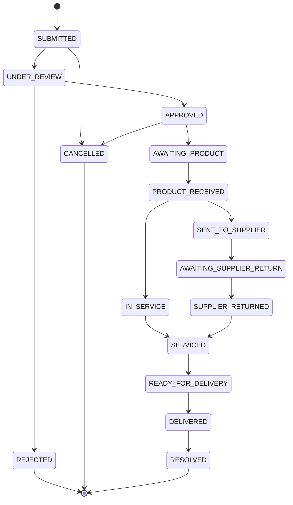

# 🛡️ Warranty System — Complete Update Plan

> **Last Updated:** 2026-07-28  
> **Current State:** Core warranty models, services, and basic claim flow exist.  
> **Goal:** Full end-to-end warranty lifecycle with challan/document generation, SN tracking, and enhanced admin/customer panels.

---

## 📐 System Architecture Overview

```
┌─────────────────────────────────────────────────────────────────────────────┐
│                        WARRANTY LIFECYCLE (4 Parts)                         │
├─────────────────────────────────────────────────────────────────────────────┤
│                                                                             │
│  PART 1              PART 2              PART 3              PART 4         │
│  ────────            ────────            ────────            ────────        │
│  PURCHASE            SALE WITH           CUSTOMER            CLAIM          │
│  FROM                WARRANTY            CLAIM               PROCESSING     │
│  SUPPLIER            + SN                + VALIDATION        PIPELINE       │
│                                                                             │
│  ┌──────────┐     ┌──────────┐     ┌──────────┐     ┌──────────────────┐   │
│  │ Supplier │     │ Customer │     │ Customer │     │ Receive → Service│   │
│  │ Warranty │────▶│ Warranty │────▶│  Claim   │────▶│ → Return →       │   │
│  │ Created  │     │ Sale +SN │     │ Filed    │     │ Deliver + Chalan │   │
│  └──────────┘     └──────────┘     └──────────┘     └──────────────────┘   │
│                                                                             │
└─────────────────────────────────────────────────────────────────────────────┘
```

---

## 🗄️ Database Schema Changes Required

### 1.1 New Migration: `add_sn_to_warranty_sales`

**File:** `database/migrations/2026_07_28_000001_add_serial_number_to_warranty_sales.php`

```php
Schema::table('warranty_sales', function (Blueprint $table) {
    // Product Serial Number — unique identifier per sold item
    $table->string('serial_number', 100)->nullable()->after('product_id');
    // Unique: one SN per product (optional, can be relaxed)
    $table->unique(['product_id', 'serial_number'], 'warranty_sales_product_sn_unique');

    // Store who sold it
    $table->foreignId('sold_by')->nullable()->after('customer_id')
          ->constrained('users')->nullOnDelete();

    // Which batch this item came from
    $table->foreignId('stock_batch_id')->nullable()->after('supplier_warranty_id')
          ->constrained('stock_batches')->nullOnDelete();

    // Purchase reference (where the store bought it)
    $table->foreignId('purchase_id')->nullable()->after('stock_batch_id')
          ->constrained('purchases')->nullOnDelete();
});
```

### 1.2 New Migration: `add_claim_pipeline_to_warranty_claims`

**File:** `database/migrations/2026_07_28_000002_add_pipeline_fields_to_warranty_claims.php`

```php
Schema::table('warranty_claims', function (Blueprint $table) {
    // ── Receive from Customer ──
    $table->timestamp('product_received_at')->nullable();
    $table->string('receive_challan_no', 50)->nullable();       // Chalan for customer + store
    $table->text('receive_notes')->nullable();                   // Condition, accessories received, etc.

    // ── Send to Supplier ──
    $table->timestamp('sent_to_supplier_at')->nullable();
    $table->string('supplier_challan_no', 50)->nullable();       // Chalan for supplier + store
    $table->foreignId('sent_supplier_id')->nullable()            // Which supplier it went to
          ->constrained('suppliers')->nullOnDelete();
    $table->text('supplier_send_notes')->nullable();             // Courier info, tracking, etc.

    // ── Return from Supplier ──
    $table->timestamp('returned_from_supplier_at')->nullable();
    $table->string('supplier_return_challan_no', 50)->nullable(); // Supplier's return chalan
    $table->string('replacement_sn', 100)->nullable();           // New SN if replaced
    $table->enum('return_type', ['repaired', 'replaced', 'refunded'])
          ->nullable();                                           // What supplier did
    $table->text('supplier_return_notes')->nullable();

    // ── Deliver to Customer ──
    $table->timestamp('ready_for_delivery_at')->nullable();
    $table->string('delivery_challan_no', 50)->nullable();       // Chalan for customer + store
    $table->timestamp('delivered_to_customer_at')->nullable();
    $table->text('delivery_notes')->nullable();

    // ── Claim cost tracking ──
    $table->decimal('supplier_charge', 15, 2)->nullable();       // What supplier charged
    $table->decimal('customer_charge', 15, 2)->nullable();       // What customer paid (if any)
});
```

### 1.3 New Migration: `create_warranty_challans_table`

**File:** `database/migrations/2026_07_28_000003_create_warranty_challans_table.php`

```php
Schema::create('warranty_challans', function (Blueprint $table) {
    $table->id();
    $table->foreignId('warranty_claim_id')->constrained('warranty_claims')->cascadeOnDelete();
    $table->enum('challan_type', [
        'receive',           // Customer → Store (product received)
        'send_to_supplier',  // Store → Supplier
        'receive_return',    // Supplier → Store (return)
        'delivery',          // Store → Customer (return product)
    ]);
    $table->string('challan_no', 50)->unique();
    $table->json('challan_data');        // Full challan content as JSON for printing
    $table->foreignId('generated_by')->nullable()->constrained('users')->nullOnDelete();
    $table->timestamps();
});
```

### 1.4 Updated Enum: `WarrantyClaimStatus` — New Statuses

Add to `app/Enums/WarrantyClaimStatus.php`:

```php
// New statuses to insert into the transition graph:

// Existing flow: SUBMITTED → UNDER_REVIEW → APPROVED → IN_SERVICE → SERVICED → RESOLVED
// Expanded flow:

SUBMITTED → UNDER_REVIEW → APPROVED → AWAITING_PRODUCT
  → PRODUCT_RECEIVED (generate receive challan)
  → IN_SERVICE / SENT_TO_SUPPLIER
  → AWAITING_SUPPLIER_RETURN
  → SUPPLIER_RETURNED (generate receive-return challan)
  → SERVICED → READY_FOR_DELIVERY
  → DELIVERED → RESOLVED

case AWAITING_PRODUCT       = 'awaiting_product';        // Waiting for customer to bring/send product
case PRODUCT_RECEIVED       = 'product_received';         // Store received product from customer (chalan generated)
case SENT_TO_SUPPLIER       = 'sent_to_supplier';         // Store sent product to supplier (chalan generated)
case AWAITING_SUPPLIER_RETURN = 'awaiting_supplier_return'; // Waiting for supplier
case SUPPLIER_RETURNED      = 'supplier_returned';        // Product returned from supplier (chalan generated)
case READY_FOR_DELIVERY     = 'ready_for_delivery';       // Ready to give back to customer
case DELIVERED              = 'delivered';                 // Customer received product back (chalan generated)
```

---

## 📦 PART 1: Purchase from Supplier → Supplier Warranty

### Current State
- `SupplierWarranty` model exists with: purchase_item_id, product_id, supplier_id, warranty_days, start/end dates, is_transferable
- Admin panel has basic supplier warranty CRUD at `/admin/warranty/supplier`
- Warranty is created manually via admin panel

### What Needs to Change

#### 1.1 Auto-Create Supplier Warranty on Purchase

**File:** `app/Http/Controllers/Admin/PurchaseController.php` (or equivalent)

When a purchase is completed with warranty-enabled products:

```php
// In the purchase store/update method, after purchase items are saved:

foreach ($purchase->items as $item) {
    $product = $item->product;

    if ($request->has("warranty_enabled.{$item->id}")) {
        SupplierWarranty::create([
            'purchase_item_id'   => $item->id,
            'product_id'         => $item->product_id,
            'supplier_id'        => $purchase->supplier_id,
            'warranty_days'      => $request->input("warranty_days.{$item->id}"),
            'warranty_start_date'=> $request->input("warranty_start_date.{$item->id}") ?? now(),
            'warranty_end_date'  => now()->addDays($request->input("warranty_days.{$item->id}")),
            'warranty_type'      => 'supplier_warranty',
            'warranty_terms'     => $request->input("warranty_terms.{$item->id}"),
            'is_transferable'    => $request->boolean("warranty_transferable.{$item->id}", true),
            'notes'              => $request->input("warranty_notes.{$item->id}"),
        ]);
    }
}
```

#### 1.2 Warranty Tier Auto-Generation on Purchase

**File:** `app/Services/WarrantyService.php` — `generateTiers()` already exists.

Call `generateTiers()` after supplier warranty is created (in purchase flow):

```php
$warrantyService = app(WarrantyService::class);
$warrantyService->generateTiers($product, $supplierWarranty);
```

This will create/update the `ProductWarrantyTier` for this product with live `remaining_days`.

#### 1.3 Supplier Warranty Dashboard Enhancement

**File:** `resources/views/backEnd/warranty/dashboard.blade.php`

Add sections:
- **Expiring soon** (within 7/15/30 days) — already partially exists
- **Warranty utilization**: How many warranties sold vs. how many supplier warranties available
- **Supplier-wise warranty summary**: Which supplier warranties are most utilized/claimed

---

## 📦 PART 2: Sale with Warranty + Product Serial Number (SN)

### Current State
- `WarrantySale` created when customer buys with warranty at checkout or POS
- No Serial Number tracking — multiple units of same product are indistinguishable
- Admin warranty sale detail page exists (`sales_show.blade.php`) but lacks supplier/batch info

### What Needs to Change

#### 2.1 Add Serial Number Field to POS/Checkout

**File:** `resources/views/backEnd/order/cart_table_rows.blade.php`

Add SN input field below the batch selector:

```blade
{{-- 🔢 Serial Number --}}
@if($warrantyTiers->isNotEmpty())
<div class="mt-1">
    <label class="form-label small text-muted mb-0" style="font-size:11px">
        {{ __('Product SN') }} <span class="text-danger">*</span>
    </label>
    <input type="text"
           class="form-control form-control-sm cart-sn-input"
           data-id="{{ $value->rowId }}"
           placeholder="Enter Serial Number"
           value="{{ $value->options->serial_number ?? '' }}"
           style="min-width:130px;font-size:11px;">
</div>
@endif
```

#### 2.2 SN Validation & Storage

**File:** `app/Http/Controllers/Admin/OrderController.php` — `cart_update()`

Add SN handling:

```php
// In cart_update(), add to $options:
'serial_number' => $request->serial_number ?? $cartItem->options->serial_number ?? null,
```

**File:** `app/Http/Controllers/Admin/OrderController.php` — `order_store()` / `order_update()`

When creating/updating `WarrantySale`:

```php
if ($detail->warranty_tier_id) {
    WarrantySale::updateOrCreate(
        ['order_detail_id' => $detail->id],
        [
            // ... existing fields ...
            'serial_number'   => $cart->options->serial_number ?? null,
            'stock_batch_id'  => $cart->options->batch_id ?? null,
            'sold_by'         => auth()->id(),
            'purchase_id'     => $this->resolvePurchaseId($detail->product_id, $cart->options->batch_id),
        ]
    );
}
```

#### 2.3 Admin Warranty Sale Detail Enhancement

**File:** `resources/views/backEnd/warranty/sales_show.blade.php`

Add to the sale detail view:

| Information | Source |
|-------------|--------|
| **Serial Number** | `$sale->serial_number` |
| **Supplier** | `$sale->supplierWarranty?->supplier?->name` |
| **Supplier Warranty Days** | `$sale->supplierWarranty?->remaining_days` |
| **Batch No** | `$sale->stockBatch?->batch_no` |
| **Batch Unit Cost** | `$sale->stockBatch?->unit_cost` |
| **Purchase Invoice** | `$sale->purchase?->invoice_no` |
| **Sold By** | `$sale->soldBy?->name` |
| **Product SN Scan History** | New section showing if this SN was claimed/replaced before |

Add a "Product SN History" panel:
```php
// Check if this SN was used before (same product, different sale)
$snHistory = WarrantySale::where('product_id', $sale->product_id)
    ->where('serial_number', $sale->serial_number)
    ->where('id', '!=', $sale->id)
    ->with('warrantyClaim')
    ->get();
```

#### 2.4 SN Uniqueness Validation

**File:** `app/Http/Controllers/Admin/OrderController.php` — `order_store()`

Before saving, validate:

```php
// Check SN not already used for an active warranty
$existingSn = WarrantySale::where('product_id', $product->id)
    ->where('serial_number', $sn)
    ->whereIn('status', ['active', 'claimed'])
    ->exists();

if ($existingSn) {
    throw new \RuntimeException("Serial number '{$sn}' is already registered for this product.");
}
```

---

## 📦 PART 3: Customer Warranty Claim + Validation

### Current State
- `WarrantyClaim` model with `WarrantyClaimStatus` enum (SUBMITTED → UNDER_REVIEW → APPROVED → IN_SERVICE → SERVICED → RESOLVED)
- Customer can file claim via web form (`/warranty-claim/{sale_id}`) or API
- Admin can review, approve, reject claims
- Claim stage tracking via `WarrantyClaimStage`

### What Needs to Change

#### 3.1 Claim Eligibility Validation Enhancement

**File:** `app/Services/WarrantyService.php` — `fileClaim()`

Add checks:

```php
public function fileClaim(WarrantySale $warrantySale, array $data): WarrantyClaim
{
    // ✅ Existing checks
    if (!$warrantySale->can_claim) {
        throw new \RuntimeException('This warranty cannot be claimed.');
    }

    // 🆕 Additional checks
    // 1. Order must be completed/delivered
    if (!in_array($warrantySale->order->order_status, ['completed', 'delivered'])) {
        throw new \RuntimeException('Order must be completed before filing a warranty claim.');
    }

    // 2. No active claim already exists
    $existingClaim = WarrantyClaim::where('warranty_sale_id', $warrantySale->id)
        ->whereNotIn('status', ['resolved', 'rejected', 'cancelled'])
        ->exists();
    if ($existingClaim) {
        throw new \RuntimeException('An active claim already exists for this warranty.');
    }

    // 3. Check claim count limit (configurable)
    $maxClaims = config('warranty.max_claims_per_sale', 3);
    $claimCount = WarrantyClaim::where('warranty_sale_id', $warrantySale->id)->count();
    if ($claimCount >= $maxClaims) {
        throw new \RuntimeException("Maximum claims ({$maxClaims}) reached for this warranty.");
    }

    // ... proceed with claim creation
}
```

#### 3.2 Frontend Claim Validation

**File:** `resources/views/frontEnd/layouts/customer/my-warranties.blade.php`

Update the "File Claim" button logic:

```blade
@if($warranty->can_claim)
    @if($warranty->order && in_array($warranty->order->order_status, ['completed', 'delivered']))
        <a href="{{ route('customer.warranty.claim', $warranty->id) }}"
           class="btn btn-sm btn-warning">
           🛡️ File Claim
        </a>
    @else
        <span class="text-muted small">
            ⏳ Available after order is completed
        </span>
    @endif
@else
    <span class="badge bg-secondary">Claim limit reached / Expired</span>
@endif
```

#### 3.3 Admin Can File Claim on Behalf of Customer

**File:** `app/Http/Controllers/Admin/WarrantyController.php`

Add method:

```php
public function fileClaimForCustomer(Request $request)
{
    $warrantySale = WarrantySale::findOrFail($request->warranty_sale_id);
    $data = [
        'issue_description' => $request->issue_description,
        'issue_type'        => $request->issue_type,
        'customer_id'       => $warrantySale->customer_id,
        'filed_by_admin'    => true,
        'admin_note'        => $request->admin_note,
    ];

    $claim = app(WarrantyService::class)->fileClaim($warrantySale, $data);
    return redirect()->route('admin.warranty.claims.show', $claim);
}
```

#### 3.4 Claim Tracking Enhancement for Customer

**File:** `resources/views/frontEnd/layouts/customer/track-warranty-claim.blade.php`

Add stage-specific messages and expected timelines:

```blade
@switch($claim->status)
    @case('submitted')
        <div class="alert alert-info">
            📋 Claim submitted. Our team will review within 24 hours.
        </div>
        @break
    @case('under_review')
        <div class="alert alert-info">
            🔍 Under review. Expected time: 1-2 business days.
        </div>
        @break
    @case('product_received')
        <div class="alert alert-warning">
            📦 Product received at our service center.
            <br>Challan #: {{ $claim->receive_challan_no }}
        </div>
        @break
    @case('sent_to_supplier')
        <div class="alert alert-info">
            🚚 Sent to supplier for inspection/repair.
            <br>Estimated return: 7-14 days.
        </div>
        @break
    @case('ready_for_delivery')
        <div class="alert alert-success">
            ✅ Product ready for delivery. We will contact you shortly.
        </div>
        @break
    <!-- etc. -->
@endswitch
```

---

## 📦 PART 4: Claim Processing Pipeline with Challans

This is the most complex part. The claim goes through 4 physical stages, each generating a challan document.

### 4.1 Pipeline Stages & Challan Types

```
 STEP 1                   STEP 2                    STEP 3                 STEP 4
 ────────                 ────────                  ────────               ────────
 Customer brings/         Store sends to            Supplier returns       Customer picks
 sends product            supplier                  (repaired/new)         up / receives

 ┌──────────────┐      ┌──────────────┐        ┌──────────────┐      ┌──────────────┐
 │ RECEIVE      │      │ SEND TO      │        │ SUPPLIER     │      │ DELIVER      │
 │ CHALLAN      │ ───▶ │ SUPPLIER     │ ────▶  │ RETURN       │ ───▶ │ CHALLAN      │
 │              │      │ CHALLAN      │        │ CHALLAN      │      │              │
 │ For:         │      │ For:         │        │ For:         │      │ For:         │
 │ • Customer   │      │ • Supplier   │        │ • Supplier   │      │ • Customer   │
 │ • Store      │      │ • Store      │        │ • Store      │      │ • Store      │
 └──────────────┘      └──────────────┘        └──────────────┘      └──────────────┘

 Status:                Status:                  Status:               Status:
 PRODUCT_RECEIVED       SENT_TO_SUPPLIER         SUPPLIER_RETURNED     DELIVERED
```

### 4.2 Challan Generation Service

**New File:** `app/Services/WarrantyChallanService.php`

```php
namespace App\Services;

use App\Models\WarrantyClaim;
use App\Models\WarrantyChallan;
use Illuminate\Support\Str;

class WarrantyChallanService
{
    /**
     * Generate challan when product is received from customer.
     *
     * @param WarrantyClaim $claim
     * @param array $data  ['notes', 'condition', 'accessories']
     * @return WarrantyChallan
     */
    public function generateReceiveChallan(WarrantyClaim $claim, array $data): WarrantyChallan
    {
        $challanNo = $this->generateChallanNo('RCV');

        // Build challan data
        $challanData = [
            'challan_no'       => $challanNo,
            'challan_type'     => 'receive',
            'date'             => now()->format('Y-m-d H:i'),
            'store_name'       => config('app.name'),
            'store_address'    => setting('address'),
            'store_phone'      => setting('phone'),

            // Customer info (included — this is for customer)
            'customer_name'    => $claim->customer->name ?? 'N/A',
            'customer_phone'   => $claim->customer->phone ?? 'N/A',

            // Product info
            'product_name'     => $claim->product->name ?? 'N/A',
            'serial_number'    => $claim->warrantySale->serial_number ?? 'N/A',
            'claim_number'     => $claim->claim_number,
            'issue_description'=> $claim->issue_description,
            'received_condition'=> $data['condition'] ?? 'As described',
            'accessories'      => $data['accessories'] ?? 'None',
            'notes'            => $data['notes'] ?? '',

            // Footer
            'footer_text'      => 'This is a computer-generated challan. Signature not required.',
        ];

        // Create challan
        $challan = WarrantyChallan::create([
            'warranty_claim_id' => $claim->id,
            'challan_type'      => 'receive',
            'challan_no'        => $challanNo,
            'challan_data'      => $challanData,
            'generated_by'      => auth()->id(),
        ]);

        // Update claim
        $claim->update([
            'status'                => 'product_received',
            'product_received_at'   => now(),
            'receive_challan_no'    => $challanNo,
            'receive_notes'         => $data['notes'] ?? null,
        ]);

        // Create claim stage
        $claim->stages()->create([
            'stage'       => 'product_inspection',
            'status'      => 'completed',
            'notes'       => 'Product received from customer. Challan #' . $challanNo,
            'started_at'  => now(),
            'completed_at'=> now(),
        ]);

        return $challan;
    }

    /**
     * Generate challan when product is sent to supplier for warranty claim.
     * IMPORTANT: No customer information on this challan.
     * Only store info, supplier info, and product info.
     *
     * @param WarrantyClaim $claim
     * @param array $data ['supplier_id', 'courier', 'tracking_id', 'notes']
     * @return WarrantyChallan
     */
    public function generateSendToSupplierChallan(WarrantyClaim $claim, array $data): WarrantyChallan
    {
        $challanNo = $this->generateChallanNo('SUP');
        $supplier = \App\Models\Supplier::find($data['supplier_id']);

        $challanData = [
            'challan_no'       => $challanNo,
            'challan_type'     => 'send_to_supplier',
            'date'             => now()->format('Y-m-d H:i'),

            // STORE INFO (sender)
            'store_name'       => config('app.name'),
            'store_address'    => setting('address'),
            'store_phone'      => setting('phone'),
            'store_contact'    => setting('contact_person') ?? 'N/A',

            // SUPPLIER INFO (receiver) — NO CUSTOMER INFO
            'supplier_name'    => $supplier->name ?? 'N/A',
            'supplier_address' => $supplier->address ?? 'N/A',
            'supplier_phone'   => $supplier->phone ?? 'N/A',
            'supplier_contact' => $supplier->contact_person ?? 'N/A',

            // Product info (no customer data)
            'product_name'     => $claim->product->name ?? 'N/A',
            'serial_number'    => $claim->warrantySale->serial_number ?? 'N/A',
            'claim_number'     => $claim->claim_number,
            'warranty_type'    => $claim->warrantySale->warranty_type,
            'warranty_days'    => $claim->warrantySale->warranty_days,

            // Logistics
            'courier'          => $data['courier'] ?? 'N/A',
            'tracking_id'      => $data['tracking_id'] ?? 'N/A',
            'notes'            => $data['notes'] ?? '',

            // Footer
            'footer_text'      => 'For Supplier Warranty Claim. Product SN: ' . ($claim->warrantySale->serial_number ?? 'N/A'),
        ];

        $challan = WarrantyChallan::create([
            'warranty_claim_id' => $claim->id,
            'challan_type'      => 'send_to_supplier',
            'challan_no'        => $challanNo,
            'challan_data'      => $challanData,
            'generated_by'      => auth()->id(),
        ]);

        $claim->update([
            'status'                => 'sent_to_supplier',
            'sent_to_supplier_at'   => now(),
            'supplier_challan_no'   => $challanNo,
            'sent_supplier_id'      => $data['supplier_id'] ?? null,
            'supplier_send_notes'   => $data['notes'] ?? null,
        ]);

        return $challan;
    }

    /**
     * Generate challan when product is returned from supplier.
     *
     * @param WarrantyClaim $claim
     * @param array $data ['return_type', 'replacement_sn', 'supplier_return_challan', 'notes', 'supplier_charge']
     * @return WarrantyChallan
     */
    public function generateSupplierReturnChallan(WarrantyClaim $claim, array $data): WarrantyChallan
    {
        $challanNo = $this->generateChallanNo('SRT');

        $challanData = [
            'challan_no'              => $challanNo,
            'challan_type'            => 'receive_return',
            'date'                    => now()->format('Y-m-d H:i'),

            // SUPPLIER INFO (sender)
            'supplier_name'           => $claim->sentSupplier->name ?? 'N/A',
            'supplier_return_challan' => $data['supplier_return_challan'] ?? 'N/A',

            // STORE INFO (receiver)
            'store_name'              => config('app.name'),

            // Product info
            'product_name'            => $claim->product->name ?? 'N/A',
            'original_sn'             => $claim->warrantySale->serial_number ?? 'N/A',
            'replacement_sn'          => $data['replacement_sn'] ?? null,
            'return_type'             => $data['return_type'] ?? 'repaired', // repaired | replaced | refunded
            'claim_number'            => $claim->claim_number,

            // Cost
            'supplier_charge'         => $data['supplier_charge'] ?? 0,

            'notes'                   => $data['notes'] ?? '',
            'footer_text'             => 'Product returned from supplier warranty claim.',
        ];

        $challan = WarrantyChallan::create([
            'warranty_claim_id' => $claim->id,
            'challan_type'      => 'receive_return',
            'challan_no'        => $challanNo,
            'challan_data'      => $challanData,
            'generated_by'      => auth()->id(),
        ]);

        $claim->update([
            'status'                     => 'supplier_returned',
            'returned_from_supplier_at'  => now(),
            'supplier_return_challan_no' => $data['supplier_return_challan'] ?? null,
            'replacement_sn'             => $data['replacement_sn'] ?? null,
            'return_type'                => $data['return_type'] ?? 'repaired',
            'supplier_return_notes'      => $data['notes'] ?? null,
            'supplier_charge'            => $data['supplier_charge'] ?? null,
        ]);

        // If replaced, update the WarrantySale serial number
        if ($data['return_type'] === 'replaced' && !empty($data['replacement_sn'])) {
            $claim->warrantySale->update([
                'serial_number' => $data['replacement_sn'],
            ]);

            // Add note about SN change
            $claim->notes()->create([
                'user_id' => auth()->id(),
                'note'    => "Serial Number updated: {$claim->warrantySale->serial_number} → {$data['replacement_sn']} (replaced by supplier)",
            ]);
        }

        return $challan;
    }

    /**
     * Generate delivery challan when product is returned to customer.
     *
     * @param WarrantyClaim $claim
     * @param array $data ['notes', 'delivery_method']
     * @return WarrantyChallan
     */
    public function generateDeliveryChallan(WarrantyClaim $claim, array $data): WarrantyChallan
    {
        $challanNo = $this->generateChallanNo('DLV');
        $warrantySale = $claim->warrantySale;

        $challanData = [
            'challan_no'         => $challanNo,
            'challan_type'       => 'delivery',
            'date'               => now()->format('Y-m-d H:i'),

            // STORE INFO
            'store_name'         => config('app.name'),
            'store_address'      => setting('address'),
            'store_phone'        => setting('phone'),

            // CUSTOMER INFO
            'customer_name'      => $claim->customer->name ?? 'N/A',
            'customer_phone'     => $claim->customer->phone ?? 'N/A',
            'customer_address'   => $claim->order->shipping->address ?? 'N/A',

            // Product info
            'product_name'       => $claim->product->name ?? 'N/A',
            'serial_number'      => $warrantySale->serial_number ?? 'N/A',
            'claim_number'       => $claim->claim_number,
            'return_type'        => $claim->return_type ?? 'repaired',
            'original_sn'        => $claim->warrantySale->getOriginal('serial_number') ?? 'N/A',

            // Warranty sale summary
            'warranty_type'      => $warrantySale->warranty_type,
            'warranty_days'      => $warrantySale->warranty_days,
            'warranty_start'     => $warrantySale->warranty_start_date?->format('Y-m-d'),
            'warranty_end'       => $warrantySale->warranty_end_date?->format('Y-m-d'),

            // Claim count for this sale
            'claim_count'        => WarrantyClaim::where('warranty_sale_id', $warrantySale->id)->count(),

            // Delivery info
            'delivery_method'    => $data['delivery_method'] ?? 'Counter Pickup',
            'notes'              => $data['notes'] ?? '',

            'footer_text'        => 'Thank you for your patience. Product delivered under warranty claim #' . $claim->claim_number,
        ];

        $challan = WarrantyChallan::create([
            'warranty_claim_id' => $claim->id,
            'challan_type'      => 'delivery',
            'challan_no'        => $challanNo,
            'challan_data'      => $challanData,
            'generated_by'      => auth()->id(),
        ]);

        $claim->update([
            'status'                   => 'delivered',
            'ready_for_delivery_at'    => $claim->ready_for_delivery_at ?? now(),
            'delivery_challan_no'      => $challanNo,
            'delivered_to_customer_at' => now(),
            'delivery_notes'           => $data['notes'] ?? null,
        ]);

        // Complete the claim
        $claim->transitionTo(WarrantyClaimStatus::RESOLVED, 'Delivered to customer. Challan #' . $challanNo);

        return $challan;
    }

    // ── Helper ──
    private function generateChallanNo(string $prefix): string
    {
        return strtoupper($prefix) . '-' . date('Ymd') . '-' . strtoupper(Str::random(4));
    }
}
```

### 4.3 Challan Print View (Thermal / A4)

**New File:** `resources/views/backEnd/warranty/challan_print.blade.php`

A reusable challan print template. Adapts layout based on `challan_type`:

```blade
{{-- Shows different layouts for receive / send_to_supplier / receive_return / delivery --}}

@switch($challan->challan_type)
    @case('receive')
        {{-- Customer copy + Store copy --}}
        {{-- Shows: Customer info, Product info, Claim info, Store info --}}
        @break

    @case('send_to_supplier')
        {{-- Supplier copy + Store copy --}}
        {{-- Shows: Store info, Supplier info, Product info (NO customer) --}}
        @break

    @case('receive_return')
        {{-- Store copy --}}
        {{-- Shows: Supplier info, Product info, Return type, Replacement SN, Charges --}}
        @break

    @case('delivery')
        {{-- Customer copy + Store copy --}}
        {{-- Shows: Customer info, Product info, Claim summary, Warranty sale info --}}
        @break
@endswitch
```

### 4.4 Admin Claim Processing UI

**File:** `resources/views/backEnd/warranty/claims_show.blade.php`

Add pipeline action buttons (only show relevant ones based on current status):

```blade
@switch($claim->status)
    @case('approved')
        <button class="btn btn-primary" onclick="openReceiveModal()">
            📦 Product Received from Customer
        </button>
        @break

    @case('product_received')
        <button class="btn btn-warning" onclick="openSendToSupplierModal()">
            🚚 Send to Supplier
        </button>
        @break

    @case('sent_to_supplier')
        <button class="btn btn-info" onclick="openSupplierReturnModal()">
            📥 Supplier Return Received
        </button>
        @break

    @case('supplier_returned')
        <button class="btn btn-success" onclick="markReadyForDelivery()">
            ✅ Mark Ready for Delivery
        </button>
        @break

    @case('ready_for_delivery')
        <button class="btn btn-success" onclick="openDeliveryModal()">
            🎉 Deliver to Customer
        </button>
        @break
@endswitch
```

### 4.5 Modal Forms (Inline in claims_show.blade.php)

**Receive Product Modal:**
```
Fields: Product Condition (dropdown: As described/Damaged/Missing accessories)
        Accessories received (text)
        Notes (textarea)
        [Generate Receive Challan]
```

**Send to Supplier Modal:**
```
Fields: Select Supplier (dropdown)
        Courier (text)
        Tracking ID (text)
        Notes (textarea)
        [Generate Supplier Challan]
```

**Supplier Return Modal:**
```
Fields: Return Type (dropdown: Repaired/Replaced/Refunded)
        Replacement SN (text — shown only if "Replaced" selected)
        Supplier's Return Challan No (text)
        Supplier Charge (number)
        Notes (textarea)
        [Generate Return Challan]
```

**Delivery Modal:**
```
Fields: Delivery Method (dropdown: Counter Pickup/Courier/Hand Delivery)
        Notes (textarea)
        [Generate Delivery Challan]
```

### 4.6 Admin API Endpoints for Pipeline

**File:** `routes/web.php` (admin prefix)

```php
// Claim Pipeline Actions
Route::post('claims/{claim}/receive-product', [WarrantyController::class, 'receiveProduct'])
    ->name('admin.warranty.claims.receive-product');
Route::post('claims/{claim}/send-to-supplier', [WarrantyController::class, 'sendToSupplier'])
    ->name('admin.warranty.claims.send-to-supplier');
Route::post('claims/{claim}/supplier-return', [WarrantyController::class, 'supplierReturn'])
    ->name('admin.warranty.claims.supplier-return');
Route::post('claims/{claim}/ready-for-delivery', [WarrantyController::class, 'readyForDelivery'])
    ->name('admin.warranty.claims.ready-for-delivery');
Route::post('claims/{claim}/deliver', [WarrantyController::class, 'deliverToCustomer'])
    ->name('admin.warranty.claims.deliver');

// Challan
Route::get('claims/{claim}/challans', [WarrantyController::class, 'challans'])
    ->name('admin.warranty.claims.challans');
Route::get('challans/{challan}/print', [WarrantyController::class, 'printChallan'])
    ->name('admin.warranty.challans.print');
```

### 4.7 Controller Methods

**File:** `app/Http/Controllers/Admin/WarrantyController.php`

Add methods:

```php
use App\Services\WarrantyChallanService;

public function receiveProduct(Request $request, WarrantyClaim $claim)
{
    $request->validate([
        'condition'   => 'required|string',
        'accessories' => 'nullable|string',
        'notes'       => 'nullable|string',
    ]);

    $challanService = app(WarrantyChallanService::class);
    $challan = $challanService->generateReceiveChallan($claim, $request->all());

    return response()->json([
        'success' => true,
        'message' => 'Product received. Challan #' . $challan->challan_no . ' generated.',
        'challan' => $challan,
        'print_url' => route('admin.warranty.challans.print', $challan),
    ]);
}

public function sendToSupplier(Request $request, WarrantyClaim $claim)
{
    $request->validate([
        'supplier_id' => 'required|exists:suppliers,id',
        'courier'     => 'nullable|string',
        'tracking_id' => 'nullable|string',
        'notes'       => 'nullable|string',
    ]);

    $challanService = app(WarrantyChallanService::class);
    $challan = $challanService->generateSendToSupplierChallan($claim, $request->all());

    return response()->json([...]);
}

public function supplierReturn(Request $request, WarrantyClaim $claim)
{
    $request->validate([
        'return_type'               => 'required|in:repaired,replaced,refunded',
        'replacement_sn'            => 'nullable|string|max:100',
        'supplier_return_challan'   => 'nullable|string|max:50',
        'supplier_charge'           => 'nullable|numeric|min:0',
        'notes'                     => 'nullable|string',
    ]);

    $challanService = app(WarrantyChallanService::class);
    $challan = $challanService->generateSupplierReturnChallan($claim, $request->all());

    return response()->json([...]);
}

public function deliverToCustomer(Request $request, WarrantyClaim $claim)
{
    $request->validate([
        'delivery_method' => 'nullable|string',
        'notes'           => 'nullable|string',
    ]);

    $challanService = app(WarrantyChallanService::class);
    $challan = $challanService->generateDeliveryChallan($claim, $request->all());

    return response()->json([...]);
}
```

---

## 📊 Updated Enum Status Transition Graph



---

## 🖨️ Challan Templates Summary

| Challan Type | For Whom | Contains Customer Info? | Print Trigger |
|---|---|---|---|
| **Receive** | Customer + Store | ✅ Yes | After receiving product from customer |
| **Send to Supplier** | Supplier + Store | ❌ No (only store & supplier) | After sending to supplier |
| **Supplier Return** | Store + Supplier | ❌ No | After supplier returns product |
| **Delivery** | Customer + Store | ✅ Yes | After delivering back to customer |

---

## 📋 Implementation Checklist

### Phase 1: Database & Models (Current Sprint)
- [ ] Migration: `add_serial_number_to_warranty_sales` (SN, sold_by, stock_batch_id, purchase_id)
- [ ] Migration: `add_pipeline_fields_to_warranty_claims` (receive/send/return/delivery fields)
- [ ] Migration: `create_warranty_challans_table`
- [ ] Update `WarrantySale` model: add `serial_number`, `soldBy`, `stockBatch`, `purchase` relationships, `$fillable`, `$casts`
- [ ] Update `WarrantyClaim` model: add pipeline fields to `$fillable`, `$casts`
- [ ] Create `WarrantyChallan` model
- [ ] Update `WarrantyClaimStatus` enum: add new statuses + transitions

### Phase 2: Services (Current Sprint)
- [ ] Create `WarrantyChallanService` with all 4 challan generation methods
- [ ] Update `WarrantyService::fileClaim()` with eligibility validation
- [ ] Update `cart_update()` in OrderController to handle SN
- [ ] Update `order_store()` / `order_update()` to persist SN + batch to WarrantySale

### Phase 3: Admin Panel UI
- [ ] `warranty/sales_show.blade.php`: Add SN, supplier, batch, purchase info panels
- [ ] `warranty/claims_show.blade.php`: Add pipeline action buttons + modals
- [ ] `warranty/challan_print.blade.php`: Thermal/A4 challan print template
- [ ] Admin routes: Add pipeline endpoints
- [ ] `WarrantyController`: Add pipeline action methods

### Phase 4: Customer Panel
- [ ] `my-warranties.blade.php`: Show SN, claim count, order status validation
- [ ] `track-warranty-claim.blade.php`: Enhanced timeline with pipeline stages
- [ ] Customer API: Add eligibility validation

### Phase 5: Purchase Integration
- [ ] Auto-create SupplierWarranty on purchase completion
- [ ] Auto-generate ProductWarrantyTier after supplier warranty creation

---

## 🔗 Related Files Reference

| File | Action |
|------|--------|
| `app/Models/WarrantySale.php` | Add SN, batch, purchase relationships + fillable |
| `app/Models/WarrantyClaim.php` | Add pipeline fields + fillable + casts |
| `app/Models/WarrantyChallan.php` | **NEW** — Challan model |
| `app/Enums/WarrantyClaimStatus.php` | Add new statuses + transitions |
| `app/Services/WarrantyService.php` | Add eligibility validation to fileClaim() |
| `app/Services/WarrantyChallanService.php` | **NEW** — All challan generation logic |
| `app/Http/Controllers/Admin/WarrantyController.php` | Add pipeline action methods |
| `app/Http/Controllers/Admin/OrderController.php` | Handle SN in cart_update/order_store/order_update |
| `app/Http/Controllers/Api/WarrantyApiController.php` | Add eligibility validation |
| `resources/views/backEnd/warranty/sales_show.blade.php` | Enhanced sale detail |
| `resources/views/backEnd/warranty/claims_show.blade.php` | Pipeline UI + modals |
| `resources/views/backEnd/warranty/challan_print.blade.php` | **NEW** — Challan print template |
| `resources/views/backEnd/order/cart_table_rows.blade.php` | Add SN input field |
| `resources/views/frontEnd/layouts/customer/my-warranties.blade.php` | SN display, claim validation |
| `resources/views/frontEnd/layouts/customer/track-warranty-claim.blade.php` | Enhanced timeline |
| `routes/web.php` | Add pipeline + challan routes |
| `database/migrations/` | 3 new migration files |
