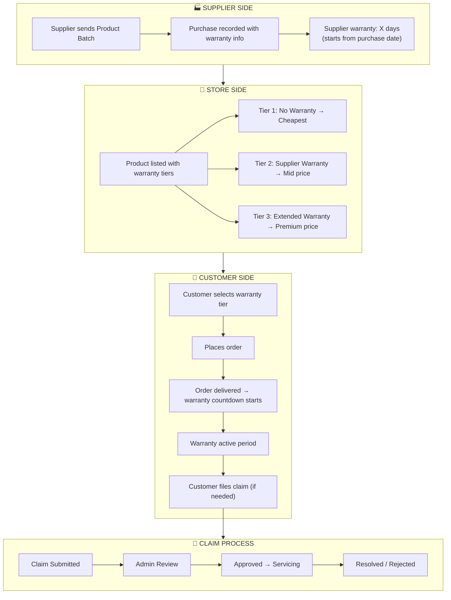
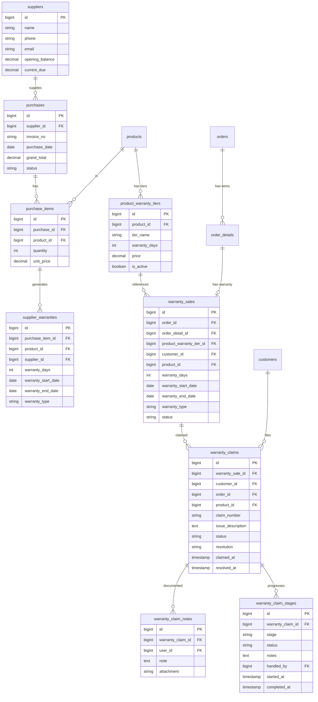
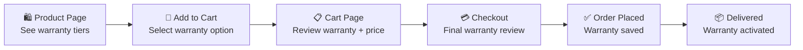
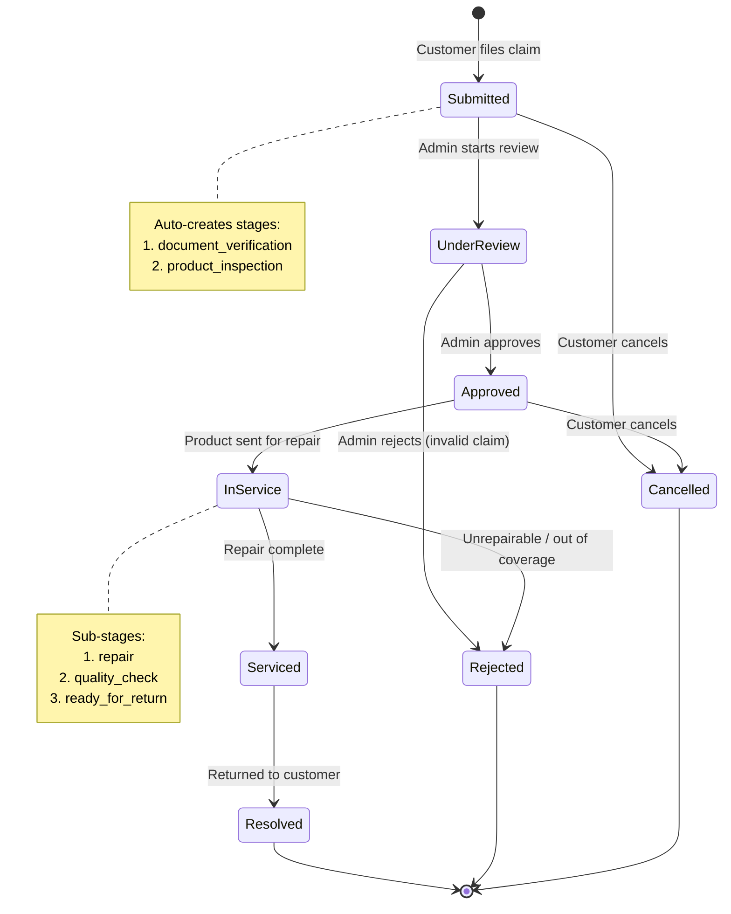
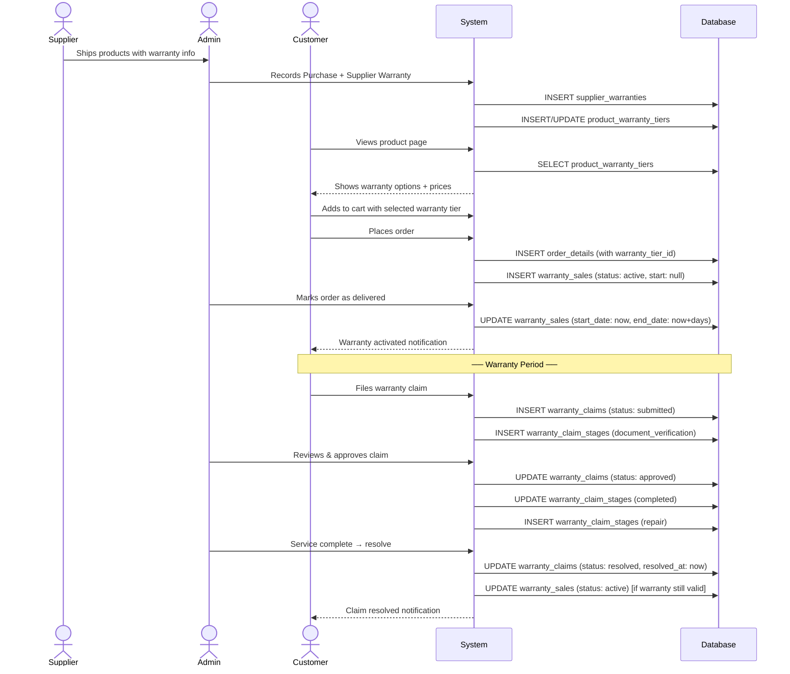

# 🛡️ Product Warranty Management System

> **Laravel E-Commerce — Complete Warranty Lifecycle**  
> Version: 1.0 | Author: System Design | Date: 2026-07-20

---

## 📑 Table of Contents

1. [Overview & Business Concepts](#1-overview--business-concepts)
2. [Warranty Types & Price Variation](#2-warranty-types--price-variation)
3. [Real-World Demo Scenarios](#3-real-world-demo-scenarios)
4. [Database Architecture](#4-database-architecture)
5. [Enum Definitions](#5-enum-definitions)
6. [Model Relationships](#6-model-relationships)
7. [Migration Blueprints](#7-migration-blueprints)
8. [Backend Logic & Service Layer](#8-backend-logic--service-layer)
9. [Admin Panel — UI/UX Workflow](#9-admin-panel--uiux-workflow)
10. [Customer-Facing Features](#10-customer-facing-features)
    - 10.5 [Online Purchase Flow — Warranty at Cart & Checkout](#105-online-purchase-flow--warranty-selection-at-cart--checkout)
    - 10.6 [Admin Control — Warranty Visibility & Settings](#106-admin-control-panel--warranty-visibility--global-settings)
11. [Warranty Claim Lifecycle](#11-warranty-claim-lifecycle)
12. [API Endpoints](#12-api-endpoints)
13. [Edge Cases & Business Rules](#13-edge-cases--business-rules)
14. [Testing Strategy](#14-testing-strategy)
15. [Deployment Checklist](#15-deployment-checklist)

---

## 1. Overview & Business Concepts

### 1.1 What is This System?

The **Product Warranty Management System** handles the complete lifecycle of warranties — from supplier purchase to customer sale, through to claim resolution. It enables:

- 📦 **Supplier-side warranty tracking** — when products arrive from suppliers, they may carry built-in warranty periods.
- 🏷️ **Multi-tier warranty pricing** — the same product can be sold with different warranty levels, each at a different price.
- 🧾 **Customer warranty purchases** — customers choose a warranty tier at checkout.
- 🔧 **Warranty claim processing** — customers submit claims, which go through defined stages until resolution.

### 1.2 Core Business Rules

| # | Rule | Description |
|---|------|-------------|
| R1 | **Supplier Warranty is Inheritable** | If a supplier gives warranty on a product batch, we CAN pass it to the customer. |
| R2 | **Warranty is Optional at Sale** | Customer may buy with supplier warranty, with our extended warranty, or without any warranty. |
| R3 | **Warranty Affects Price** | Each warranty tier has its own sale price. No warranty = cheapest. Extended warranty = most expensive. |
| R4 | **Warranty Starts from Delivery** | Warranty countdown begins when the order is marked as `delivered`. |
| R5 | **Supplier Warranty ≠ Store Warranty** | Our store warranty starts only when we sell. Supplier warranty may already be running from purchase date. |
| R6 | **Claim within Validity** | Customer can only claim warranty if current date ≤ warranty expiry date. |
| R7 | **One Claim per Item** | Each order item can have ONE active claim at a time. New claim only after previous is resolved/rejected. |
| R8 | **Claim Stages are Sequential** | Claims progress through defined stages; skipping stages is not allowed. |

### 1.3 Warranty Flow Diagram



---

## 2. Warranty Types & Price Variation

### 2.1 The Three Warranty Tiers

Every product can have up to **3 warranty tiers**:

| Tier | Name | Source | Price Impact | Description |
|------|------|--------|-------------|-------------|
| **Tier 0** | `no_warranty` | None | **Cheapest** (−X%) | Product sold as-is. No warranty coverage. |
| **Tier 1** | `supplier_warranty` | Inherited from supplier | **Standard** (base) | The original supplier warranty passed to customer. |
| **Tier 2** | `store_warranty` | Our store provides | **Premium** (+Y%) | Extended warranty beyond supplier's. Store bears responsibility. |

### 2.2 Price Variation Formula

```
Base Product Cost (from supplier) = B

No Warranty Price     = B × (1 + margin_no_warranty)      // e.g., B + 12.5%
Supplier Warranty Price = B × (1 + margin_supplier_warranty) // e.g., B + 25%
Store Warranty Price  = B × (1 + margin_store_warranty)    // e.g., B + 25% + extra
```

### 2.3 Warranty Coverage Matrix

| Scenario | Supplier Gave Warranty? | We Sell With? | Who Bears Risk? | Warranty Days |
|----------|------------------------|---------------|-----------------|---------------|
| A | ✅ Yes (180 days) | Supplier Warranty | Supplier → Us → Customer | 180 days from delivery |
| B | ✅ Yes (180 days) | No Warranty | Customer | 0 days |
| C | ✅ Yes (180 days) | Store Extended (360 days) | Us (first 180 via supplier, next 180 store) | 360 days from delivery |
| D | ❌ No | No Warranty | Customer | 0 days |
| E | ❌ No | Store Warranty (90 days) | Us (fully) | 90 days from delivery |

---

## 3. Real-World Demo Scenarios

### 3.1 Product Inventory Setup

```
┌──────────┬──────────────┬───────────────┬─────────────────────┐
│ Product  │ Supplier     │ Cost Price    │ Supplier Warranty    │
├──────────┼──────────────┼───────────────┼─────────────────────┤
│ A        │ XYZ Supplier │ 400 TK        │ 180 days             │
│ B        │ ABC Supplier │ 300 TK        │ 60 days              │
│ C        │ PQR Supplier │ 350 TK        │ 0 days (no warranty) │
└──────────┴──────────────┴───────────────┴─────────────────────┘
```

### 3.2 Warranty Tier Pricing (Store Side)

```
┌──────────┬─────────────────────┬──────────────────────┬──────────────────────┐
│ Product  │ No Warranty Price   │ Supplier Warranty    │ Store Extended        │
│          │                     │ Price                │ Warranty Price        │
├──────────┼─────────────────────┼──────────────────────┼──────────────────────┤
│ A        │ 450 TK              │ 500 TK (180 days)    │ 550 TK (360 days)    │
│ B        │ 350 TK              │ 400 TK (60 days)     │ 450 TK (120 days)    │
│ C        │ 400 TK              │ N/A                  │ 450 TK (90 days)     │
└──────────┴─────────────────────┴──────────────────────┴──────────────────────┘
```

### 3.3 Sales Scenario — Day 1 (Today)

| # | Product | Warranty Tier | Sale Price | Warranty Days | Expiry Date |
|---|---------|--------------|------------|---------------|-------------|
| 1 | A | Supplier Warranty | 500 TK | 180 | Today + 180 |
| 2 | A | No Warranty | 450 TK | 0 | N/A |
| 3 | C | No Warranty | 400 TK | 0 | N/A |
| 4 | C | Store Warranty | 450 TK | 90 | Today + 90 |
| 5 | B | Supplier Warranty | 400 TK | 60 | Today + 60 |
| 6 | B | No Warranty | 350 TK | 0 | N/A |
| 7 | B | Store Extended | 450 TK | 120 | Today + 120 |

### 3.4 Sales Scenario — 3 Months Later (Day 90)

Supplier warranty on Product A purchased 90 days ago now has only **90 days remaining**.
But we can still sell:

| # | Product | Warranty Tier | Sale Price | Warranty Days | Notes |
|---|---------|--------------|------------|---------------|-------|
| 8 | A | Supplier Warranty | 500 TK | 180 | Fresh batch from supplier |
| 9 | A | No Warranty | 430 TK | 0 | Slightly cheaper (older stock discount) |
| 10 | A | Store Warranty | 480 TK | 90 | Only 90 days store warranty (old batch) |

> **Key Insight**: Warranty pricing is **dynamic** — it depends on remaining supplier warranty days, stock age, and our risk appetite.

---

## 4. Database Architecture

### 4.1 Entity-Relationship Diagram



### 4.2 Table Summary

| # | Table Name | Purpose | Row Estimate |
|---|-----------|---------|-------------|
| 1 | `supplier_warranties` | Tracks warranty given by supplier per purchase batch | 1× per purchase item |
| 2 | `product_warranty_tiers` | Defines warranty options + prices per product | ~3× per product |
| 3 | `warranty_sales` | Records which warranty was sold with each order item | 1× per order detail |
| 4 | `warranty_claims` | Customer warranty claim requests | ~5% of warranty sales |
| 5 | `warranty_claim_stages` | Tracks stage-by-stage progress of a claim | ~4× per claim |
| 6 | `warranty_claim_notes` | Internal/admin notes on claims | ~3× per claim |

---

## 5. Enum Definitions

### 5.1 `WarrantyType` Enum

```php
<?php

namespace App\Enums;

/**
 * Warranty source/type classification.
 */
enum WarrantyType: string
{
    case NONE              = 'none';               // No warranty coverage
    case SUPPLIER_WARRANTY = 'supplier_warranty';  // Inherited from supplier
    case STORE_WARRANTY    = 'store_warranty';     // Our store provides it
    case EXTENDED_WARRANTY = 'extended_warranty';  // Supplier + extra store days

    public function label(): string
    {
        return match ($this) {
            self::NONE              => 'No Warranty',
            self::SUPPLIER_WARRANTY => 'Supplier Warranty',
            self::STORE_WARRANTY    => 'Store Warranty',
            self::EXTENDED_WARRANTY => 'Extended Warranty',
        };
    }

    public function badgeClass(): string
    {
        return match ($this) {
            self::NONE              => 'secondary',
            self::SUPPLIER_WARRANTY => 'info',
            self::STORE_WARRANTY    => 'primary',
            self::EXTENDED_WARRANTY => 'success',
        };
    }

    /** Does this tier provide any coverage? */
    public function hasCoverage(): bool
    {
        return $this !== self::NONE;
    }

    /** Is the store liable for this warranty? */
    public function isStoreLiable(): bool
    {
        return in_array($this, [self::STORE_WARRANTY, self::EXTENDED_WARRANTY]);
    }
}
```

### 5.2 `WarrantyClaimStatus` Enum

```php
<?php

namespace App\Enums;

/**
 * Warranty claim lifecycle status.
 */
enum WarrantyClaimStatus: string
{
    // ── Active ─────────────────────────────────
    case SUBMITTED   = 'submitted';     // Customer filed claim
    case UNDER_REVIEW = 'under_review'; // Admin is reviewing
    case APPROVED    = 'approved';      // Claim accepted
    case IN_SERVICE  = 'in_service';    // Product being serviced
    case SERVICED    = 'serviced';      // Service complete, awaiting pickup/delivery

    // ── Terminal ───────────────────────────────
    case RESOLVED    = 'resolved';      // Fully resolved, closed happily
    case REJECTED    = 'rejected';      // Claim denied
    case CANCELLED   = 'cancelled';     // Customer cancelled claim

    public function label(): string
    {
        return match ($this) {
            self::SUBMITTED    => 'Submitted',
            self::UNDER_REVIEW => 'Under Review',
            self::APPROVED     => 'Approved',
            self::IN_SERVICE   => 'In Service',
            self::SERVICED     => 'Serviced',
            self::RESOLVED     => 'Resolved',
            self::REJECTED     => 'Rejected',
            self::CANCELLED    => 'Cancelled',
        };
    }

    public function badgeClass(): string
    {
        return match ($this) {
            self::SUBMITTED    => 'warning',
            self::UNDER_REVIEW => 'info',
            self::APPROVED     => 'primary',
            self::IN_SERVICE   => 'orange',
            self::SERVICED     => 'teal',
            self::RESOLVED     => 'success',
            self::REJECTED     => 'danger',
            self::CANCELLED    => 'dark',
        };
    }

    /** Is this a closed/final state? */
    public function isTerminal(): bool
    {
        return in_array($this, [
            self::RESOLVED,
            self::REJECTED,
            self::CANCELLED,
        ]);
    }

    /** Is the claim still active/ongoing? */
    public function isActive(): bool
    {
        return !$this->isTerminal();
    }

    /**
     * Allowed transitions from current status.
     * Returns array of valid next statuses.
     */
    public function allowedTransitions(): array
    {
        return match ($this) {
            self::SUBMITTED    => [self::UNDER_REVIEW, self::CANCELLED],
            self::UNDER_REVIEW => [self::APPROVED, self::REJECTED],
            self::APPROVED     => [self::IN_SERVICE, self::CANCELLED],
            self::IN_SERVICE   => [self::SERVICED, self::REJECTED],
            self::SERVICED     => [self::RESOLVED],
            self::RESOLVED     => [],
            self::REJECTED     => [],
            self::CANCELLED    => [],
        };
    }

    /** Can transition to the given status? */
    public function canTransitionTo(self $target): bool
    {
        return in_array($target, $this->allowedTransitions());
    }
}
```

### 5.3 `WarrantySaleStatus` Enum

```php
<?php

namespace App\Enums;

/**
 * Status of a warranty sale record.
 */
enum WarrantySaleStatus: string
{
    case ACTIVE    = 'active';     // Warranty is currently valid
    case EXPIRED   = 'expired';    // Warranty period ended
    case CLAIMED   = 'claimed';    // Has an active claim
    case VOID      = 'void';       // Voided (e.g., product returned)

    public function label(): string
    {
        return match ($this) {
            self::ACTIVE  => 'Active',
            self::EXPIRED => 'Expired',
            self::CLAIMED => 'Claimed',
            self::VOID    => 'Void',
        };
    }

    /** Can a new claim be filed? */
    public function canClaim(): bool
    {
        return $this === self::ACTIVE;
    }
}
```

### 5.4 `WarrantyStageType` Enum

```php
<?php

namespace App\Enums;

/**
 * Predefined stages a warranty claim passes through.
 */
enum WarrantyStageType: string
{
    case SUBMITTED        = 'submitted';
    case DOCUMENT_VERIFY  = 'document_verification';
    case PRODUCT_INSPECT  = 'product_inspection';
    case REPAIR           = 'repair';
    case REPLACEMENT      = 'replacement';
    case QUALITY_CHECK    = 'quality_check';
    case READY_FOR_RETURN = 'ready_for_return';
    case RETURNED         = 'returned_to_customer';
    case CLOSED           = 'closed';

    public function label(): string
    {
        return match ($this) {
            self::SUBMITTED        => 'Claim Submitted',
            self::DOCUMENT_VERIFY  => 'Document Verification',
            self::PRODUCT_INSPECT  => 'Product Inspection',
            self::REPAIR           => 'Repair / Service',
            self::REPLACEMENT      => 'Replacement',
            self::QUALITY_CHECK    => 'Quality Check',
            self::READY_FOR_RETURN => 'Ready for Return',
            self::RETURNED         => 'Returned to Customer',
            self::CLOSED           => 'Closed',
        };
    }

    /** CSS icon class for UI */
    public function icon(): string
    {
        return match ($this) {
            self::SUBMITTED        => 'fa-paper-plane',
            self::DOCUMENT_VERIFY  => 'fa-file-alt',
            self::PRODUCT_INSPECT  => 'fa-search',
            self::REPAIR           => 'fa-tools',
            self::REPLACEMENT      => 'fa-exchange-alt',
            self::QUALITY_CHECK    => 'fa-clipboard-check',
            self::READY_FOR_RETURN => 'fa-box',
            self::RETURNED         => 'fa-hand-holding',
            self::CLOSED           => 'fa-check-circle',
        };
    }
}
```

---

## 6. Model Relationships

### 6.1 `SupplierWarranty` Model

```php
<?php

namespace App\Models;

use App\Enums\WarrantyType;
use Illuminate\Database\Eloquent\Model;

class SupplierWarranty extends Model
{
    protected $fillable = [
        'purchase_item_id',
        'product_id',
        'supplier_id',
        'warranty_days',
        'warranty_start_date',
        'warranty_end_date',
        'warranty_type',
        'warranty_terms',
        'is_transferable',
        'notes',
    ];

    protected function casts(): array
    {
        return [
            'warranty_days'       => 'integer',
            'warranty_start_date' => 'date',
            'warranty_end_date'   => 'date',
            'is_transferable'     => 'boolean',
        ];
    }

    // ── Relationships ─────────────────────────

    public function purchaseItem()
    {
        return $this->belongsTo(PurchaseItem::class);
    }

    public function product()
    {
        return $this->belongsTo(Product::class);
    }

    public function supplier()
    {
        return $this->belongsTo(Supplier::class);
    }

    // ── Accessors ─────────────────────────────

    /** Remaining days on supplier warranty (from now). */
    public function getRemainingDaysAttribute(): int
    {
        if (!$this->warranty_end_date) {
            return 0;
        }
        return max(0, (int) now()->diffInDays($this->warranty_end_date, false));
    }

    /** Is supplier warranty still valid? */
    public function getIsValidAttribute(): bool
    {
        return $this->remaining_days > 0;
    }

    /** Can we still sell this with supplier warranty? */
    public function getIsSellableAttribute(): bool
    {
        return $this->is_valid && $this->is_transferable;
    }
}
```

### 6.2 `ProductWarrantyTier` Model

```php
<?php

namespace App\Models;

use App\Enums\WarrantyType;
use Illuminate\Database\Eloquent\Model;

class ProductWarrantyTier extends Model
{
    protected $fillable = [
        'product_id',
        'tier_name',
        'warranty_type',
        'warranty_days',
        'price',
        'additional_cost',
        'is_active',
        'sort_order',
    ];

    protected function casts(): array
    {
        return [
            'warranty_days'   => 'integer',
            'price'           => 'decimal:2',
            'additional_cost' => 'decimal:2',
            'is_active'       => 'boolean',
            'sort_order'      => 'integer',
        ];
    }

    // ── Relationships ─────────────────────────

    public function product()
    {
        return $this->belongsTo(Product::class);
    }

    public function warrantySales()
    {
        return $this->hasMany(WarrantySale::class, 'product_warranty_tier_id');
    }

    // ── Scopes ────────────────────────────────

    public function scopeActive($query)
    {
        return $query->where('is_active', true);
    }

    public function scopeOrdered($query)
    {
        return $query->orderBy('sort_order');
    }

    // ── Helpers ───────────────────────────────

    /** The display label for this tier on frontend. */
    public function getDisplayLabelAttribute(): string
    {
        if ($this->warranty_days === 0) {
            return 'No Warranty';
        }
        return "{$this->warranty_days} Days — {$this->tier_name}";
    }

    /** Formatted price for display. */
    public function getFormattedPriceAttribute(): string
    {
        return number_format($this->price, 2) . ' TK';
    }
}
```

### 6.3 `WarrantySale` Model

```php
<?php

namespace App\Models;

use App\Enums\WarrantySaleStatus;
use App\Enums\WarrantyType;
use Illuminate\Database\Eloquent\Model;

class WarrantySale extends Model
{
    protected $fillable = [
        'order_id',
        'order_detail_id',
        'product_warranty_tier_id',
        'customer_id',
        'product_id',
        'supplier_warranty_id',
        'warranty_type',
        'warranty_days',
        'warranty_start_date',
        'warranty_end_date',
        'warranty_price',
        'status',
    ];

    protected function casts(): array
    {
        return [
            'warranty_days'       => 'integer',
            'warranty_start_date' => 'date',
            'warranty_end_date'   => 'date',
            'warranty_price'      => 'decimal:2',
        ];
    }

    // ── Relationships ─────────────────────────

    public function order()
    {
        return $this->belongsTo(Order::class);
    }

    public function orderDetail()
    {
        return $this->belongsTo(OrderDetails::class, 'order_detail_id');
    }

    public function productWarrantyTier()
    {
        return $this->belongsTo(ProductWarrantyTier::class);
    }

    public function customer()
    {
        return $this->belongsTo(Customer::class);
    }

    public function product()
    {
        return $this->belongsTo(Product::class);
    }

    public function supplierWarranty()
    {
        return $this->belongsTo(SupplierWarranty::class);
    }

    public function claims()
    {
        return $this->hasMany(WarrantyClaim::class, 'warranty_sale_id');
    }

    /** Current active claim (if any). */
    public function activeClaim()
    {
        return $this->hasOne(WarrantyClaim::class, 'warranty_sale_id')
                    ->whereNotIn('status', ['resolved', 'rejected', 'cancelled']);
    }

    // ── Accessors ─────────────────────────────

    public function getRemainingDaysAttribute(): int
    {
        if (!$this->warranty_end_date) {
            return 0;
        }
        return max(0, (int) now()->diffInDays($this->warranty_end_date, false));
    }

    public function getIsExpiredAttribute(): bool
    {
        return $this->remaining_days <= 0;
    }

    public function getCanClaimAttribute(): bool
    {
        return !$this->is_expired
            && $this->status === WarrantySaleStatus::ACTIVE->value
            && !$this->activeClaim;
    }

    public function getWarrantyProgressPercentAttribute(): float
    {
        if ($this->warranty_days <= 0) return 100;
        $elapsed = now()->diffInDays($this->warranty_start_date);
        return min(100, round(($elapsed / $this->warranty_days) * 100, 1));
    }

    // ── Boot ──────────────────────────────────

    protected static function booted(): void
    {
        static::saving(function (self $warrantySale) {
            if ($warrantySale->warranty_start_date && $warrantySale->warranty_days > 0) {
                $warrantySale->warranty_end_date = $warrantySale->warranty_start_date
                    ->copy()
                    ->addDays($warrantySale->warranty_days);
            }
        });
    }
}
```

### 6.4 `WarrantyClaim` Model

```php
<?php

namespace App\Models;

use App\Enums\WarrantyClaimStatus;
use Illuminate\Database\Eloquent\Model;

class WarrantyClaim extends Model
{
    protected $fillable = [
        'warranty_sale_id',
        'customer_id',
        'order_id',
        'product_id',
        'claim_number',
        'issue_description',
        'issue_type',
        'attachments',
        'status',
        'resolution',
        'resolved_at',
        'rejection_reason',
        'servicing_cost',
        'store_bears_cost',
        'claimed_at',
    ];

    protected function casts(): array
    {
        return [
            'attachments'      => 'array',
            'claimed_at'       => 'datetime',
            'resolved_at'      => 'datetime',
            'servicing_cost'   => 'decimal:2',
            'store_bears_cost' => 'boolean',
        ];
    }

    // ── Relationships ─────────────────────────

    public function warrantySale()
    {
        return $this->belongsTo(WarrantySale::class);
    }

    public function customer()
    {
        return $this->belongsTo(Customer::class);
    }

    public function order()
    {
        return $this->belongsTo(Order::class);
    }

    public function product()
    {
        return $this->belongsTo(Product::class);
    }

    public function stages()
    {
        return $this->hasMany(WarrantyClaimStage::class)->orderBy('started_at');
    }

    public function notes()
    {
        return $this->hasMany(WarrantyClaimNote::class)->latest();
    }

    /** Current/latest stage. */
    public function currentStage()
    {
        return $this->hasOne(WarrantyClaimStage::class)
                    ->whereNull('completed_at')
                    ->latest('started_at');
    }

    // ── Helpers ───────────────────────────────

    public function transitionTo(WarrantyClaimStatus $newStatus, ?string $note = null): bool
    {
        $current = WarrantyClaimStatus::from($this->status);

        if (!$current->canTransitionTo($newStatus)) {
            throw new \InvalidArgumentException(
                "Cannot transition from {$current->value} to {$newStatus->value}"
            );
        }

        $this->status = $newStatus->value;

        if ($newStatus->isTerminal()) {
            $this->resolved_at = now();
        }

        $this->save();

        if ($note) {
            $this->notes()->create(['note' => $note, 'user_id' => auth()->id()]);
        }

        return true;
    }

    // ── Scopes ────────────────────────────────

    public function scopeActive($query)
    {
        return $query->whereNotIn('status', ['resolved', 'rejected', 'cancelled']);
    }

    public function scopePending($query)
    {
        return $query->where('status', 'submitted');
    }

    // ── Accessors ─────────────────────────────

    public function getStatusEnumAttribute(): WarrantyClaimStatus
    {
        return WarrantyClaimStatus::from($this->status);
    }

    public function getIsActiveAttribute(): bool
    {
        return $this->status_enum->isActive();
    }
}
```

### 6.5 `WarrantyClaimStage` Model

```php
<?php

namespace App\Models;

use App\Enums\WarrantyStageType;
use Illuminate\Database\Eloquent\Model;

class WarrantyClaimStage extends Model
{
    protected $fillable = [
        'warranty_claim_id',
        'stage',
        'status',
        'notes',
        'handled_by',
        'started_at',
        'completed_at',
    ];

    protected function casts(): array
    {
        return [
            'started_at'   => 'datetime',
            'completed_at' => 'datetime',
        ];
    }

    // ── Relationships ─────────────────────────

    public function warrantyClaim()
    {
        return $this->belongsTo(WarrantyClaim::class);
    }

    public function handledBy()
    {
        return $this->belongsTo(User::class, 'handled_by');
    }

    // ── Helpers ───────────────────────────────

    public function complete(?string $notes = null): void
    {
        $this->update([
            'status'       => 'completed',
            'notes'        => $notes ?? $this->notes,
            'completed_at' => now(),
        ]);
    }

    public function getIsCompleteAttribute(): bool
    {
        return $this->completed_at !== null;
    }

    public function getStageEnumAttribute(): WarrantyStageType
    {
        return WarrantyStageType::from($this->stage);
    }
}
```

### 6.6 `WarrantyClaimNote` Model

```php
<?php

namespace App\Models;

use Illuminate\Database\Eloquent\Model;

class WarrantyClaimNote extends Model
{
    protected $fillable = [
        'warranty_claim_id',
        'user_id',
        'note',
        'attachment',
    ];

    // ── Relationships ─────────────────────────

    public function warrantyClaim()
    {
        return $this->belongsTo(WarrantyClaim::class);
    }

    public function user()
    {
        return $this->belongsTo(User::class);
    }
}
```

---

## 7. Migration Blueprints

### 7.1 `supplier_warranties` Table

```php
<?php

use Illuminate\Database\Migrations\Migration;
use Illuminate\Database\Schema\Blueprint;
use Illuminate\Support\Facades\Schema;

return new class extends Migration
{
    public function up(): void
    {
        Schema::create('supplier_warranties', function (Blueprint $table) {
            $table->id();
            $table->foreignId('purchase_item_id')->constrained('purchase_items')->cascadeOnDelete();
            $table->foreignId('product_id')->constrained('products')->cascadeOnDelete();
            $table->foreignId('supplier_id')->constrained('suppliers')->cascadeOnDelete();

            // Warranty details
            $table->integer('warranty_days')->default(0)->comment('Supplier warranty in days');
            $table->date('warranty_start_date')->nullable()->comment('Supplier warranty start');
            $table->date('warranty_end_date')->nullable()->comment('Supplier warranty expiry');
            $table->string('warranty_type')->default('supplier_warranty');
            $table->text('warranty_terms')->nullable();
            $table->boolean('is_transferable')->default(true);

            // Meta
            $table->text('notes')->nullable();
            $table->timestamps();

            // Indexes
            $table->index(['product_id', 'warranty_end_date']);
            $table->index('supplier_id');
        });
    }

    public function down(): void
    {
        Schema::dropIfExists('supplier_warranties');
    }
};
```

### 7.2 `product_warranty_tiers` Table

```php
<?php

use Illuminate\Database\Migrations\Migration;
use Illuminate\Database\Schema\Blueprint;
use Illuminate\Support\Facades\Schema;

return new class extends Migration
{
    public function up(): void
    {
        Schema::create('product_warranty_tiers', function (Blueprint $table) {
            $table->id();
            $table->foreignId('product_id')->constrained('products')->cascadeOnDelete();

            $table->string('tier_name')->comment('e.g., No Warranty, Standard, Extended');
            $table->string('warranty_type')->default('none');
            $table->integer('warranty_days')->default(0);
            $table->decimal('price', 12, 2)->default(0);
            $table->decimal('additional_cost', 12, 2)->default(0)
                  ->comment('Extra cost over base product price');

            $table->boolean('is_active')->default(true);
            $table->integer('sort_order')->default(0);
            $table->timestamps();

            // One tier type per product
            $table->unique(['product_id', 'warranty_type']);
        });
    }

    public function down(): void
    {
        Schema::dropIfExists('product_warranty_tiers');
    }
};
```

### 7.3 `warranty_sales` Table

```php
<?php

use Illuminate\Database\Migrations\Migration;
use Illuminate\Database\Schema\Blueprint;
use Illuminate\Support\Facades\Schema;

return new class extends Migration
{
    public function up(): void
    {
        Schema::create('warranty_sales', function (Blueprint $table) {
            $table->id();
            $table->foreignId('order_id')->constrained('orders')->cascadeOnDelete();
            $table->foreignId('order_detail_id')->constrained('order_details')->cascadeOnDelete();
            $table->foreignId('product_warranty_tier_id')->nullable()
                  ->constrained('product_warranty_tiers')->nullOnDelete();
            $table->foreignId('customer_id')->constrained('customers')->cascadeOnDelete();
            $table->foreignId('product_id')->constrained('products')->cascadeOnDelete();
            $table->foreignId('supplier_warranty_id')->nullable()
                  ->constrained('supplier_warranties')->nullOnDelete();

            // Warranty info snapshot
            $table->string('warranty_type');
            $table->integer('warranty_days')->default(0);
            $table->date('warranty_start_date')->nullable();
            $table->date('warranty_end_date')->nullable();
            $table->decimal('warranty_price', 12, 2)->default(0);

            // Status
            $table->string('status')->default('active');

            $table->timestamps();

            // Indexes
            $table->index('customer_id');
            $table->index('status');
            $table->index('warranty_end_date');
            $table->unique('order_detail_id'); // One warranty per order item
        });
    }

    public function down(): void
    {
        Schema::dropIfExists('warranty_sales');
    }
};
```

### 7.4 `warranty_claims` Table

```php
<?php

use Illuminate\Database\Migrations\Migration;
use Illuminate\Database\Schema\Blueprint;
use Illuminate\Support\Facades\Schema;

return new class extends Migration
{
    public function up(): void
    {
        Schema::create('warranty_claims', function (Blueprint $table) {
            $table->id();
            $table->foreignId('warranty_sale_id')->constrained('warranty_sales')->cascadeOnDelete();
            $table->foreignId('customer_id')->constrained('customers')->cascadeOnDelete();
            $table->foreignId('order_id')->constrained('orders')->cascadeOnDelete();
            $table->foreignId('product_id')->constrained('products')->cascadeOnDelete();

            $table->string('claim_number')->unique();
            $table->text('issue_description');
            $table->string('issue_type')->nullable()
                  ->comment('defective, damaged, not_working, missing_parts, other');

            $table->json('attachments')->nullable();

            // Status tracking
            $table->string('status')->default('submitted');
            $table->text('resolution')->nullable();
            $table->text('rejection_reason')->nullable();

            // Cost tracking
            $table->decimal('servicing_cost', 12, 2)->default(0);
            $table->boolean('store_bears_cost')->default(false);

            // Timestamps
            $table->timestamp('claimed_at')->nullable();
            $table->timestamp('resolved_at')->nullable();
            $table->timestamps();

            // Indexes
            $table->index('customer_id');
            $table->index('status');
            $table->index('claim_number');
        });
    }

    public function down(): void
    {
        Schema::dropIfExists('warranty_claims');
    }
};
```

### 7.5 `warranty_claim_stages` Table

```php
<?php

use Illuminate\Database\Migrations\Migration;
use Illuminate\Database\Schema\Blueprint;
use Illuminate\Support\Facades\Schema;

return new class extends Migration
{
    public function up(): void
    {
        Schema::create('warranty_claim_stages', function (Blueprint $table) {
            $table->id();
            $table->foreignId('warranty_claim_id')->constrained('warranty_claims')->cascadeOnDelete();

            $table->string('stage');
            $table->string('status')->default('pending');
            $table->text('notes')->nullable();
            $table->foreignId('handled_by')->nullable()->constrained('users')->nullOnDelete();

            $table->timestamp('started_at')->nullable();
            $table->timestamp('completed_at')->nullable();
            $table->timestamps();
        });
    }

    public function down(): void
    {
        Schema::dropIfExists('warranty_claim_stages');
    }
};
```

### 7.6 `warranty_claim_notes` Table

```php
<?php

use Illuminate\Database\Migrations\Migration;
use Illuminate\Database\Schema\Blueprint;
use Illuminate\Support\Facades\Schema;

return new class extends Migration
{
    public function up(): void
    {
        Schema::create('warranty_claim_notes', function (Blueprint $table) {
            $table->id();
            $table->foreignId('warranty_claim_id')->constrained('warranty_claims')->cascadeOnDelete();
            $table->foreignId('user_id')->nullable()->constrained('users')->nullOnDelete();

            $table->text('note');
            $table->string('attachment')->nullable();

            $table->timestamps();
        });
    }

    public function down(): void
    {
        Schema::dropIfExists('warranty_claim_notes');
    }
};
```

---

## 8. Backend Logic & Service Layer

### 8.1 `WarrantyService` — Core Business Logic

```php
<?php

namespace App\Services;

use App\Enums\WarrantyClaimStatus;
use App\Enums\WarrantySaleStatus;
use App\Enums\WarrantyType;
use App\Models\Order;
use App\Models\OrderDetails;
use App\Models\Product;
use App\Models\ProductWarrantyTier;
use App\Models\SupplierWarranty;
use App\Models\WarrantyClaim;
use App\Models\WarrantyClaimStage;
use App\Models\WarrantySale;
use Illuminate\Support\Facades\DB;

class WarrantyService
{
    /**
     * Generate warranty tiers for a product based on supplier warranty.
     *
     * @return array<int, ProductWarrantyTier>
     */
    public function generateTiers(Product $product, ?SupplierWarranty $supplierWarranty = null): array
    {
        $tiers = [];
        $basePrice = $product->selling_price ?? $product->purchase_price * 1.25;

        // Tier 0: No Warranty (always available)
        $tiers[] = ProductWarrantyTier::updateOrCreate(
            ['product_id' => $product->id, 'warranty_type' => WarrantyType::NONE->value],
            [
                'tier_name'        => 'No Warranty',
                'warranty_days'    => 0,
                'price'            => round($basePrice * 0.90, 2),  // 10% cheaper
                'additional_cost'  => 0,
                'sort_order'       => 0,
                'is_active'        => true,
            ]
        );

        // Tier 1: Supplier Warranty (if available)
        if ($supplierWarranty && $supplierWarranty->is_sellable) {
            $tiers[] = ProductWarrantyTier::updateOrCreate(
                ['product_id' => $product->id, 'warranty_type' => WarrantyType::SUPPLIER_WARRANTY->value],
                [
                    'tier_name'        => 'Standard Warranty',
                    'warranty_days'    => $supplierWarranty->remaining_days,
                    'price'            => $basePrice,
                    'additional_cost'  => 0,
                    'sort_order'       => 1,
                    'is_active'        => true,
                ]
            );
        }

        // Tier 2: Extended Store Warranty (opt-in by admin)
        $existingExtended = ProductWarrantyTier::where('product_id', $product->id)
            ->where('warranty_type', WarrantyType::EXTENDED_WARRANTY->value)
            ->first();

        if ($existingExtended) {
            $tiers[] = $existingExtended;
        }

        return $tiers;
    }

    /**
     * Create warranty sale record when order is placed.
     */
    public function createWarrantySale(
        Order $order,
        OrderDetails $orderDetail,
        ProductWarrantyTier $tier
    ): WarrantySale {
        return DB::transaction(function () use ($order, $orderDetail, $tier) {
            // Find supplier warranty if applicable
            $supplierWarranty = null;
            if ($tier->warranty_type !== WarrantyType::NONE->value) {
                $supplierWarranty = SupplierWarranty::where('product_id', $orderDetail->product_id)
                    ->where('is_transferable', true)
                    ->where('warranty_end_date', '>', now())
                    ->orderBy('warranty_end_date')
                    ->first();
            }

            return WarrantySale::create([
                'order_id'                  => $order->id,
                'order_detail_id'           => $orderDetail->id,
                'product_warranty_tier_id'  => $tier->id,
                'customer_id'               => $order->customer_id,
                'product_id'                => $orderDetail->product_id,
                'supplier_warranty_id'      => $supplierWarranty?->id,
                'warranty_type'             => $tier->warranty_type,
                'warranty_days'             => $tier->warranty_days,
                'warranty_start_date'       => null, // Set on delivery
                'warranty_end_date'         => null, // Set on delivery
                'warranty_price'            => $tier->price,
                'status'                    => WarrantySaleStatus::ACTIVE->value,
            ]);
        });
    }

    /**
     * Activate warranty countdown when order is delivered.
     */
    public function activateOnDelivery(Order $order): void
    {
        $warrantySales = WarrantySale::where('order_id', $order->id)->get();

        foreach ($warrantySales as $sale) {
            if ($sale->warranty_days > 0) {
                $sale->update([
                    'warranty_start_date' => now(),
                    'warranty_end_date'   => now()->addDays($sale->warranty_days),
                    'status'              => WarrantySaleStatus::ACTIVE->value,
                ]);
            }
        }
    }

    /**
     * File a warranty claim for a customer.
     */
    public function fileClaim(
        WarrantySale $warrantySale,
        array $data
    ): WarrantyClaim {
        if (!$warrantySale->can_claim) {
            throw new \RuntimeException('This warranty is not eligible for claims.');
        }

        return DB::transaction(function () use ($warrantySale, $data) {
            // Mark warranty as claimed
            $warrantySale->update(['status' => WarrantySaleStatus::CLAIMED->value]);

            // Create claim
            $claim = WarrantyClaim::create([
                'warranty_sale_id'  => $warrantySale->id,
                'customer_id'       => $warrantySale->customer_id,
                'order_id'          => $warrantySale->order_id,
                'product_id'        => $warrantySale->product_id,
                'claim_number'      => $this->generateClaimNumber(),
                'issue_description' => $data['issue_description'],
                'issue_type'        => $data['issue_type'] ?? 'other',
                'attachments'       => $data['attachments'] ?? [],
                'status'            => WarrantyClaimStatus::SUBMITTED->value,
                'claimed_at'        => now(),
            ]);

            // Create initial stage
            WarrantyClaimStage::create([
                'warranty_claim_id' => $claim->id,
                'stage'             => 'submitted',
                'status'            => 'completed',
                'started_at'        => now(),
                'completed_at'      => now(),
            ]);

            // Create next stage
            WarrantyClaimStage::create([
                'warranty_claim_id' => $claim->id,
                'stage'             => 'document_verification',
                'status'            => 'pending',
                'started_at'        => now(),
            ]);

            return $claim;
        });
    }

    /**
     * Advance a claim to the next stage.
     */
    public function advanceClaimStage(WarrantyClaim $claim, string $notes = null): void
    {
        $currentStage = $claim->currentStage;

        if ($currentStage) {
            $currentStage->complete($notes);
        }

        // Determine next stage based on current claim status
        $nextStage = $this->getNextStage($claim);

        if ($nextStage) {
            WarrantyClaimStage::create([
                'warranty_claim_id' => $claim->id,
                'stage'             => $nextStage,
                'status'            => 'pending',
                'handled_by'        => auth()->id(),
                'started_at'        => now(),
            ]);
        }
    }

    /**
     * Handle cron: expire warranties past their end date.
     */
    public function expireWarranties(): int
    {
        return WarrantySale::where('status', WarrantySaleStatus::ACTIVE->value)
            ->where('warranty_end_date', '<', now())
            ->where('warranty_days', '>', 0)
            ->update(['status' => WarrantySaleStatus::EXPIRED->value]);
    }

    // ── Private Helpers ──────────────────────

    private function generateClaimNumber(): string
    {
        $prefix = 'WCL-';
        $date   = now()->format('Ymd');
        $random = strtoupper(substr(uniqid(), -5));

        return $prefix . $date . '-' . $random;
    }

    private function getNextStage(WarrantyClaim $claim): ?string
    {
        return match ($claim->status) {
            'submitted'    => 'document_verification',
            'under_review' => 'product_inspection',
            'approved'     => 'repair',
            'in_service'   => 'quality_check',
            'serviced'     => 'ready_for_return',
            default        => null,
        };
    }
}
```

### 8.2 `WarrantyPriceCalculator`

```php
<?php

namespace App\Services;

use App\Models\Product;
use App\Models\SupplierWarranty;

class WarrantyPriceCalculator
{
    /**
     * Calculate all warranty tier prices for a product.
     */
    public function calculate(Product $product, ?SupplierWarranty $supplierWarranty = null): array
    {
        $basePrice  = $product->selling_price;
        $costPrice  = $product->purchase_price;

        $tiers = [];

        // No Warranty — Discounted
        $tiers['no_warranty'] = [
            'label'         => 'No Warranty',
            'days'          => 0,
            'price'         => round($basePrice * 0.88, 2),
            'savings'       => round($basePrice - ($basePrice * 0.88), 2),
            'description'   => 'Buy without warranty coverage at a discounted price.',
        ];

        // Supplier Warranty — If available
        if ($supplierWarranty && $supplierWarranty->is_sellable) {
            $remainingDays = $supplierWarranty->remaining_days;

            $tiers['supplier_warranty'] = [
                'label'         => "{$remainingDays} Days Warranty",
                'days'          => $remainingDays,
                'price'         => $basePrice,
                'savings'       => 0,
                'description'   => "Covered by supplier warranty for {$remainingDays} days.",
                'source'        => 'supplier',
                'expires_at'    => $supplierWarranty->warranty_end_date->format('d M, Y'),
            ];
        }

        // Extended Store Warranty — Always available as upsell
        $extendedDays = 90; // default, configurable per product
        $tiers['extended_warranty'] = [
            'label'         => "{$extendedDays} Days Extended Warranty",
            'days'          => $extendedDays,
            'price'         => round($basePrice * 1.12, 2),
            'savings'       => 0,
            'description'   => "Extended warranty provided by our store for {$extendedDays} days.",
            'source'        => 'store',
        ];

        return $tiers;
    }

    /**
     * Dynamic margin-based pricing.
     */
    public function calculateWithMargins(
        float $costPrice,
        array $margins = ['no_warranty' => 0.15, 'supplier' => 0.25, 'extended' => 0.35]
    ): array {
        return [
            'no_warranty'       => round($costPrice * (1 + $margins['no_warranty']), 2),
            'supplier_warranty' => round($costPrice * (1 + $margins['supplier']), 2),
            'extended_warranty' => round($costPrice * (1 + $margins['extended']), 2),
        ];
    }
}
```

---

## 9. Admin Panel — UI/UX Workflow

### 9.1 Sidebar Navigation

```
🛡️ Warranty Management
├── 📊 Dashboard (stats overview)
├── 📦 Supplier Warranties
│   ├── List all
│   └── Add from purchase
├── 🏷️ Warranty Tiers
│   ├── Manage per product
│   └── Bulk update
├── 🧾 Warranty Sales
│   ├── All sales
│   ├── Active
│   └── Expired
└── 🔧 Claims
    ├── Pending review
    ├── In service
    └── Resolved
```

### 9.2 Admin Dashboard Widgets

```
┌──────────────┬──────────────┬──────────────┬──────────────┐
│ 📦 Total     │ 🟢 Active     │ 🔴 Expired   │ 🔧 Pending   │
│ Warranties   │ Warranties   │ Warranties   │ Claims       │
│   1,234      │    892       │    234       │     18       │
└──────────────┴──────────────┴──────────────┴──────────────┘

┌─────────────────────────────────────────────────────────────┐
│ 📈 Warranty Claims Trend (Last 30 days)                     │
│   [Bar chart: submitted, approved, rejected, resolved]       │
├─────────────────────────────────────────────────────────────┤
│ ⏰ Expiring Soon (next 7 days)                              │
│   Product X — 3 days left | Product Y — 5 days left         │
├─────────────────────────────────────────────────────────────┤
│ 🔧 Recent Claims                                            │
│   #WCL-20260720-AB3F — Submitted — 2 hours ago              │
│   #WCL-20260720-CD5G — In Service — 1 day ago               │
└─────────────────────────────────────────────────────────────┘
```

### 9.3 Managing Warranty Tiers per Product

**Product Edit Page → Warranty Tab:**

```
┌─────────────────────────────────────────────────────────────┐
│ 🛡️ Warranty Tiers for: Product A                           │
│                                                             │
│ Supplier Warranty: ✅ 180 days (Expires: 15 Jan 2027)      │
│ Remaining: 90 days                                          │
│                                                             │
│ ┌─ Tier Configuration ──────────────────────────────────┐  │
│ │                                                        │  │
│ │ ○ No Warranty                                          │  │
│ │   Price: [ 450  ] TK    Active: [✓]  Sort: [0]        │  │
│ │                                                        │  │
│ │ ○ Supplier Warranty (180 days)                         │  │
│ │   Price: [ 500  ] TK    Active: [✓]  Sort: [1]        │  │
│ │                                                        │  │
│ │ ○ Extended Store Warranty                              │  │
│ │   Days:  [ 360  ]       Price: [ 550  ] TK            │  │
│ │   Active: [✓]           Sort: [2]                      │  │
│ │                                                        │  │
│ │ [+ Add Custom Tier]                                    │  │
│ └────────────────────────────────────────────────────────┘  │
│                                                             │
│ [ Save Tiers ]  [ Reset to Default ]                        │
└─────────────────────────────────────────────────────────────┘
```

### 9.4 Claim Processing Screen

```
┌─────────────────────────────────────────────────────────────┐
│ 🔧 Claim #WCL-20260720-AB3F                                │
│                                                             │
│ Customer: John Doe (ID: 42)                                 │
│ Order: #ORD-20260701-0052                                   │
│ Product: Product A                                          │
│ Warranty Type: Supplier Warranty (180 days)                 │
│ Warranty Expiry: 15 Jan 2027 (90 days remaining)            │
│                                                             │
│ Issue: "Product stopped working after 2 months. Not         │
│         charging properly."                                 │
│                                                             │
│ Attachments: [📎 photo1.jpg] [📎 video1.mp4]                │
│                                                             │
│ ═══════════════════════════════════════════════════════════ │
│                                                             │
│ 📋 Claim Progress                                           │
│                                                             │
│ ✅ Submitted ──→ ✅ Doc Verified ──→ 🔄 In Inspection      │
│  (20 Jul)        (20 Jul)            (Current)              │
│                                                             │
│ Next: [Approve & Start Service] [Reject Claim]              │
│                                                             │
│ ═══════════════════════════════════════════════════════════ │
│                                                             │
│ 💬 Notes                                                    │
│ ┌───────────────────────────────────────────────────────┐   │
│ │ Admin: "Verified purchase. Product under inspection." │   │
│ │ — 20 Jul, 2:30 PM                                     │   │
│ │                                                       │   │
│ │ System: "Claim submitted by customer."                 │   │
│ │ — 20 Jul, 2:00 PM                                     │   │
│ └───────────────────────────────────────────────────────┘   │
│                                                             │
│ [Add Note...]                           [Upload Attachment] │
└─────────────────────────────────────────────────────────────┘
```

---

## 10. Customer-Facing Features

### 10.1 Product Page — Warranty Selector

```
┌─────────────────────────────────────────────────────────────┐
│ 📱 Product A — Smart Watch                                 │
│                                                             │
│ 💰 Base Price: 500 TK                                      │
│                                                             │
│ 🛡️ Select Warranty:                                        │
│                                                             │
│ ┌──────────────────────────────────────────────────────┐    │
│ │ ○ No Warranty                           450 TK       │    │
│ │   Save 50 TK! Buy without warranty.                  │    │
│ │                                                      │    │
│ │ ● 180 Days Warranty (Recommended)        500 TK       │    │
│ │   Covered by supplier warranty.                       │    │
│ │   Valid until: 15 Jan 2027                            │    │
│ │                                                      │    │
│ │ ○ 360 Days Extended Warranty            550 TK       │    │
│ │   Extra peace of mind! Store-backed warranty.         │    │
│ └──────────────────────────────────────────────────────┘    │
│                                                             │
│ Warranty includes:                                          │
│ ✅ Free servicing  ✅ Replacement if unrepairable            │
│ ✅ Free pickup & delivery                                   │
│                                                             │
│ [ Add to Cart — 500 TK ]                                    │
└─────────────────────────────────────────────────────────────┘
```

### 10.2 Customer Dashboard — My Warranties

```
┌─────────────────────────────────────────────────────────────┐
│ 🛡️ My Warranties                                           │
│                                                             │
│ Active (3)  |  Expired (1)  |  Claims (1)                   │
│                                                             │
│ ┌──────────────────────────────────────────────────────┐    │
│ │ 🟢 Product A — 180 Days Warranty                     │    │
│ │    Order: #ORD-0052 | Expires: 15 Jan 2027           │    │
│ │    Progress: ████████████░░░░ 65% (63 days left)     │    │
│ │    [ File Claim ]                                    │    │
│ ├──────────────────────────────────────────────────────┤    │
│ │ 🟢 Product B — 60 Days Warranty                      │    │
│ │    Order: #ORD-0089 | Expires: 18 Sep 2026           │    │
│ │    Progress: ██████████████░░ 78% (13 days left)     │    │
│ │    [ File Claim ]                                    │    │
│ ├──────────────────────────────────────────────────────┤    │
│ │ 🟡 Product A — Claim In Progress                     │    │
│ │    Claim: #WCL-20260720-AB3F | Status: In Service    │    │
│ │    [ Track Claim → ]                                 │    │
│ ├──────────────────────────────────────────────────────┤    │
│ │ 🔴 Product C — 90 Days Warranty (Expired)            │    │
│ │    Order: #ORD-0012 | Expired: 01 Jun 2026           │    │
│ └──────────────────────────────────────────────────────┘    │
└─────────────────────────────────────────────────────────────┘
```

### 10.3 Customer — File a Claim

```
┌─────────────────────────────────────────────────────────────┐
│ 🔧 File Warranty Claim                                     │
│                                                             │
│ Product: Product A                                          │
│ Order: #ORD-0052                                            │
│ Warranty: 180 Days (63 days remaining)                      │
│                                                             │
│ Issue Type: [▼ Select Type]                                │
│   • Defective product                                       │
│   • Not working as expected                                 │
│   • Physical damage (covered)                               │
│   • Missing parts/accessories                               │
│   • Other                                                   │
│                                                             │
│ Describe the issue:                                         │
│ ┌───────────────────────────────────────────────────────┐   │
│ │                                                       │   │
│ │                                                       │   │
│ └───────────────────────────────────────────────────────┘   │
│                                                             │
│ Attachments (optional):                                     │
│ [📎 Upload Photos/Videos]  (Max: 5 files, 10MB each)       │
│                                                             │
│ ┌─ Warranty Terms Reminder ────────────────────────────┐    │
│ │ • Physical damage from misuse NOT covered            │    │
│ │ • Water damage NOT covered                           │    │
│ │ • Normal wear & tear NOT covered                     │    │
│ └──────────────────────────────────────────────────────┘    │
│                                                             │
│ [✓] I confirm the issue is covered under warranty terms     │
│                                                             │
│ [ Submit Claim ]                                            │
└─────────────────────────────────────────────────────────────┘
```

### 10.4 Customer — Track Claim Status

```
┌─────────────────────────────────────────────────────────────┐
│ 🔍 Claim #WCL-20260720-AB3F                                │
│                                                             │
│ Product: Product A | Filed: 20 Jul 2026                     │
│                                                             │
│ ═══════════════════════════════════════════════════════════ │
│                                                             │
│   ✅ Submitted      ✅ Reviewed      ✅ Approved             │
│   (20 Jul)          (20 Jul)         (21 Jul)               │
│          ↘              ↘               ↘                    │
│             🔄 In Service                        ⬜ Resolved │
│             (Current — 21 Jul)                               │
│                                                             │
│ ═══════════════════════════════════════════════════════════ │
│                                                             │
│ 📝 Latest Update:                                           │
│ "Your product is being serviced. Estimated completion:      │
│  25 Jul 2026."                                              │
│                                                             │
│ [ Contact Support ]  [ Cancel Claim ]                       │
└─────────────────────────────────────────────────────────────┘
```

### 10.5 Online Purchase Flow — Warranty Selection at Cart & Checkout

When a customer buys a product **online**, the warranty option is displayed at every step — from product page → cart → checkout. The warranty choice directly affects the final price.

#### 10.5.1 Step-by-Step Online Purchase Journey



#### 10.5.2 Product Page — Warranty Radio Selector

The warranty selector appears prominently **above the Add to Cart button**. Only options the admin has **enabled** for this product are shown:

```
┌─────────────────────────────────────────────────────────────┐
│ 📱 Product A — Wireless Earbuds                             │
│                                                             │
│ 💰 Price: 500 TK                                            │
│                                                             │
│ ╔═══════════════════════════════════════════════════════════╗│
│ ║  🛡️ WARRANTY OPTIONS                      [ℹ️ What's this?]║│
│ ╠═══════════════════════════════════════════════════════════╣│
│ ║                                                           ║│
│ ║  ○  🟢 WITH WARRANTY — 180 Days                          ║│
│ ║     Price: 500 TK                                        ║│
│ ║     ✓ Free servicing   ✓ Replacement guarantee            ║│
│ ║     Valid from delivery date                              ║│
│ ║                                                           ║│
│ ║  ●  ⚪ NO WARRANTY                                       ║│
│ ║     Price: 450 TK  (−50 TK savings!)                     ║│
│ ║     No coverage after purchase                            ║│
│ ║                                                           ║│
│ ║  ○  🔵 EXTRA WARRANTY — 360 Days                         ║│
│ ║     Price: 550 TK  (+50 TK)                              ║│
│ ║     Store-backed extended protection                      ║│
│ ║     ✓ Free pickup   ✓ Priority service   ✓ Replacement    ║│
│ ║                                                           ║│
│ ╚═══════════════════════════════════════════════════════════╝│
│                                                             │
│ Selected: No Warranty — 450 TK                              │
│                                                             │
│ [🛒 Add to Cart — 450 TK]                                   │
└─────────────────────────────────────────────────────────────┘
```

#### 10.5.3 Cart Page — Warranty Column & Change Option

Each cart item shows its selected warranty. The customer can **change** the warranty directly from the cart:

```
┌──────────────────────────────────────────────────────────────────────┐
│ 🛒 MY CART (3 items)                                                │
│                                                                      │
│ ┌────────────────────────────────────────────────────────────────┐   │
│ │ [📷] Product A — Wireless Earbuds                              │   │
│ │      Qty: [ 1 ▼]                                               │   │
│ │                                                                │   │
│ │      🛡️ Warranty:                                              │   │
│ │      ┌─────────────────────────────────────────────────────┐   │
│ │      │ [▼ 180 Days Warranty — 500 TK                 ]    │   │
│ │      │   • 180 Days Warranty — 500 TK                     │   │
│ │      │   • No Warranty — 450 TK                           │   │
│ │      │   • 360 Days Extra Warranty — 550 TK               │   │
│ │      └─────────────────────────────────────────────────────┘   │
│ │                                                                │   │
│ │      Line Total: 500 TK                     [🗑️ Remove]        │
│ ├────────────────────────────────────────────────────────────────┤   │
│ │ [📷] Product B — Bluetooth Speaker                             │   │
│ │      Qty: [ 2 ▼]                                               │   │
│ │      🛡️ Warranty: [▼ No Warranty — 350 TK each          ]     │   │
│ │      Line Total: 700 TK (2 × 350 TK)      [🗑️ Remove]        │
│ ├────────────────────────────────────────────────────────────────┤   │
│ │ [📷] Product C — USB Cable                                     │   │
│ │      Qty: [ 1 ▼]                                               │   │
│ │      🛡️ Warranty: [▼ 90 Days Extra Warranty — 450 TK   ]     │   │
│ │      Line Total: 450 TK                     [🗑️ Remove]        │
│ └────────────────────────────────────────────────────────────────┘   │
│                                                                      │
│ ─────────────────────────────────────────────────────────────────── │
│ Subtotal (products):        1,650 TK                                │
│ Shipping:                      60 TK                                │
│ ─────────────────────────────────────────────────────────────────── │
│ 💰 TOTAL:                   1,710 TK                                │
│                                                                      │
│ [🔄 Update Cart]                           [💳 Proceed to Checkout]  │
└──────────────────────────────────────────────────────────────────────┘
```

#### 10.5.4 Checkout — Final Warranty Confirmation

Before placing the order, the customer sees a **non-editable warranty summary** for each item:

```
┌──────────────────────────────────────────────────────────────────────┐
│ 💳 CHECKOUT — Order Summary                                         │
│                                                                      │
│ ┌─ Order Items ──────────────────────────────────────────────────┐   │
│ │                                                                │   │
│ │  1. Product A — Wireless Earbuds                               │   │
│ │     Qty: 1                                                     │   │
│ │     🛡️ 180 Days Warranty                                       │   │
│ │     Warranty valid from delivery until: ~15 Jan 2027            │   │
│ │     Price: 500 TK                                              │   │
│ │                                                                │   │
│ │  2. Product B — Bluetooth Speaker                              │   │
│ │     Qty: 2                                                     │   │
│ │     🛡️ No Warranty                                             │   │
│ │     Price: 350 TK × 2 = 700 TK                                 │   │
│ │                                                                │   │
│ │  3. Product C — USB Cable                                      │   │
│ │     Qty: 1                                                     │   │
│ │     🛡️ 90 Days Extra Warranty (Store)                          │   │
│ │     Price: 450 TK                                              │   │
│ │                                                                │   │
│ └────────────────────────────────────────────────────────────────┘   │
│                                                                      │
│ ═══════════════════════════════════════════════════════════════════ │
│ 💰 Grand Total: 1,710 TK                                            │
│ ═══════════════════════════════════════════════════════════════════ │
│                                                                      │
│ [✓] I agree to the Warranty Terms & Conditions                      │
│                                                                      │
│ [💳 Place Order]                                                     │
└──────────────────────────────────────────────────────────────────────┘
```

#### 10.5.5 Order Confirmation — Warranty Details

After order placement, the **Order Details** page shows warranty info per item:

```
┌─────────────────────────────────────────────────────────────┐
│ ✅ ORDER #ORD-20260720-0091 — CONFIRMED                     │
│                                                             │
│ 🛡️ Warranty will activate after delivery                    │
│                                                             │
│ ┌───────────────────────────────────────────────────────┐   │
│ │ Product A                    🛡️ 180 Days Warranty     │   │
│ │ Qty: 1 × 500 TK              Status: Pending Delivery │   │
│ ├───────────────────────────────────────────────────────┤   │
│ │ Product B                    ⚪ No Warranty            │   │
│ │ Qty: 2 × 350 TK              Status: Pending Delivery │   │
│ ├───────────────────────────────────────────────────────┤   │
│ │ Product C                    🔵 90 Days Extra Warranty │   │
│ │ Qty: 1 × 450 TK              Status: Pending Delivery │   │
│ └───────────────────────────────────────────────────────┘   │
└─────────────────────────────────────────────────────────────┘
```

---

### 10.6 Admin Control Panel — Warranty Visibility & Global Settings

**All warranty options are fully controlled by the admin.** The admin decides:

- Which warranty tiers appear per product
- The price for each warranty tier
- Whether "Extra Warranty" is available
- Global default settings

#### 10.6.1 Admin — Product Warranty Settings Page

```
┌──────────────────────────────────────────────────────────────────────┐
│ ⚙️ Warranty Settings — Product A (Wireless Earbuds)                  │
│                                                                      │
│ ┌─ Supplier Warranty Info ───────────────────────────────────────┐   │
│ │ Supplier: XYZ Electronics                                      │   │
│ │ Supplier Warranty: 180 days (Expires: 15 Jan 2027)             │   │
│ │ Remaining: 90 days                                             │   │
│ │ [🔄 Refresh from Purchase]                                      │   │
│ └────────────────────────────────────────────────────────────────┘   │
│                                                                      │
│ ┌─ Warranty Tier Configuration ──────────────────────────────────┐   │
│ │                                                                │   │
│ │  ╔══════════════════════════════════════════════════════════╗  │   │
│ │  ║  TIER 1: WITH WARRANTY (Supplier)                       ║  │   │
│ │  ╠══════════════════════════════════════════════════════════╣  │   │
│ │  ║  Enable: [✓]  ← Show this option on product page        ║  │   │
│ │  ║  Label:  [With Warranty (180 Days)          ]           ║  │   │
│ │  ║  Days:   [180]  (auto-syncs from supplier warranty)     ║  │   │
│ │  ║  Price:  [500  ] TK                                     ║  │   │
│ │  ║  Badge:  [🟢] Recommended                               ║  │   │
│ │  ╚══════════════════════════════════════════════════════════╝  │   │
│ │                                                                │   │
│ │  ╔══════════════════════════════════════════════════════════╗  │   │
│ │  ║  TIER 2: NO WARRANTY                                    ║  │   │
│ │  ╠══════════════════════════════════════════════════════════╣  │   │
│ │  ║  Enable: [✓]  ← Show this option on product page        ║  │   │
│ │  ║  Label:  [No Warranty                       ]           ║  │   │
│ │  ║  Price:  [450  ] TK                                     ║  │   │
│ │  ║  Show savings badge: [✓]  "Save 50 TK!"                 ║  │   │
│ │  ╚══════════════════════════════════════════════════════════╝  │   │
│ │                                                                │   │
│ │  ╔══════════════════════════════════════════════════════════╗  │   │
│ │  ║  TIER 3: EXTRA WARRANTY (Store Extended)                ║  │   │
│ │  ╠══════════════════════════════════════════════════════════╣  │   │
│ │  ║  Enable: [✓]  ← Show this option on product page        ║  │   │
│ │  ║  Label:  [Extra Warranty (360 Days)         ]           ║  │   │
│ │  ║  Days:   [360]  (admin-defined)                         ║  │   │
│ │  ║  Price:  [550  ] TK                                     ║  │   │
│ │  ║  Badge:  [🔵] Premium Protection                        ║  │   │
│ │  ║  Features:                                              ║  │   │
│ │  ║   [✓] Free pickup & delivery                            ║  │   │
│ │  ║   [✓] Priority service queue                            ║  │   │
│ │  ║   [✓] Full replacement if unrepairable                  ║  │   │
│ │  ║   [ ] Cashback on unused warranty                       ║  │   │
│ │  ╚══════════════════════════════════════════════════════════╝  │   │
│ │                                                                │   │
│ └────────────────────────────────────────────────────────────────┘   │
│                                                                      │
│ ┌─ Quick Actions ───────────────────────────────────────────────┐   │
│ │ [💾 Save Settings]  [📋 Copy to All Products]                 │   │
│ │ [🔄 Reset to Default]  [📥 Export Config]                     │   │
│ └────────────────────────────────────────────────────────────────┘   │
└──────────────────────────────────────────────────────────────────────┘
```

#### 10.6.2 Admin — Global Warranty Defaults

```
┌──────────────────────────────────────────────────────────────────────┐
│ 🌐 GLOBAL WARRANTY DEFAULTS                                          │
│                                                                      │
│ ┌─ Default Tier Settings (applied to NEW products) ──────────────┐   │
│ │                                                                │   │
│ │  No Warranty Tier:                                             │   │
│ │    [✓] Auto-create for all products                            │   │
│ │    Default discount: [10]% off base price                      │   │
│ │                                                                │   │
│ │  Supplier Warranty Tier:                                       │   │
│ │    [✓] Auto-create if supplier has warranty                    │   │
│ │    Default price: [Base selling price]                         │   │
│ │                                                                │   │
│ │  Extra Warranty Tier:                                          │   │
│ │    [ ] Auto-create for all products  (manual per product)      │   │
│ │    Default days: [90]                                          │   │
│ │    Default markup: [12]% above base price                      │   │
│ │    Default label: [Extra Warranty]                             │   │
│ │                                                                │   │
│ └────────────────────────────────────────────────────────────────┘   │
│                                                                      │
│ ┌─ Display Settings ─────────────────────────────────────────────┐   │
│ │                                                                │   │
│ │  Warranty selector position on product page:                   │   │
│ │    (●) Above Add to Cart                                       │   │
│ │    ( ) Below price                                              │   │
│ │    ( ) In a tab                                                 │   │
│ │                                                                │   │
│ │  [✓] Show warranty badge on product cards (listing pages)      │   │
│ │  [✓] Show "Warranty Included" on search results                │   │
│ │  [✓] Allow warranty change from cart page                      │   │
│ │  [ ] Require warranty selection before Add to Cart             │   │
│ │                                                                │   │
│ └────────────────────────────────────────────────────────────────┘   │
│                                                                      │
│ ┌─ Warranty Visibility Rules ────────────────────────────────────┐   │
│ │                                                                │   │
│ │  When supplier warranty expires:                               │   │
│ │    (●) Auto-hide "With Warranty" option                        │   │
│ │    ( ) Show but mark as "Unavailable"                          │   │
│ │    ( ) Keep showing (manual control)                           │   │
│ │                                                                │   │
│ │  When product has NO supplier warranty:                        │   │
│ │    [✓] Hide "With Warranty" tier entirely                      │   │
│ │    [✓] Auto-show "No Warranty" as default selected             │   │
│ │    [ ] Show "Extra Warranty" if configured                     │   │
│ │                                                                │   │
│ └────────────────────────────────────────────────────────────────┘   │
│                                                                      │
│ [💾 Save Global Settings]                                            │
└──────────────────────────────────────────────────────────────────────┘
```

#### 10.6.3 Admin — Bulk Warranty Management

```
┌──────────────────────────────────────────────────────────────────────┐
│ 📋 BULK WARRANTY MANAGEMENT                                          │
│                                                                      │
│ ┌─ Filters ─────────────────────────────────────────────────────┐   │
│ │ Category: [All ▼]  Supplier: [All ▼]  Status: [Active ▼]     │   │
│ │ [🔍 Search products...]                          [Apply]      │   │
│ └────────────────────────────────────────────────────────────────┘   │
│                                                                      │
│ ┌─ Product List ────────────────────────────────────────────────┐   │
│ │                                                                │   │
│ │  [✓] Select All (3 of 50)                                     │   │
│ │                                                                │   │
│ │  ┌──────────────────────────────────────────────────────────┐  │   │
│ │  │ [✓] Product A — Wireless Earbuds                         │  │   │
│ │  │     Supplier: ✅ 180d | With Warr: ✅ 500 TK              │  │   │
│ │  │     No Warr: ✅ 450 TK | Extra Warr: ✅ 360d @ 550 TK    │  │   │
│ │  ├──────────────────────────────────────────────────────────┤  │   │
│ │  │ [✓] Product D — Smart Watch                              │  │   │
│ │  │     Supplier: ✅ 365d | With Warr: ✅ 3,000 TK           │  │   │
│ │  │     No Warr: ✅ 2,600 TK | Extra Warr: ❌ disabled       │  │   │
│ │  ├──────────────────────────────────────────────────────────┤  │   │
│ │  │ [✓] Product E — Headphones                               │  │   │
│ │  │     Supplier: ❌ none  | With Warr: ❌ N/A               │  │   │
│ │  │     No Warr: ✅ 800 TK  | Extra Warr: ✅ 90d @ 950 TK   │  │   │
│ │  └──────────────────────────────────────────────────────────┘  │   │
│ │                                                                │   │
│ └────────────────────────────────────────────────────────────────┘   │
│                                                                      │
│ ┌─ Bulk Actions (for 3 selected products) ───────────────────────┐   │
│ │                                                                │   │
│ │  [Enable Extra Warranty]  [Disable Extra Warranty]             │   │
│ │  [Set No Warranty Discount: 10% ▼]  [Apply]                   │   │
│ │  [Sync from Supplier Warranty]                                 │   │
│ │                                                                │   │
│ └────────────────────────────────────────────────────────────────┘   │
└──────────────────────────────────────────────────────────────────────┘
```

#### 10.6.4 Admin Control Summary — What Admin Can Do

| Control | Scope | Description |
|---------|-------|-------------|
| 🔘 **Enable/Disable Tiers** | Per Product | Turn each warranty tier ON/OFF individually |
| 🏷️ **Custom Labels** | Per Product | Rename tiers (e.g., "With Warranty (180 Days)", "No Warranty", "Extra Warranty") |
| 💰 **Set Prices** | Per Product | Manual price for each tier, or auto-calculate from margins |
| 📅 **Set Days** | Per Product | How many days for supplier/extended warranty tiers |
| ⭐ **Default Selection** | Global | Which tier is pre-selected on product page |
| 🎨 **Badge/Highlight** | Per Product | Mark a tier as "Recommended" or "Best Value" |
| 👁️ **Visibility Rules** | Global | When to auto-hide supplier warranty (e.g., when expired) |
| 📋 **Bulk Actions** | Multi-Product | Apply settings to multiple products at once |
| 🔄 **Auto-Sync** | Global | Auto-update supplier warranty days from purchase batches |

#### 10.6.5 Warranty Selection Logic (Backend)

```php
<?php

namespace App\Services;

use App\Models\Product;
use App\Models\ProductWarrantyTier;

class WarrantyDisplayService
{
    /**
     * Get the warranty options to display on the product page.
     * Fully controlled by admin settings.
     *
     * @return array<int, array>
     */
    public function getDisplayableTiers(Product $product): array
    {
        // Only fetch tiers that admin has ENABLED
        $tiers = ProductWarrantyTier::where('product_id', $product->id)
            ->where('is_active', true)          // ← Admin control: enable/disable
            ->orderBy('sort_order')
            ->get();

        $displayable = [];

        foreach ($tiers as $tier) {
            // ── TIER: With Warranty (Supplier) ──
            if ($tier->warranty_type === 'supplier_warranty') {
                // Admin rule: auto-hide if supplier warranty expired
                $supplierWarranty = $product->supplierWarranties()
                    ->where('is_transferable', true)
                    ->where('warranty_end_date', '>', now())
                    ->first();

                if (!$supplierWarranty) {
                    continue; // Skip — no valid supplier warranty
                }

                $displayable[] = [
                    'id'              => $tier->id,
                    'type'            => 'with_warranty',
                    'label'           => $tier->tier_name,        // Admin-set label
                    'badge'           => $tier->badge ?? '🟢 Recommended',
                    'warranty_days'   => $supplierWarranty->remaining_days,
                    'price'           => $tier->price,             // Admin-set price
                    'formatted_price' => number_format($tier->price, 2) . ' TK',
                    'features'        => ['Free servicing', 'Replacement guarantee'],
                    'is_default'      => true,                     // Admin: default selected
                ];
            }

            // ── TIER: No Warranty ──
            if ($tier->warranty_type === 'none') {
                $basePrice = $product->selling_price;
                $savings = $basePrice - $tier->price;

                $displayable[] = [
                    'id'              => $tier->id,
                    'type'            => 'no_warranty',
                    'label'           => $tier->tier_name,        // Admin-set label
                    'badge'           => $savings > 0 ? "Save {$savings} TK!" : null,
                    'warranty_days'   => 0,
                    'price'           => $tier->price,             // Admin-set price
                    'formatted_price' => number_format($tier->price, 2) . ' TK',
                    'savings'         => $savings,
                    'features'        => [],
                    'is_default'      => false,
                ];
            }

            // ── TIER: Extra Warranty (Store Extended) ──
            if (in_array($tier->warranty_type, ['store_warranty', 'extended_warranty'])) {
                $displayable[] = [
                    'id'              => $tier->id,
                    'type'            => 'extra_warranty',
                    'label'           => $tier->tier_name,        // Admin-set label
                    'badge'           => $tier->badge ?? '🔵 Premium',
                    'warranty_days'   => $tier->warranty_days,    // Admin-set days
                    'price'           => $tier->price,             // Admin-set price
                    'formatted_price' => number_format($tier->price, 2) . ' TK',
                    'features'        => $tier->features ?? [
                        'Free pickup & delivery',
                        'Priority service',
                        'Full replacement',
                    ],
                    'is_default'      => false,
                ];
            }
        }

        // Sort: with_warranty → no_warranty → extra_warranty
        $order = ['with_warranty' => 0, 'no_warranty' => 1, 'extra_warranty' => 2];
        usort($displayable, fn($a, $b) => $order[$a['type']] <=> $order[$b['type']]);

        return $displayable;
    }

    /**
     * Check if any warranty option should be shown at all.
     * If admin disabled ALL tiers, show nothing.
     */
    public function hasAnyWarrantyOptions(Product $product): bool
    {
        return ProductWarrantyTier::where('product_id', $product->id)
            ->where('is_active', true)
            ->exists();
    }
}
```

#### 10.6.6 Cart Integration — Warranty Validation Before Checkout

```php
<?php

namespace App\Services;

use App\Models\Cart;
use App\Models\ProductWarrantyTier;

class CartWarrantyService
{
    /**
     * Validate that the selected warranty tier is still valid
     * before allowing checkout.
     */
    public function validateCartWarranties(Cart $cart): array
    {
        $errors = [];

        foreach ($cart->items as $item) {
            if (!$item->warranty_tier_id) {
                continue; // No warranty selected — allowed
            }

            $tier = ProductWarrantyTier::find($item->warranty_tier_id);

            // Admin disabled this tier after customer added to cart
            if (!$tier || !$tier->is_active) {
                $errors[] = "{$item->product->name}: Selected warranty is no longer available. Please choose another option.";
                continue;
            }

            // Price changed (admin updated)
            if ($tier->price != $item->warranty_price_at_add) {
                // Option A: Auto-update price
                $item->update(['warranty_price' => $tier->price]);
                // Option B: Notify customer
                $errors[] = "{$item->product->name}: Warranty price updated from {$item->warranty_price_at_add} TK to {$tier->price} TK.";
            }
        }

        return $errors;
    }
}
```

---

## 11. Warranty Claim Lifecycle

### 11.1 Full State Machine



### 11.2 Stage-by-Stage Breakdown

| # | Stage | Who Handles | Typical Duration | Actions |
|---|-------|------------|-----------------|---------|
| 1 | `submitted` | System | Instant | Auto-created on claim submission |
| 2 | `document_verification` | Admin | 1–2 hours | Verify purchase, warranty validity, attachments |
| 3 | `product_inspection` | Service Team | 1–2 days | Inspect physical product, confirm issue |
| 4 | `repair` | Technician | 2–5 days | Repair or replace product |
| 5 | `quality_check` | QA Team | 1 day | Test repaired product |
| 6 | `ready_for_return` | Logistics | 1 day | Package and ship back |
| 7 | `returned_to_customer` | Courier | 1–3 days | Delivered back |
| 8 | `closed` | System | Instant | Claim resolved |

### 11.3 SLA Targets

| Priority | Response SLA | Resolution SLA | Escalation |
|----------|-------------|----------------|------------|
| Standard | 24 hours | 7 days | After 5 days |
| Urgent | 4 hours | 3 days | After 2 days |
| Critical | 1 hour | 24 hours | After 12 hours |

---

## 12. API Endpoints

### 12.1 Admin API Routes (`routes/api.php`)

```php
<?php

use App\Http\Controllers\Api\Admin\WarrantyController;
use App\Http\Controllers\Api\Admin\WarrantyClaimController;
use App\Http\Controllers\Api\Admin\WarrantyTierController;

Route::middleware(['auth:sanctum', 'role:admin'])->prefix('admin')->group(function () {

    // ── Warranty Stats ────────────────────
    Route::get('warranty/stats', [WarrantyController::class, 'stats']);

    // ── Supplier Warranties ───────────────
    Route::apiResource('supplier-warranties', WarrantyController::class)
         ->only(['index', 'show', 'store', 'update']);

    // ── Product Warranty Tiers ────────────
    Route::get('products/{product}/warranty-tiers', [WarrantyTierController::class, 'index']);
    Route::put('products/{product}/warranty-tiers', [WarrantyTierController::class, 'update']);
    Route::post('products/{product}/warranty-tiers/bulk', [WarrantyTierController::class, 'bulkUpdate']);

    // ── Warranty Sales ────────────────────
    Route::get('warranty-sales', [WarrantyController::class, 'sales']);
    Route::get('warranty-sales/{warrantySale}', [WarrantyController::class, 'showSale']);
    Route::post('warranty-sales/{warrantySale}/void', [WarrantyController::class, 'voidSale']);

    // ── Claims Management ─────────────────
    Route::get('warranty-claims', [WarrantyClaimController::class, 'index']);
    Route::get('warranty-claims/{warrantyClaim}', [WarrantyClaimController::class, 'show']);
    Route::post('warranty-claims/{warrantyClaim}/review', [WarrantyClaimController::class, 'review']);
    Route::post('warranty-claims/{warrantyClaim}/approve', [WarrantyClaimController::class, 'approve']);
    Route::post('warranty-claims/{warrantyClaim}/reject', [WarrantyClaimController::class, 'reject']);
    Route::post('warranty-claims/{warrantyClaim}/advance-stage', [WarrantyClaimController::class, 'advanceStage']);
    Route::post('warranty-claims/{warrantyClaim}/resolve', [WarrantyClaimController::class, 'resolve']);
    Route::post('warranty-claims/{warrantyClaim}/notes', [WarrantyClaimController::class, 'addNote']);
});
```

### 12.2 Customer API Routes

```php
<?php

use App\Http\Controllers\Api\Customer\WarrantyController as CustomerWarrantyController;

Route::middleware('auth:sanctum')->prefix('customer')->group(function () {

    // My warranties list
    Route::get('my-warranties', [CustomerWarrantyController::class, 'index']);
    Route::get('my-warranties/{warrantySale}', [CustomerWarrantyController::class, 'show']);

    // File a claim
    Route::post('my-warranties/{warrantySale}/claim', [CustomerWarrantyController::class, 'fileClaim']);

    // Track claim
    Route::get('my-claims', [CustomerWarrantyController::class, 'claims']);
    Route::get('my-claims/{warrantyClaim}', [CustomerWarrantyController::class, 'showClaim']);
    Route::post('my-claims/{warrantyClaim}/cancel', [CustomerWarrantyController::class, 'cancelClaim']);
    Route::post('my-claims/{warrantyClaim}/notes', [CustomerWarrantyController::class, 'addNote']);
});
```

### 12.3 Public API Routes

```php
<?php

use App\Http\Controllers\Api\ProductWarrantyController;

// Get warranty tiers for a product (used on product page)
Route::get('products/{product}/warranty-tiers', [ProductWarrantyController::class, 'tiers']);

// Calculate warranty price
Route::get('products/{product}/warranty-price', [ProductWarrantyController::class, 'calculatePrice']);
```

### 12.4 API Response Examples

**GET `/api/products/42/warranty-tiers`**

```json
{
    "success": true,
    "data": {
        "product_id": 42,
        "product_name": "Product A",
        "has_supplier_warranty": true,
        "supplier_warranty_remaining_days": 90,
        "tiers": [
            {
                "id": 101,
                "type": "no_warranty",
                "label": "No Warranty",
                "warranty_days": 0,
                "price": 450.00,
                "formatted_price": "450.00 TK",
                "savings": 50.00,
                "description": "Buy without warranty coverage at a discounted price."
            },
            {
                "id": 102,
                "type": "supplier_warranty",
                "label": "180 Days Warranty",
                "warranty_days": 180,
                "price": 500.00,
                "formatted_price": "500.00 TK",
                "savings": 0,
                "description": "Covered by supplier warranty for 180 days.",
                "expires_at": "2027-01-15"
            },
            {
                "id": 103,
                "type": "extended_warranty",
                "label": "360 Days Extended Warranty",
                "warranty_days": 360,
                "price": 550.00,
                "formatted_price": "550.00 TK",
                "savings": 0,
                "description": "Extended warranty provided by our store for 360 days."
            }
        ]
    }
}
```

**GET `/api/admin/warranty-claims/WCL-20260720-AB3F`**

```json
{
    "success": true,
    "data": {
        "id": 15,
        "claim_number": "WCL-20260720-AB3F",
        "status": "in_service",
        "status_label": "In Service",
        "customer": {
            "id": 42,
            "name": "John Doe",
            "phone": "017XXXXXXXX"
        },
        "order": {
            "id": 52,
            "order_number": "ORD-20260701-0052"
        },
        "product": {
            "id": 42,
            "name": "Product A"
        },
        "warranty": {
            "type": "supplier_warranty",
            "days": 180,
            "remaining_days": 63,
            "expires_at": "2027-01-15"
        },
        "issue_type": "defective",
        "issue_description": "Product stopped working after 2 months. Not charging properly.",
        "attachments": ["photo1.jpg", "video1.mp4"],
        "servicing_cost": 0,
        "store_bears_cost": true,
        "claimed_at": "2026-07-20T14:00:00Z",
        "stages": [
            {
                "stage": "submitted",
                "status": "completed",
                "started_at": "2026-07-20T14:00:00Z",
                "completed_at": "2026-07-20T14:00:01Z"
            },
            {
                "stage": "document_verification",
                "status": "completed",
                "started_at": "2026-07-20T14:00:01Z",
                "completed_at": "2026-07-20T14:30:00Z"
            },
            {
                "stage": "product_inspection",
                "status": "completed",
                "started_at": "2026-07-20T14:30:00Z",
                "completed_at": "2026-07-21T10:00:00Z"
            },
            {
                "stage": "repair",
                "status": "pending",
                "started_at": "2026-07-21T10:00:00Z",
                "completed_at": null
            }
        ],
        "notes": [
            {
                "user": "Admin",
                "note": "Verified purchase. Product under inspection.",
                "created_at": "2026-07-20T14:30:00Z"
            }
        ]
    }
}
```

---

## 13. Edge Cases & Business Rules

### 13.1 Full Rulebook

| # | Scenario | Rule | Behavior |
|---|----------|------|----------|
| E1 | **Supplier warranty expires before sale** | Cannot sell with supplier warranty | Auto-hide supplier warranty tier; only "No Warranty" and "Extended" available |
| E2 | **Product returned/refunded** | Warranty is voided | `warranty_sales.status` → `void`; no claims allowed |
| E3 | **Partial order return** | Warranty voided only for returned items | Per-item warranty void; other items unaffected |
| E4 | **Customer tries to claim expired warranty** | Rejected automatically | System returns error: "Warranty expired on [date]" |
| E5 | **Customer already has active claim** | Cannot file duplicate | System returns error: "Active claim #XYZ already exists" |
| E6 | **Claim after warranty voided** | Rejected | System returns error: "Warranty was voided due to return" |
| E7 | **Supplier warranty batch partially used** | FIFO allocation | Oldest batch warranties assigned first |
| E8 | **Multiple purchases, same product, same supplier** | Tracked per batch | Each purchase batch has its own `supplier_warranty` record |
| E9 | **Stock transfer between warehouses** | Warranty follows stock | Warranty metadata transferred with batch |
| E10 | **Bulk warranty tier update** | Use queue for >100 products | `WarrantyTierBulkUpdate` job dispatched |
| E11 | **Admin overrides warranty price** | Manual override flag | `is_manual_override` = true, skip auto-calculation |
| E12 | **Customer claims warranty for "No Warranty" purchase** | Rejected | System: "This product was purchased without warranty" |

### 13.2 Dynamic Warranty Days After 3 Months

This is a critical edge case from the demo:

```
Scenario: Product A has 180-day supplier warranty, purchased 90 days ago.
          Now only 90 days remain on supplier warranty.

Actions:
  1. System detects: supplier_warranty.remaining_days = 90
  2. Supplier warranty tier auto-updates: "90 Days Warranty" (was "180 Days Warranty")
  3. Price may be adjusted (admin configurable):
     - Option A: Keep same price (500 TK)
     - Option B: Reduce price proportionally (e.g., 475 TK)
  4. Extended warranty still available at 360 days (550 TK)
```

**Implementation**: A scheduled command runs daily:

```php
// App\Console\Commands\UpdateWarrantyTiers.php
// Runs: every hour via cron
// Updates product_warranty_tiers based on remaining supplier warranty days
```

---

## 14. Testing Strategy

### 14.1 Unit Tests

| Test Class | Covers |
|-----------|--------|
| `WarrantyTypeTest` | Enum values, labels, `hasCoverage()`, `isStoreLiable()` |
| `WarrantyClaimStatusTest` | Transitions, `isTerminal()`, `isActive()`, `canTransitionTo()` |
| `WarrantyPriceCalculatorTest` | Price calculations with all margin scenarios |
| `WarrantySaleTest` | `can_claim`, `remaining_days`, `is_expired` accessors |
| `SupplierWarrantyTest` | `is_valid`, `is_sellable`, `remaining_days` |

### 14.2 Feature Tests

```php
<?php

use App\Enums\WarrantyClaimStatus;
use App\Enums\WarrantyType;
use App\Models\Order;
use App\Models\Product;
use App\Models\WarrantyClaim;
use App\Models\WarrantySale;

test('customer can file warranty claim for active warranty', function () {
    $warrantySale = WarrantySale::factory()->active()->create();
    
    $claim = $this->actingAs($warrantySale->customer)
        ->postJson("/api/customer/my-warranties/{$warrantySale->id}/claim", [
            'issue_description' => 'Product not charging',
            'issue_type'        => 'defective',
        ])
        ->assertOk()
        ->json('data');
    
    expect($claim['status'])->toBe('submitted');
    expect($claim['claim_number'])->toMatch('/^WCL-\d{8}-[A-Z0-9]{5}$/');
});

test('cannot claim expired warranty', function () {
    $warrantySale = WarrantySale::factory()->expired()->create();
    
    $this->actingAs($warrantySale->customer)
        ->postJson("/api/customer/my-warranties/{$warrantySale->id}/claim", [
            'issue_description' => 'Defective product',
        ])
        ->assertStatus(422);
});

test('claim follows correct stage progression', function () {
    $claim = WarrantyClaim::factory()->submitted()->create();
    
    expect($claim->status_enum->canTransitionTo(WarrantyClaimStatus::UNDER_REVIEW))->toBeTrue();
    expect($claim->status_enum->canTransitionTo(WarrantyClaimStatus::RESOLVED))->toBeFalse();
    
    $claim->transitionTo(WarrantyClaimStatus::UNDER_REVIEW);
    expect($claim->status)->toBe('under_review');
    
    $claim->transitionTo(WarrantyClaimStatus::APPROVED);
    expect($claim->status)->toBe('approved');
});

test('no_warranty purchase cannot file claim', function () {
    $warrantySale = WarrantySale::factory()->noWarranty()->create();
    
    $this->actingAs($warrantySale->customer)
        ->postJson("/api/customer/my-warranties/{$warrantySale->id}/claim", [
            'issue_description' => 'Broken product',
        ])
        ->assertStatus(422);
});
```

### 14.3 Integration Tests

| Scenario | Test |
|----------|------|
| Full order → delivery → warranty activation | `OrderDeliveryActivatesWarrantyTest` |
| Claim lifecycle (submit → review → approve → service → resolve) | `WarrantyClaimLifecycleTest` |
| Supplier warranty expiry auto-updates tiers | `WarrantyTierAutoUpdateTest` |
| Bulk tier update with 500 products | `WarrantyBulkUpdatePerformanceTest` |
| Concurrent claims on same warranty (should block second) | `WarrantyClaimConcurrencyTest` |

---

## 15. Deployment Checklist

### 15.1 Migration Order

```
1. supplier_warranties          (depends: purchase_items, products, suppliers)
2. product_warranty_tiers       (depends: products)
3. warranty_sales               (depends: orders, order_details, product_warranty_tiers, customers, products)
4. warranty_claims              (depends: warranty_sales, customers, orders, products)
5. warranty_claim_stages        (depends: warranty_claims, users)
6. warranty_claim_notes         (depends: warranty_claims, users)
```

### 15.2 Seeders Needed

- `SupplierWarrantySeeder` — Sample supplier warranties for demo products
- `ProductWarrantyTierSeeder` — Default tiers for all products
- `WarrantySaleSeeder` — Sample warranty sales
- `WarrantyClaimSeeder` — Sample claims in various stages

### 15.3 Scheduled Commands (Cron)

```php
// App\Console\Kernel.php
protected function schedule(Schedule $schedule): void
{
    // Expire warranties past end date — every hour
    $schedule->command('warranty:expire')->hourly();

    // Update warranty tiers based on remaining supplier warranty — daily
    $schedule->command('warranty:update-tiers')->dailyAt('03:00');

    // Notify customers whose warranty expires in 7 days — daily
    $schedule->command('warranty:notify-expiring')->dailyAt('09:00');

    // Auto-escalate claims past SLA — every hour
    $schedule->command('warranty:escalate-claims')->hourly();
}
```

### 15.4 Configuration (`config/warranty.php`)

```php
<?php

return [
    // Default warranty tier margins
    'margins' => [
        'no_warranty'       => 0.15,  // 15% above cost
        'supplier_warranty' => 0.25,  // 25% above cost
        'extended_warranty' => 0.35,  // 35% above cost
    ],

    // Default extended warranty days
    'default_extended_days' => 90,

    // Claim SLA (in hours)
    'sla' => [
        'standard_response'  => 24,
        'standard_resolution' => 168, // 7 days
        'urgent_response'    => 4,
        'urgent_resolution'  => 72,   // 3 days
        'critical_response'  => 1,
        'critical_resolution' => 24,
    ],

    // Auto-void warranty if order returned within N days
    'void_on_return_days' => 15,

    // Max attachments per claim
    'max_attachments' => 5,

    // Max attachment size (KB)
    'max_attachment_size' => 10240, // 10 MB

    // Claim number prefix
    'claim_number_prefix' => 'WCL-',
];
```

### 15.5 Permissions (Spatie/Laravel Permission)

```php
// Admin permissions
'warranty.view_stats',
'warranty.manage_supplier',
'warranty.manage_tiers',
'warranty.view_sales',
'warranty.manage_sales',
'warranty.view_claims',
'warranty.review_claims',
'warranty.approve_claims',
'warranty.resolve_claims',

// Customer permissions (granted by default)
'warranty.view_own',
'warranty.file_claim',
'warranty.cancel_claim',
```

---

## 📊 Summary: Complete Data Flow



---

> **Document Version**: 1.0  
> **Last Updated**: 2026-07-20  
> **Total Sections**: 15  
> **Tables**: 6 new  
> **Enums**: 4 new (`WarrantyType`, `WarrantyClaimStatus`, `WarrantySaleStatus`, `WarrantyStageType`)  
> **Models**: 6 new (`SupplierWarranty`, `ProductWarrantyTier`, `WarrantySale`, `WarrantyClaim`, `WarrantyClaimStage`, `WarrantyClaimNote`)  
> **Services**: 2 new (`WarrantyService`, `WarrantyPriceCalculator`)  
> **API Endpoints**: ~25  
> **Artisan Commands**: 4 scheduled

---

*End of Warranty Management System Documentation*
